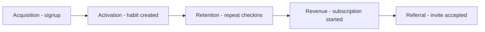

# Lecture 2 — The AARRR Growth Funnel

> **Duration:** ~2 hours. **Outcome:** You can name and define all five AARRR stages, map each one to a specific `event_name` in a real schema, query each stage's headline number against the StreakLab seed data, and argue — with numbers — where a given product's growth leverage actually sits.

"Growth" is too big a word to work on directly. **AARRR** (coined by Dave McClure in 2007, and still the default vocabulary in every growth team on earth) breaks the customer journey into five stages you can each measure, own, and improve independently: **Acquisition, Activation, Retention, Revenue, Referral.** Say it as "pirate metrics" if you like the mnemonic — the point isn't the joke, it's that five sharp questions replace one vague one.

## 1. The five stages, defined precisely

| Stage | The question it answers | StreakLab's version |
|---|---|---|
| **Acquisition** | How do people find us, and from where? | A row lands in `users` — `signup_channel` records the *how* |
| **Activation** | Did they experience the product's core value, fast? | First `habit_created` event — did they actually start a habit? |
| **Retention** | Do they come back and keep getting value? | Repeated `checkin_logged` events over multiple weeks |
| **Revenue** | Do they pay, and does that scale with the value they get? | `subscription_started` event, `event_value` = $9/mo |
| **Referral** | Do happy users bring other users? | `invite_sent` → `invite_accepted` event pair |

Each stage is a **funnel narrowing**, not a separate audience — the same 15 StreakLab users flow through all five, and at each stage some fraction drops off. The craft of growth work is knowing *which* stage has the worst drop-off **relative to how fixable it is**, because that's where an hour of work returns the most.



*The same cohort of users narrows through all five AARRR stages, in order.*

## 2. Acquisition — how do people find us?

Acquisition is the top of the funnel: a person becomes a `users` row. The critical discipline here is recording **`signup_channel`** at the moment of signup, not guessing at it later — by the time someone's active for a month, nobody remembers if they came from a Google ad or a friend's text.

```sql
SELECT signup_channel, COUNT(*) AS signups
FROM users
GROUP BY signup_channel
ORDER BY signups DESC;
```

Against the seed data, every channel (`paid_search`, `organic_search`, `paid_social`, `social_organic`, `referral`) has exactly 3 signups — StreakLab intentionally seeded one of each per cohort so you can compare channels apples-to-apples this week. In a real dataset the channels would be wildly uneven; you'll build full attribution modeling for uneven, multi-touch journeys in **Week 2**. This week, acquisition is just: *count the top of the funnel, broken out by channel.*

**The acquisition trap:** acquisition is the easiest stage to fake progress in — buy more ads, signups go up, the top-of-funnel chart looks great — and the *only* stage where "more" is trivially achievable with money alone. That's exactly why it's dangerous as a north star (Lecture 1) and exactly why the next four stages exist: they're what tells you whether those signups were worth acquiring at all.

## 3. Activation — did they get to value, fast?

**Activation** is the single highest-leverage stage in most products, and the most commonly skipped in analysis, because "we got the signup" *feels* like success. It isn't — a signup with no activation is a wasted acquisition dollar.

Activation needs a precise, product-specific definition: the **first moment a user experiences your core value.** For StreakLab, that's creating their first habit — `habit_created`. (Note it's *not* `session_start`; opening the app and looking around isn't activation, it's just acquisition confirming its own pulse.)

```sql
SELECT
    u.user_id,
    u.signup_at,
    MIN(e.event_time) FILTER (WHERE e.event_name = 'habit_created') AS activated_at
FROM users u
LEFT JOIN events e ON e.user_id = u.user_id
GROUP BY u.user_id, u.signup_at
ORDER BY u.user_id;
```

`FILTER (WHERE ...)` is PostgreSQL's clean way to aggregate over a subset of rows without a `CASE` expression — it reads "the `MIN` of `event_time`, but only counting rows where `event_name = 'habit_created'`." Three users (the "browser" pattern in each cohort) show `NULL` for `activated_at`: they opened the app once and never created a habit. That's your **activation rate**:

```sql
SELECT
    COUNT(*) FILTER (WHERE activated_at IS NOT NULL) * 100.0 / COUNT(*) AS activation_rate_pct
FROM (
    SELECT
        u.user_id,
        MIN(e.event_time) FILTER (WHERE e.event_name = 'habit_created') AS activated_at
    FROM users u
    LEFT JOIN events e ON e.user_id = u.user_id
    GROUP BY u.user_id
) per_user;
```

**80.0%** — 12 of 15. A second, equally important number is **time-to-activate**: how long between `signup_at` and `activated_at`. Fast activation strongly predicts retention across nearly every product category (this is the empirical finding behind Facebook's "7 friends in 10 days" from Lecture 1) — you'll dig into this exact query in Week 3.

## 4. Retention — do they come back?

Retention is where a north star like StreakLab's Weekly Engaged Users lives (Lecture 1). Acquisition and activation both happen *once* per user; retention is the only stage that's fundamentally about **repeated behavior over time**, which is why it's the hardest to fake and the strongest signal of real product value.

The simplest retention question: of the users active last week, how many are still active this week?

```sql
SELECT
    user_id,
    COUNT(*) FILTER (
        WHERE event_time >= TIMESTAMP '2026-06-14' AND event_time < TIMESTAMP '2026-06-15'
    ) AS week_of_06_08,
    COUNT(*) FILTER (
        WHERE event_time >= TIMESTAMP '2026-06-21' AND event_time < TIMESTAMP '2026-06-22'
    ) AS single_day_06_21
FROM events
WHERE event_name = 'checkin_logged'
GROUP BY user_id
ORDER BY user_id;
```

That's a taste — full week-over-week **cohort retention tables** (the classic triangular grid you've probably seen in a growth deck) are Week 4's entire subject. For this week, retention is simply: *pick a repeat-behavior event, pick a time window, count who's still doing it.*

## 5. Revenue — do they pay, and does it scale with value?

Revenue is where StreakLab converts engagement into dollars — the `subscription_started` event, with `event_value` holding the $9.00 monthly price.

```sql
SELECT
    COUNT(*) AS subscribers,
    SUM(event_value) AS mrr_from_new_subs
FROM events
WHERE event_name = 'subscription_started';
```

**6 subscribers, $54.00 in new MRR.** The number that matters more than the raw count is **who** subscribes — cross-reference against activation and retention:

```sql
SELECT
    u.user_id,
    MAX(CASE WHEN e.event_name = 'habit_created' THEN 1 ELSE 0 END) AS activated,
    COUNT(*) FILTER (WHERE e.event_name = 'checkin_logged') AS total_checkins,
    MAX(CASE WHEN e.event_name = 'subscription_started' THEN 1 ELSE 0 END) AS subscribed
FROM users u
JOIN events e ON e.user_id = u.user_id
GROUP BY u.user_id
ORDER BY subscribed DESC, total_checkins DESC;
```

Every single one of StreakLab's 6 subscribers is a heavy check-in user — nobody with fewer than 5 check-ins ever subscribed. That's not a coincidence you'd want to leave to a dashboard to notice; it's a strong, queryable hint that **revenue is downstream of retention**, not a separate lever — pushing people to upgrade before they're engaged would likely just produce refunds and cancellations. Full LTV, CAC, and payback-period modeling is Week 5.

## 6. Referral — do happy users bring others?

Referral is often the most neglected stage because it's the hardest to instrument correctly — you need **two** events that must be causally linked (`invite_sent` then `invite_accepted`), not just counted independently.

```sql
SELECT
    (SELECT COUNT(*) FROM events WHERE event_name = 'invite_sent')      AS invites_sent,
    (SELECT COUNT(*) FROM events WHERE event_name = 'invite_accepted')  AS invites_accepted;
```

**3 sent, 3 accepted** — a 100% acceptance rate in this seed data (unrealistically clean on purpose, so the query is easy to verify by eye; real referral acceptance rates are usually 10–30%). All 3 come from StreakLab's "power user" behavior pattern — one per cohort — which tells you something actionable on its own: **referral is concentrated in your most-engaged users**, so a referral program aimed at *everyone* equally is probably misallocating effort compared to one that specifically equips your top 20% with better sharing tools.

## 7. Where's StreakLab's real leverage?

Lay the five headline numbers next to each other:

| Stage | Headline number | Drop-off from prior stage |
|---|---:|---:|
| Acquisition | 15 signups | — |
| Activation | 12 activated (80%) | 3 users (20%) never create a habit |
| Retention (proxy: engaged now) | 10 weekly engaged (67% of signups) | 2 more activated users aren't hitting 3+ check-ins/week |
| Revenue | 6 subscribers (40%) | 6 engaged users haven't converted to Pro |
| Referral | 3 invites sent (20%) | Only the most-engaged tier refers at all |

Reading this top to bottom is the entire job of a growth analyst in one glance: the biggest **absolute** drop is activation → engagement (only 2 users, small) versus revenue conversion (6 users, large) — but the biggest **relative leverage** might be activation, because it's the earliest stage and every user lost there is lost from every later stage too. There's no universally correct answer here — it depends on cost, fixability, and strategy, which is exactly Challenge 2's subject this week.

## 8. Check yourself

- Name the five AARRR stages in order, and StreakLab's `event_name` (or table) for each.
- Why is `session_start` not a good activation event for StreakLab, even though it's the first thing a user does?
- Explain in one sentence why acquisition is the *easiest* stage to fake progress on, and why that makes it dangerous as a north star.
- What two events, in sequence, does a correct referral metric require? What would counting just one of them (in isolation) get wrong?
- StreakLab's data shows every subscriber is also a heavy check-in user. What does that suggest about the order growth work should happen in — fix activation/retention first, or push revenue first?
- If you had one week and one engineer, which AARRR stage would you invest in for StreakLab, and why? (There's no single right answer — defend your reasoning.)

If those are solid, Lecture 3 stops treating the seed data as a given and shows you how to design and load an event schema like this one from a blank page.

## Further reading

- **Dave McClure, "Startup Metrics for Pirates" (original 2007 talk)** — the source of AARRR; see `resources.md` for a link.
- **PostgreSQL — Aggregate expressions (`FILTER`):** <https://www.postgresql.org/docs/current/sql-expressions.html#SYNTAX-AGGREGATES>
- **PostgreSQL — Window and aggregate functions overview:** <https://www.postgresql.org/docs/current/functions-aggregate.html>
