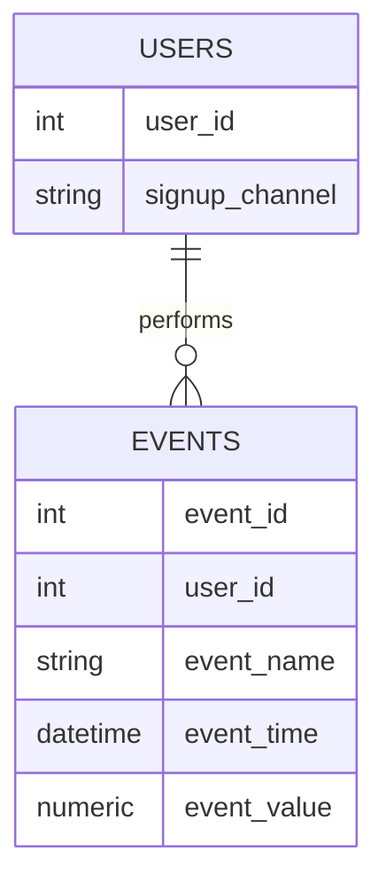
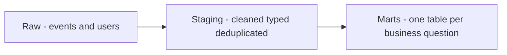

# Lecture 3 — From Events to a Warehouse

> **Duration:** ~2 hours. **Outcome:** You can design a minimal event schema from a blank page, explain why raw events (not pre-aggregated spreadsheet numbers) are the source of truth, and write a full metric-tree query set — north star plus every input metric — as reusable SQL, backed entirely by PostgreSQL.

Lectures 1 and 2 gave you the *vocabulary* — north star, input metrics, AARRR. This lecture gives you the *plumbing*: how those numbers get from "a user tapped a button" to "a trustworthy row in a query result," without a spreadsheet anywhere in the chain.

## 1. Why raw events, and never a spreadsheet

Here's the failure mode this lecture exists to prevent. A growth analyst opens the product's admin panel, eyeballs "active users this week," types `10` into a spreadsheet cell, does this every Monday for three months, and builds a chart on top of those 12 hand-typed numbers. Then someone asks: *"what exactly counted as active — one session, or three check-ins?"* Nobody remembers. The 12 numbers cannot be recomputed, audited, or corrected. This is not a hypothetical — it is the default failure mode of growth reporting at every company that hasn't deliberately prevented it.

**The fix is structural, not disciplinary:** never store a *metric*. Store the **raw events** the metric is computed from, and compute the metric fresh, every time, with a query whose text is the metric's actual, unambiguous definition. If the definition changes (say, WEU moves from "3+ check-ins" to "4+"), you edit one `WHERE`/`HAVING` clause and every historical week is recomputed correctly and consistently — something no spreadsheet of hand-typed numbers can ever do, because a spreadsheet has already thrown the raw events away.

This is why **C38 never uses a spreadsheet as a data store.** A spreadsheet is a fine place to *view* a query's output for five minutes. It is never the place growth numbers *live* — that's PostgreSQL, always, in this course and in any team that wants numbers people can trust six months from now.

## 2. Designing an event schema from a blank page

An **event schema** is the smallest set of tables that can answer "who did what, and when" honestly. There are exactly two moving pieces:

1. **A dimension table** — the "nouns." Who or what exists, with attributes that are true *at a point in time* or slowly-changing. StreakLab's `users` table: one row per person, `signup_channel` and `country` fixed at signup.
2. **A fact table** — the "verbs." Things that *happened*, one immutable row per happening, always with a timestamp. StreakLab's `events` table.

### Designing the fact table

Every event row needs, at minimum:

| Column | Purpose | StreakLab example |
|---|---|---|
| A primary key | Uniquely identifies the event itself (not the user) | `event_id` |
| A foreign key to the actor | Who did it | `user_id` |
| A name | What happened — a short, stable, machine-readable string | `event_name` (`'checkin_logged'`, not `"User logged a check-in!"`) |
| A timestamp | When, with enough precision to order same-day events | `event_time` |
| Optional value/properties | Numeric or structured detail specific to that event type | `event_value` (only meaningful for `subscription_started`) |



*One dimension table of who users are, one fact table of everything they did.*

Two design rules that separate a real event schema from an accidental mess:

- **Events are immutable and append-only.** You never `UPDATE` an event row — if a check-in gets deleted in the app, you log a *new* event (`checkin_deleted`) rather than deleting or editing the old row. This is what makes an event table auditable: it's a permanent, tamper-evident log, exactly like a bank ledger never erases a transaction — it posts a reversing entry.
- **`event_name` values are a fixed, small vocabulary, not free text.** StreakLab has exactly six: `session_start`, `habit_created`, `checkin_logged`, `invite_sent`, `invite_accepted`, `subscription_started`. A new event type is a deliberate decision (usually made alongside a product change), never something that silently drifts because someone typed `'Checkin Logged'` with different capitalization in one code path. In production this is enforced with a `CHECK` constraint or an `event_catalog` reference table — sketched in the mini-project.

### Where properties go: wide columns vs. a JSON bag

Real systems (Segment, Amplitude, Snowplow) attach a flexible **properties** blob to every event, because different event types need different extra detail — a `checkin_logged` might carry `{"habit_id": 4, "streak_length": 12}` while `subscription_started` carries `{"plan": "pro", "price_usd": 9.00}`. PostgreSQL's native `JSONB` type is built exactly for this:

```sql
ALTER TABLE events ADD COLUMN properties JSONB;

-- example of what a richer row might carry (not in this week's seed data):
-- properties = '{"habit_id": 4, "streak_length": 12}'::jsonb

-- querying inside JSONB:
SELECT event_id, properties ->> 'habit_id' AS habit_id
FROM events
WHERE event_name = 'checkin_logged' AND properties IS NOT NULL;
```

This week's seed schema keeps `event_value` as a single flat `NUMERIC` column instead of full `JSONB`, deliberately, so Lecture 3's SQL stays approachable — but know that `JSONB` is the production-grade extension of exactly this same idea, and you'll use it for real starting in later weeks once event payloads get richer.

## 3. Staging vs. marts — the shape of a real warehouse

Production analytics warehouses don't query the raw `events` table directly for every dashboard — that gets slow and repetitive fast. They add layers:

```
RAW              →   STAGING              →   MARTS
events, users        cleaned, typed,           one table per business
(exactly as              deduplicated,             question — pre-joined,
 collected,               one row per real          pre-aggregated to the
 append-only)             event                     grain people ask about
```

- **Raw** is what you loaded this week: append-only, untouched, the permanent source of truth.
- **Staging** applies light, reversible cleaning — cast types, drop exact duplicate `event_id`s, rename cryptically-named columns. Still one row per event.
- **Marts** are where a metric tree actually gets fast to query: a `mart_weekly_engagement` table might have one row per `(user_id, week)` with a precomputed `checkin_count` and `is_engaged` flag, refreshed on a schedule.



*Raw events flow through staging into purpose-built marts, never the reverse.*

This week you work entirely against **raw** — that's deliberate, because you need to trust you can derive every mart from raw before you're allowed to shortcut through one. Week 6 (RevOps & the customer data stack) builds staging and marts properly, with `dbt`-style transformation SQL. For now: raw in, metric tree queried straight out of raw, every time.

## 4. Building the metric tree as a query set

A **metric tree** stops being a whiteboard diagram (Lecture 1, section 4) the moment every node is a runnable query. Build StreakLab's tree top to bottom, using CTEs (`WITH`) so the whole thing reads like the diagram it represents:

```sql
WITH signups AS (
    SELECT user_id, signup_channel, signup_at::date AS signup_date
    FROM users
),
activation AS (
    SELECT
        user_id,
        MIN(event_time) FILTER (WHERE event_name = 'habit_created') AS activated_at
    FROM events
    GROUP BY user_id
),
checkins_last_7d AS (
    SELECT user_id, COUNT(*) AS checkins
    FROM events
    WHERE event_name = 'checkin_logged'
      AND event_time >= TIMESTAMP '2026-06-21' - INTERVAL '6 days'
      AND event_time <  TIMESTAMP '2026-06-21' + INTERVAL '1 day'
    GROUP BY user_id
),
subs AS (
    SELECT user_id, MIN(event_time) AS subscribed_at, MAX(event_value) AS price
    FROM events
    WHERE event_name = 'subscription_started'
    GROUP BY user_id
)
SELECT
    s.user_id,
    s.signup_channel,
    a.activated_at IS NOT NULL                         AS activated,
    COALESCE(c.checkins, 0)                             AS checkins_last_7d,
    COALESCE(c.checkins, 0) >= 3                         AS is_weekly_engaged,
    sub.subscribed_at IS NOT NULL                        AS is_subscriber
FROM signups s
LEFT JOIN activation a       ON a.user_id = s.user_id
LEFT JOIN checkins_last_7d c ON c.user_id = s.user_id
LEFT JOIN subs sub           ON sub.user_id = s.user_id
ORDER BY s.user_id;
```

Every column in that result is one node of the metric tree, computed for every user in one pass. Rolling it up to the headline numbers is now trivial aggregation on top of the same CTEs:

```sql
SELECT
    COUNT(*)                                        AS total_signups,
    COUNT(*) FILTER (WHERE a.activated_at IS NOT NULL)  AS activated_users,
    COUNT(*) FILTER (WHERE COALESCE(c.checkins,0) >= 3)  AS weekly_engaged_users,  -- the north star
    COUNT(*) FILTER (WHERE sub.subscribed_at IS NOT NULL) AS subscribers
FROM users s
LEFT JOIN activation a       ON a.user_id = s.user_id
LEFT JOIN checkins_last_7d c ON c.user_id = s.user_id
LEFT JOIN subs sub           ON sub.user_id = s.user_id;
```

This is the shape of the query set you'll ship in this week's mini-project: **one query per tree node, one rollup query for the headline row**, all against raw `events` — reproducible by anyone, forever, with zero manual number-typing.

## 5. Auditing a metric — the discipline that makes numbers trustworthy

Whenever you hand someone a metric, hand them the ability to check it. Two habits:

1. **Always show the denominator, not just the percentage.** "80% activation" is unverifiable on its own; "12 of 15 activated" lets anyone recount by hand against the seed data. Every query and table in this course reports counts alongside rates for exactly this reason.
2. **Spot-check one row by name.** Before trusting an aggregate query, pull one individual and trace them manually. E.g., user 4 signed up 2026-06-01, has one `session_start` and nothing else — confirm they're correctly excluded from `activated_users` and `weekly_engaged_users` both. If a hand-traced example disagrees with your aggregate, the aggregate has a bug, not the person.

```sql
SELECT * FROM events WHERE user_id = 4 ORDER BY event_time;
-- one row: session_start on 2026-06-01. Correctly: not activated, not engaged, not a subscriber.
```

## 6. Check yourself

- What's the difference between a dimension table and a fact table? Which is `users`, and which is `events`?
- Why must event rows be immutable/append-only — what goes wrong if you allow `UPDATE`/`DELETE` on them?
- Where would `{"streak_length": 12}` live in a richer version of this schema, and what PostgreSQL type is built for it?
- Describe, in one sentence each, what raw, staging, and marts are for.
- Why is "type the number into a spreadsheet cell every Monday" structurally unfixable, even by a very careful analyst?
- What two things should always accompany a percentage metric so someone else can audit it?

You now have the full toolkit for Week 1: a north star, the AARRR map, and a real event schema you can query end to end. The exercises, challenges, and mini-project spend the rest of the week making all three automatic.

## Further reading

- **PostgreSQL — `JSON` and `JSONB` types:** <https://www.postgresql.org/docs/current/datatype-json.html>
- **PostgreSQL — Common Table Expressions (`WITH`):** <https://www.postgresql.org/docs/current/queries-with.html>
- **PostgreSQL — Aggregate `FILTER`:** <https://www.postgresql.org/docs/current/sql-expressions.html#SYNTAX-AGGREGATES>
- **Segment — "The Event Tracking Cheat Sheet"** (naming and schema conventions used by every mainstream analytics vendor): see `resources.md`.
