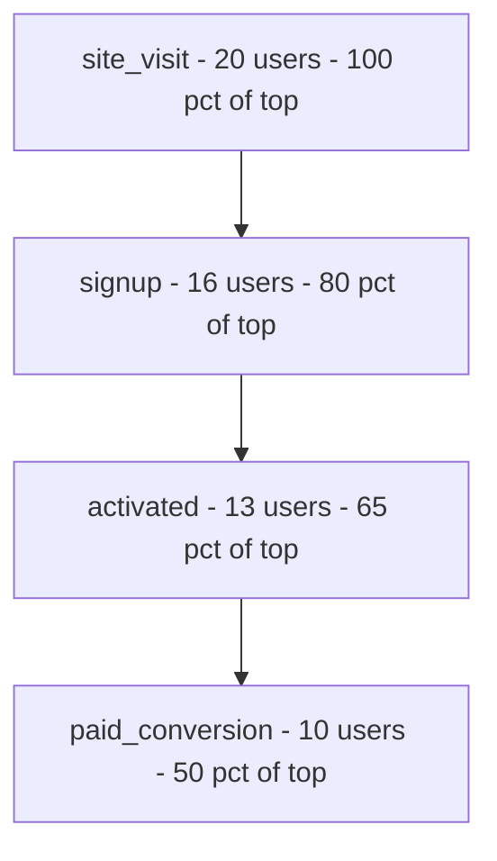
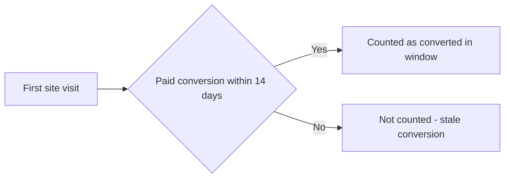

# Lecture 1 — Anatomy of an Acquisition Funnel

> **Duration:** ~2 hours. **Outcome:** You can turn `funnel_events` into a step-by-step funnel with correct counts and conversion rates, use window functions to find each user's step timing, and bound a "did they convert" question to a real time window instead of "ever, eventually."

A funnel is not a chart. A chart is what you get *after* you've decided, precisely, what a "step" is, how you count a person who skips a step, and how long you'll wait before calling a non-conversion a non-conversion. Get those three decisions wrong and the chart is confidently reporting nonsense. This lecture is about making those decisions in SQL, where you can see and defend every one of them.

## 1. A funnel is an ordered sequence of events, one row per (user, step)

Our `funnel_events` table has exactly the shape a funnel needs:

```sql
SELECT * FROM funnel_events WHERE user_id = 18 ORDER BY event_ts;
```

```
 event_id | user_id |   step_name     |      event_ts
----------+---------+-----------------+---------------------
       51 |      18 | site_visit      | 2025-01-09 08:05:00
       52 |      18 | signup          | 2025-01-09 08:30:00
       53 |      18 | activated       | 2025-01-10 09:00:00
       54 |      18 | paid_conversion | 2025-01-13 09:00:00
```

One row per step a user actually completed. A user who bounces after `site_visit` (like user 7 or user 19) simply has **one row** — there's no "signup: false" row to filter on. This is the standard shape for event-based funnels, and it's the reason funnel SQL is mostly about **counting distinct users per step**, not filtering booleans.

Give each step a number so you can compare and order them — SQL has no built-in idea that `'activated'` comes after `'signup'`:

```sql
SELECT
    event_id, user_id, step_name, event_ts,
    CASE step_name
        WHEN 'site_visit'      THEN 1
        WHEN 'signup'          THEN 2
        WHEN 'activated'       THEN 3
        WHEN 'paid_conversion' THEN 4
    END AS step_order
FROM funnel_events;
```

You'll reuse this `CASE` block — or a small lookup table, in a bigger warehouse — constantly this week. Wrap it in a view or CTE rather than repeating it in every query.

## 2. Counting each step — the fan-out trap

The naive instinct is to `GROUP BY step_name, COUNT(*)`. That's *almost* right, and the gap between "almost" and "right" is where funnel bugs live:

```sql
-- Careful: COUNT(*) counts EVENTS, not USERS
SELECT step_name, COUNT(*) AS n
FROM funnel_events
GROUP BY step_name;
```

For this data `COUNT(*)` and `COUNT(DISTINCT user_id)` happen to agree, because no user visits a step twice. But the moment a real warehouse logs a `site_visit` event on every session (most do — someone visits three times before signing up), `COUNT(*)` silently inflates your top-of-funnel number and every conversion rate below it goes with it. Default to `COUNT(DISTINCT user_id)` in funnel SQL and only drop to `COUNT(*)` when you deliberately want event volume, not people:

```sql
SELECT
    step_name,
    COUNT(DISTINCT user_id) AS users_at_step
FROM funnel_events
GROUP BY step_name;
```

```
   step_name     | users_at_step
------------------+---------------
 site_visit       |            20
 signup           |            16
 activated        |            13
 paid_conversion  |            10
```

That's the shape of the funnel. But it's not ordered, and it's not a *rate* yet — both fixable.

## 3. Ordering the steps and computing step-over-step conversion

Order the rows with the `step_order` mapping, then compute two kinds of rate: **step-over-step** (what fraction of the *previous* step's users made it here) and **step-over-top** (what fraction of the *very first* step's users made it here). Stakeholders confuse these constantly — always label which one you're showing.

```sql
WITH step_counts AS (
    SELECT
        CASE step_name
            WHEN 'site_visit'      THEN 1
            WHEN 'signup'          THEN 2
            WHEN 'activated'       THEN 3
            WHEN 'paid_conversion' THEN 4
        END AS step_order,
        step_name,
        COUNT(DISTINCT user_id) AS users_at_step
    FROM funnel_events
    GROUP BY step_name
)
SELECT
    step_order,
    step_name,
    users_at_step,
    ROUND(100.0 * users_at_step
          / FIRST_VALUE(users_at_step) OVER (ORDER BY step_order), 1)  AS pct_of_top,
    ROUND(100.0 * users_at_step
          / LAG(users_at_step) OVER (ORDER BY step_order), 1)          AS pct_of_prev_step
FROM step_counts
ORDER BY step_order;
```

```
 step_order |   step_name     | users_at_step | pct_of_top | pct_of_prev_step
------------+------------------+---------------+------------+-------------------
          1 | site_visit       |            20 |      100.0 |
          2 | signup           |            16 |       80.0 |              80.0
          3 | activated        |            13 |       65.0 |              81.3
          4 | paid_conversion  |            10 |       50.0 |              76.9
```

Two window functions doing real work here:

- **`FIRST_VALUE(users_at_step) OVER (ORDER BY step_order)`** — grabs the top-of-funnel count and repeats it on every row, so each row can divide by it. This is the classic "denominator that doesn't change per row" pattern window functions exist for.
- **`LAG(users_at_step) OVER (ORDER BY step_order)`** — pulls the *previous* row's value onto the current row, giving you the step-over-step comparison without a self-join.

Read the two rate columns differently: `pct_of_top` tells a VP "half of everyone who visited eventually paid." `pct_of_prev_step` tells the activation team "of the people who signed up, 81.3% went on to activate" — the number they can actually move by changing onboarding, isolated from acquisition-quality noise upstream.


*Each stage narrows the funnel; pct_of_top always compares back to the original 20 site visits, while pct_of_prev_step compares each arrow to the stage before it.*

## 4. Per-user step timing with `LAG`

Counts tell you *where* people drop off. Timing tells you *how long* the ones who don't drop off take — and that matters for the next section. `LAG() OVER (PARTITION BY user_id ORDER BY event_ts)` gives every event row a look back at that same user's previous event:

```sql
SELECT
    user_id,
    step_name,
    event_ts,
    LAG(step_name) OVER (PARTITION BY user_id ORDER BY event_ts) AS prev_step,
    event_ts - LAG(event_ts) OVER (PARTITION BY user_id ORDER BY event_ts) AS time_since_prev
FROM funnel_events
WHERE user_id IN (1, 9)
ORDER BY user_id, event_ts;
```

```
 user_id |   step_name     |      event_ts       | prev_step  | time_since_prev
---------+------------------+----------------------+------------+------------------
       1 | site_visit       | 2025-01-05 14:05:00 |            |
       1 | signup           | 2025-01-05 14:20:00 | site_visit | 00:15:00
       1 | activated        | 2025-01-06 10:00:00 | signup     | 19:40:00
       1 | paid_conversion  | 2025-01-09 11:00:00 | activated  | 3 days 01:00:00
       9 | site_visit       | 2025-01-07 09:05:00 |            |
       9 | signup           | 2025-01-07 09:30:00 | site_visit | 00:25:00
       9 | activated        | 2025-01-08 10:00:00 | signup     | 1 day 00:30:00
       9 | paid_conversion  | 2025-01-12 10:00:00 | activated  | 4 days 00:00:00
```

`PARTITION BY user_id` is doing the heavy lifting — without it, `LAG` would reach across users and report nonsense like "user 9's site visit happened 2 days after user 1's activation." This is the single most common window-function mistake in funnel SQL: forgetting the partition and getting a query that runs, returns rows, and is completely wrong. `PostgreSQL` returns an `interval` for a timestamp subtraction (shown above); on SQLite, cast both sides with `julianday()` and subtract to get days as a float — `(julianday(event_ts) - julianday(prev_ts)) * 24` gives hours.

## 5. Time-lag: bounding what counts as "converted"

Here's the question every funnel eventually forces: user 9 signed up on Jan 7 and paid on Jan 12 — five days later. Is that "converted"? Almost everyone says yes. But what if it had been five *months* later — is that the same acquisition event, or did they churn out, come back through a totally different channel, and coincidentally still have the same `user_id`? Funnels need an explicit **conversion window**: a maximum time-lag after which you stop crediting the original visit for a later conversion.

```sql
-- Did each user reach paid_conversion within 14 days of their FIRST site_visit?
WITH first_visit AS (
    SELECT user_id, MIN(event_ts) AS visit_ts
    FROM funnel_events
    WHERE step_name = 'site_visit'
    GROUP BY user_id
),
paid AS (
    SELECT user_id, event_ts AS paid_ts
    FROM funnel_events
    WHERE step_name = 'paid_conversion'
)
SELECT
    fv.user_id,
    fv.visit_ts,
    p.paid_ts,
    p.paid_ts IS NOT NULL
        AND p.paid_ts <= fv.visit_ts + INTERVAL '14 days'  AS converted_in_window
FROM first_visit fv
LEFT JOIN paid p ON p.user_id = fv.user_id
ORDER BY fv.user_id;
```

Every one of our ten payers converts within 4 days of their first visit, so all ten pass a 14-day window — but write the window explicitly anyway. A funnel query with no time bound quietly answers "did they ever, eventually convert" (which inflates old cohorts that had more time) instead of "did *this* visit lead to *this* conversion" (which is comparable across cohorts). On SQLite, replace `+ INTERVAL '14 days'` with `datetime(visit_ts, '+14 days')`.


*A conversion window turns an unbounded ever eventually question into a bounded, comparable one.*

## 6. The full funnel, correctly windowed

Putting it together — step counts, ordered, rated, with the time-lag rule folded in so a "conversion" from a stale visit doesn't sneak in:

```sql
WITH first_visit AS (
    SELECT user_id, MIN(event_ts) AS visit_ts
    FROM funnel_events WHERE step_name = 'site_visit'
    GROUP BY user_id
),
ranked_events AS (
    SELECT
        fe.user_id,
        fe.step_name,
        CASE fe.step_name
            WHEN 'site_visit'      THEN 1
            WHEN 'signup'          THEN 2
            WHEN 'activated'       THEN 3
            WHEN 'paid_conversion' THEN 4
        END AS step_order,
        fe.event_ts
    FROM funnel_events fe
    JOIN first_visit fv ON fv.user_id = fe.user_id
    WHERE fe.event_ts <= fv.visit_ts + INTERVAL '14 days'   -- the window rule
)
SELECT
    step_order,
    step_name,
    COUNT(DISTINCT user_id) AS users_at_step,
    ROUND(100.0 * COUNT(DISTINCT user_id)
          / FIRST_VALUE(COUNT(DISTINCT user_id)) OVER (ORDER BY step_order), 1) AS pct_of_top
FROM ranked_events
GROUP BY step_order, step_name
ORDER BY step_order;
```

This is the query you'll write in Exercise 1 against the full dataset. Notice the shape: a CTE to establish the anchor event (first visit), a CTE to attach the ordinal and apply the window filter, then the same `GROUP BY` + window-function pattern from section 3. That three-part shape — anchor, filter/label, aggregate — is the template for essentially every funnel query you'll write in this course.

## 7. Common bugs to recognize on sight

- **`COUNT(*)` instead of `COUNT(DISTINCT user_id)`** when any step can log more than once per user — silently inflates every downstream rate.
- **A `LIMIT` with no `ORDER BY`** feeding a "top of funnel" number — same non-determinism bug from C33 Week 1, and it's just as common here.
- **`LAG`/`LEAD` without `PARTITION BY user_id`** — the window slides across users and every "previous step" is somebody else's event.
- **A `JOIN` between `funnel_events` and `touches` (or `conversions`) with no `GROUP BY`/dedup afterward** — if a user has 3 touches, a plain join multiplies their funnel row by 3. Challenge 2 this week is built entirely around this one bug.
- **No conversion window at all** — "did they ever convert" instead of "did they convert because of this visit" — makes funnels from different time periods incomparable.

## 8. Check yourself

- Why does `COUNT(*)` and `COUNT(DISTINCT user_id)` matter for a funnel, and when do they diverge?
- What does `FIRST_VALUE(...) OVER (ORDER BY step_order)` compute, and why is it useful as a denominator?
- Explain the difference between `pct_of_top` and `pct_of_prev_step` in one sentence each, and when a stakeholder wants which.
- Why must `LAG() OVER (... ORDER BY event_ts)` be paired with `PARTITION BY user_id` in a funnel query?
- What problem does a conversion window (e.g., 14 days) solve that an unbounded "did they ever convert" query doesn't?
- Name the fan-out bug: what happens if you join a one-row-per-user funnel summary to a multi-row-per-user `touches` table without aggregating first?

Lecture 2 takes the `touches` table you've been peeking at and turns it into four different, defensible ways to answer "which channel gets the credit."

## Further reading

- **PostgreSQL — Window Functions Tutorial:** <https://www.postgresql.org/docs/current/tutorial-window.html>
- **PostgreSQL — Window Functions reference (`LAG`, `LEAD`, `FIRST_VALUE`):** <https://www.postgresql.org/docs/current/functions-window.html>
- **SQLite — Window Functions:** <https://www.sqlite.org/windowfunctions.html>
- **SQLite — Date and Time Functions (`julianday`, `datetime`):** <https://www.sqlite.org/lang_datefunc.html>
