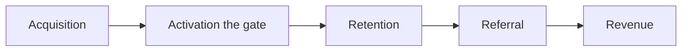

# Lecture 1 — What Activation Really Is

> **Duration:** ~2 hours. **Outcome:** You can explain why activation is the highest-leverage stage in the growth funnel, state the four criteria a real activation event must meet, and compute the raw reach of every candidate event in a live dataset with SQL.

## 1. Where activation sits in the funnel

AARRR — the pirate funnel from Week 1 — has five stages: **A**cquisition, **A**ctivation, **R**etention, **R**eferral, **R**evenue. Most teams obsess over the first and the last: how many people came in, how much money came out. Activation is the quiet stage in the middle, and it is the one that decides whether the other four matter at all.

Here's why it's the highest-leverage stage:

- **Acquisition without activation is a leaky bucket.** If you spend $50 to acquire a user and 90% of them never experience the product's value, you just spent $50 to show ninety cents of a product demo to nine people who won't be back. No amount of acquisition spend fixes a broken activation step — it just buys you more people to lose.
- **Retention is downstream of activation, not independent of it.** You cannot retain a user who never got value in the first place. Every retention curve (Week 4) starts at day 0 with 100% of *activated* users, not 100% of signups — activation is the gate.
- **Activation is fixable fast.** Acquisition channels take months to shift (SEO, brand, sales cycles). Retention curves take months to even *measure*. Activation happens in the first minutes to days of a user's life — you can ship an onboarding change on Monday and see the effect in a cohort by Friday. Short feedback loops are what make a metric worth optimizing.

This is why growth teams spend a disproportionate amount of their roadmap on the first session, first day, and first week. It's the cheapest lever with the fastest read-out.


*The AARRR funnel: activation is the narrow gate every downstream stage must pass through.*

## 2. What an activation event actually is

An **activation event** is a single, observable action (or short combination of actions) in your event log that marks the moment a user first experienced your product's core value.

Notice what that definition does *not* say:

- It does not say "signed up." Signup is acquisition — the user hasn't touched the product yet. Calling signup your activation event is a category error that shows up constantly in immature analytics setups (usually because signup is the easiest event to track, not because it's meaningful).
- It does not say "became a paying customer." Payment is monetization, and it's *downstream* of activation for almost every product — people pay because they already got value, not the other way around. Using it as your activation event tells you who converted, not who activated; you'll be measuring the wrong thing weeks too late to act on it.
- It does not say "logged in." Login is necessary but not sufficient — someone can log in, stare at an empty dashboard, and leave having learned nothing about why your product exists.

A good activation event names the moment the product's value became *real* to the user — not the moment they walked in the door, and not the moment they later decided to pay for it.

### 2.1 Activation vs. engagement vs. stickiness — three terms people mix up

These three words get used interchangeably in casual conversation, and conflating them leads to picking the wrong metric:

- **Activation** is a one-time, early gate: did the user experience core value *at all*, once? It's binary per user, and it's about the first days of a lifecycle.
- **Engagement** is an ongoing intensity measure: *how much* is a user doing, this week, this month — session count, actions per session, depth of feature usage. It applies to a user's entire tenure, not just the start.
- **Stickiness** is a specific ratio (commonly DAU/MAU) describing how habitual usage is across your *whole* user base over time — a company-level metric, not a per-user gate.

A user can be activated (they got the aha moment once) without being highly engaged (they use the product lightly) or contributing much to stickiness (they only open it monthly). All three are legitimate things to measure — they just answer different questions, and this week is specifically about the first one: the earliest, one-time gate.

## 3. The four criteria for a real activation event

Anyone can propose an activation event. The discipline is in testing the proposal against four criteria before you commit a team's roadmap to optimizing it.

| Criterion | Question | Why it matters |
|---|---|---|
| **Specific & observable** | Is it a single, unambiguous event (or tight combination) in the event log — not a vague feeling like "engaged"? | If you can't write the `WHERE` clause for it, you can't measure it, and you definitely can't put it on a dashboard. |
| **Early** | Does it happen in the first session, day, or week — not months in? | An event that takes 60 days to reach isn't useful as an *early* signal; by the time you observe it, most of your cohort has already churned or stuck for reasons unrelated to it. |
| **Predictive of retention** | Do users who hit this event retain meaningfully better than users who don't? | This is the whole point — see Lecture 2. An event with no retention lift is just trivia. |
| **Actionable** | Can the product team actually move the needle on it — via onboarding copy, defaults, nudges, or design — within a normal sprint? | If the event is a proxy for something outside your control (e.g. "user's company was already large"), you can measure it but you can't move it. |

Hold all four in your head at once. Chasing only "predictive of retention" is how teams end up anchoring on rare power-user behaviors that correlate beautifully with retention but that 95% of users will never realistically reach — more on that trap in Lecture 2 and Challenge 1.

## 4. A first pass at Crunch Boards' candidate events

Crunch Boards is a small Kanban-style project tool. Its event log — the `events` table you seeded this week — contains these `event_name` values, roughly in the order most users would hit them:

1. `signed_up` — everyone, by definition.
2. `verified_email` — clicked the confirmation link.
3. `created_first_board` — made their first project board.
4. `created_first_card` — added a task card to a board.
5. `invited_teammate` — invited a colleague to a board.
6. `completed_first_task` — dragged a card to "Done."
7. `connected_integration` — hooked up Slack/GitHub/etc. (a power-user action).

Plus a recurring `app_open` event we use to measure whether a user came back in later weeks (that's how we'll define retention this week — more in Lecture 2).

Before running a single query, apply the four criteria as a sniff test:

- `signed_up` fails "specific & observable" as an activation event — it's not specific to activation, it's the acquisition boundary itself. Every user has it, so it has zero discriminating power.
- `verified_email` is early and observable, but is it *product value*? Confirming an email proves nothing about whether the user understood what Crunch Boards does.
- `created_first_board` and `created_first_card` look promising — they're the user doing something with the product.
- `invited_teammate` is interesting because Crunch Boards is fundamentally a *collaboration* tool — a board with one person on it is arguably not the product being used as intended.
- `completed_first_task` happens late in the sequence (it requires a card to exist and, in this data, follows an invite for most users) — is it early enough, and is it a cause of retention or just a symptom of a user who was already going to stick around?
- `connected_integration` is rare — only power users reach it. Great signal, terrible reach.

This is exactly the kind of reasoning worth doing *before* you touch SQL. But intuition isn't proof. The next step is measuring reach for real.

## 5. Measuring reach with SQL

**Reach** is the simplest first metric: of all signups, what fraction ever fired this event? It doesn't yet tell you about retention (Lecture 2) — it just tells you how common the behavior is, which matters for the "actionable at scale" half of the criteria table.

```sql
SELECT
    e.event_name,
    COUNT(DISTINCT e.user_id)                                     AS users_reached,
    ROUND(100.0 * COUNT(DISTINCT e.user_id) / (SELECT COUNT(*) FROM users), 1) AS pct_of_signups
FROM events e
WHERE e.event_name <> 'app_open'
GROUP BY e.event_name
ORDER BY pct_of_signups DESC;
```

Against this week's seed, that returns:

| event_name | users_reached | pct_of_signups |
|---|---:|---:|
| signed_up | 400 | 100.0 |
| verified_email | 322 | 80.5 |
| created_first_board | 256 | 64.0 |
| created_first_card | 209 | 52.2 |
| invited_teammate | 116 | 29.0 |
| completed_first_task | 101 | 25.2 |
| connected_integration | 37 | 9.2 |

Already this rules a few things out on reach alone: `connected_integration` reaches barely 1 in 11 signups — even if it turns out to correlate beautifully with retention (it does, a little — Lecture 2), it can never be the org's *headline* activation metric, because 91% of users will never see it regardless of what you build. A metric almost nobody can reach isn't a lever, it's a curiosity.

## 6. Activation rate — turning reach into a windowed KPI

Once you've picked a candidate, you don't report raw reach forever — you report **activation rate**: the percentage of signups in a cohort who hit the activation event within a *fixed window* (commonly 24 hours, 7 days, or 30 days, chosen to match how fast your product's value is reasonably reachable).

The window matters. Without one, "activation rate" silently grows over time as stragglers eventually get there months later, and you can't compare cohort to cohort fairly. With a 7-day window:

```sql
SELECT
    ROUND(100.0 * COUNT(DISTINCT u.user_id) / (SELECT COUNT(*) FROM users), 1) AS activation_rate_7d
FROM users u
JOIN events e
  ON e.user_id = u.user_id
 AND e.event_name = 'invited_teammate'
 AND e.event_at <= u.signup_at + INTERVAL '7 days';   -- SQLite: datetime(u.signup_at, '+7 days')
```

Note the join condition does double duty: it finds the event *and* enforces the window in the same clause, rather than filtering afterward — this pattern (a windowed join, not a plain `WHERE` on the events table) is what keeps the denominator correct: everyone who signed up is still in `users`, whether or not they ever fired the event.

## 7. Common mistakes, named so you can catch them

**Anchoring on signup or login.** These have zero discriminating power as activation events — nearly every user has them, by construction, so grouping by "did they sign up" tells you nothing about who goes on to succeed. If a metric doesn't split your population into meaningfully different groups, it can't predict anything about them.

**Anchoring on payment.** Payment is downstream of activation for almost every product — people pay because they already got value, not the other way around. Worse, it conflates two separate decisions ("did I get value" and "am I willing to pay for it") that can have very different timelines — a user can be fully activated and stay on a free tier for months. Optimizing onboarding toward "get to payment faster" often means optimizing toward *pressuring* users before they've experienced value, which tends to backfire on retention.

**Picking the rarest, highest-lift event and calling it the org-wide KPI.** This is the reach trap from §5 above, restated as a process failure: it happens when a team runs the Lecture 2 analysis, sees a huge lift number on a rare event, and ships it as the headline metric without checking reach. It looks impressive in a slide deck and is useless as a target 90% of users structurally cannot reach.

**No window on the activation-rate metric.** Report raw "ever reached this event" without a time cap, and the number silently drifts upward every week as stragglers eventually trickle through — a cohort measured today and the same cohort measured again in three months will show different "activation rates" for no reason related to the product changing. That makes cohort-to-cohort comparison (the whole point of tracking the metric) impossible.

**Picking one event and never revisiting it.** The right activation event can change as the product changes — a new default workflow, a redesigned onboarding wizard, or a new feature can shift which early action best predicts retention. Treat the Lecture 2 analysis as something you re-run periodically (quarterly is common), not a one-time decision carved in stone.

## 8. Check yourself

- Why is signup a poor choice of activation event, even though it's the easiest thing to track?
- Name the four criteria a real activation event must satisfy, in your own words.
- Why is "became a paying customer" usually the *wrong* activation event, even for a product with a free trial?
- `connected_integration` reaches only 9.2% of signups. Under what circumstance could it still be a *reasonable* activation event, and when would it clearly not be?
- What does a 7-day activation-rate window buy you that raw reach doesn't?
- Look back at the SQL in §6 — why is the window condition (`e.event_at <= u.signup_at + INTERVAL '7 days'`) written inside the `JOIN`'s `ON` clause rather than in a `WHERE` on `events` alone?

If those are automatic, Lecture 2 shows you how to go from "these are the candidates" to "here is the one the data actually supports" — by measuring what each candidate does to retention, not just how common it is.

## Further reading

- **Amplitude — "What Is User Activation?"**: <https://amplitude.com/blog/activation-metric>
- **First Round Review — Rahul Vohra, "How Superhuman Built an Engine to Find Product/Market Fit"**: <https://review.firstround.com/how-superhuman-built-an-engine-to-find-product-market-fit>
- **PostgreSQL — Date/Time functions and `INTERVAL`**: <https://www.postgresql.org/docs/current/functions-datetime.html>
- **SQLite — Date and Time functions**: <https://www.sqlite.org/lang_datefunc.html>
