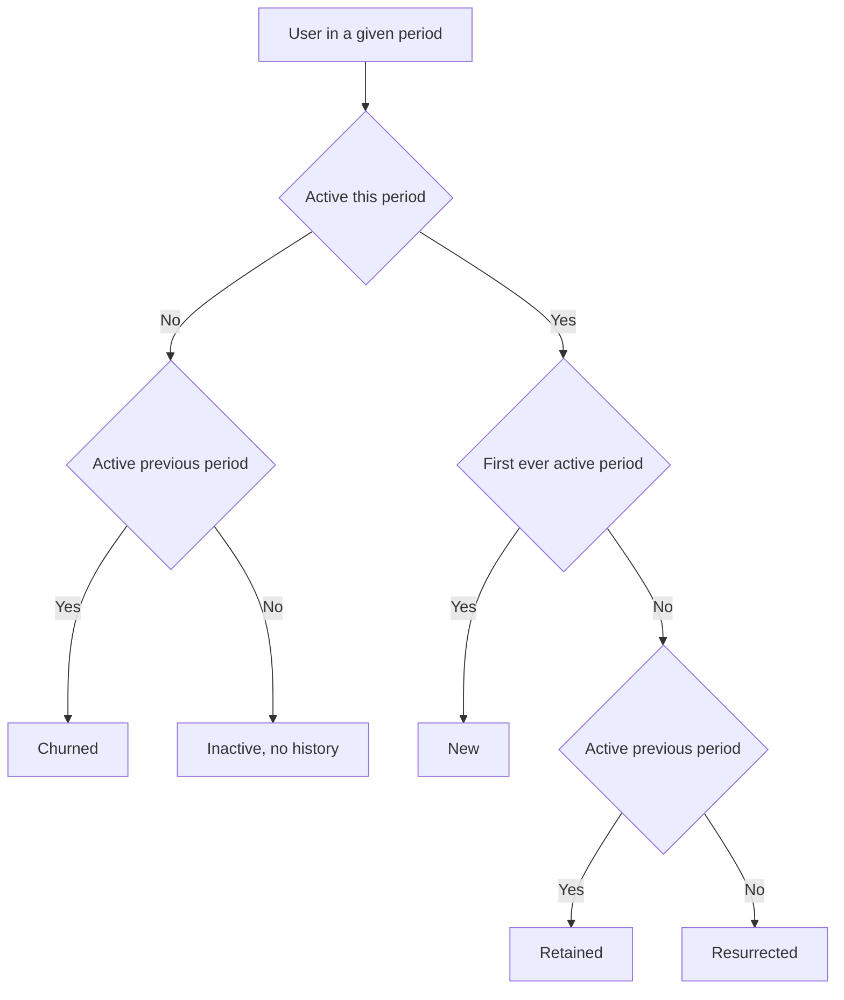

# Lecture 2 — Retention, Defined Correctly

> **Duration:** ~2 hours. **Outcome:** You can compute N-day, unbounded, and rolling retention from the same `events` table, explain in one sentence when each is the right tool, and split any calendar month's active users into new/retained/resurrected/churned with a query that provably sums correctly.

Two analysts can both say "our 30-day retention is 40%" and be measuring completely different things. One means "40% of users were active *on exactly* day 30." The other means "40% of users had done *anything at all* by day 30." A third might mean "40% of users were active at some point in the trailing 30 days, measured today." All three are legitimate metrics. None of them is "retention" in general — each is a specific, named thing, and this lecture is about knowing which one you're computing and why.

## 1. N-day retention — did they come back on *that* day?

**N-day retention** asks: of the users who signed up, what fraction returned and were active on exactly day N after signup (day 0 = signup day)? It's the strictest, noisiest, and most common definition in consumer/mobile analytics — you'll see "D1," "D7," and "D30" retention constantly.

```sql
SELECT
    SUM(CASE WHEN days_since_signup = 1  THEN 1 ELSE 0 END) AS day1_returns,
    SUM(CASE WHEN days_since_signup = 7  THEN 1 ELSE 0 END) AS day7_returns,
    SUM(CASE WHEN days_since_signup = 30 THEN 1 ELSE 0 END) AS day30_returns
FROM (
    SELECT DISTINCT
        u.user_id,
        CAST(julianday(e.event_date) - julianday(u.signup_date) AS INT) AS days_since_signup
    FROM users u
    JOIN events e ON e.user_id = u.user_id
) t;
```

(**PostgreSQL:** replace `CAST(julianday(e.event_date) - julianday(u.signup_date) AS INT)` with the plain `e.event_date - u.signup_date`, which already returns an integer number of days.)

Against the seed data, out of 48 signups: **5 returned exactly on day 1 (10.4%), 8 returned exactly on day 7 (16.7%), 5 returned exactly on day 30 (10.4%).** Notice these don't have to move monotonically — day 7 being higher than day 1 just means fewer people happen to log in the very next day than happen to log in a week later (a weekly-cadence product, maybe). N-day retention is precise and comparable across cohorts of any age (a user who signed up yesterday can't have a day-30 number yet, but everyone who *can* have one is measured the same way) — but it's noisy at the individual-day level, because it demands activity on one exact day rather than "around" that day.

## 2. Unbounded retention — did they come back *by* some point?

**Unbounded retention** (the metric behind the triangle from Lecture 1) asks: of the users who signed up, what fraction did *anything at all* during a given period after signup — usually a calendar month, sometimes a week? It doesn't care which specific day within the period; any activity counts.

```sql
-- unbounded month-1 retention: active ANY TIME during the calendar month after signup
SELECT
    u.cohort_month,
    COUNT(DISTINCT u.user_id)                                              AS cohort_size,
    COUNT(DISTINCT CASE WHEN month_number = 1 THEN a.user_id END)          AS month1_active,
    ROUND(100.0 * COUNT(DISTINCT CASE WHEN month_number = 1 THEN a.user_id END)
                / COUNT(DISTINCT u.user_id), 1)                            AS month1_pct
FROM users u
LEFT JOIN (
    SELECT
        e.user_id,
        (CAST(strftime('%Y', e.event_date) AS INT) - CAST(strftime('%Y', us.signup_date) AS INT)) * 12
      + (CAST(strftime('%m', e.event_date) AS INT) - CAST(strftime('%m', us.signup_date) AS INT))
        AS month_number
    FROM events e JOIN users us ON us.user_id = e.user_id
) a ON a.user_id = u.user_id
GROUP BY u.cohort_month
ORDER BY u.cohort_month;
```

This is the metric that produces the triangle. It's smoother than N-day (a whole month of chances to show up, instead of one exact day) and it's the natural choice for B2B or lower-frequency products where "came back within the month" is a more meaningful bar than "came back on the exact 30th day." Its weakness is the flip side of its strength: it hides *when* within the month the activity happened, and a barely-active month ("logged in once, did nothing") counts the same as a heavily-active one.

## 3. Rolling retention — are they *currently* engaged, as of today?

**Rolling retention** (sometimes "trailing-N-day retention") asks a present-tense question that N-day and unbounded retention don't: **as of right now, what fraction of eligible users have been active at all in the last N days?** Unlike the first two, it's not anchored to a signup cohort at all — it's a snapshot of the whole active base.

```sql
-- rolling 28-day retention, as of 2025-06-30
SELECT
    COUNT(DISTINCT e.user_id) AS active_last_28_days,
    (SELECT COUNT(*) FROM users WHERE signup_date <= '2025-06-30') AS eligible_users,
    ROUND(100.0 * COUNT(DISTINCT e.user_id)
        / (SELECT COUNT(*) FROM users WHERE signup_date <= '2025-06-30'), 1) AS rolling_l28_pct
FROM events e
JOIN users u ON u.user_id = e.user_id
WHERE e.event_date BETWEEN date('2025-06-30', '-27 day') AND '2025-06-30'
  AND u.signup_date <= '2025-06-30';
```

Run this and you'll get **19 of 48 eligible users active in the trailing 28 days (39.6%)**, ending 2025-06-30 (the window starts 2025-06-03). Run the same query anchored to 2025-05-31 instead and you get **23 of 48 (47.9%)** — a real decline worth investigating. This is exactly what rolling retention is for: not "how did the March cohort do," but "is the business's active base growing or shrinking, right now." It's the number that goes on a live dashboard, refreshed daily, because — unlike a cohort triangle, which needs a whole month to add one more column — it updates every single day.

## 4. Picking the right one

| Question you're actually asking | Use |
|---|---|
| "Does a specific cohort still use the product a month after signup?" | Unbounded, by cohort |
| "Do users habitually return on a predictable cadence (daily app, weekly report)?" | N-day (D1/D7/D30) |
| "Is the live, current user base healthy *today*?" | Rolling (trailing N-day) |
| "Did the onboarding change we shipped in April work?" | Unbounded month-1, compared across cohorts (Lecture 1, §6) |

Mixing these up is how a growth review turns into an argument about numbers instead of a conversation about the product. If someone hands you a retention number, the first question is always: **N-day, unbounded, or rolling — and over what window?**

## 5. Growth accounting: new, retained, resurrected, churned

A single retention percentage — even a well-defined one — collapses four very different kinds of users into one number. **Growth accounting** breaks a period's active users into buckets that explain *where* they came from:

- **New** — active for the first time this period (their signup period).
- **Retained** — active this period *and* active the immediately preceding period.
- **Resurrected** — active this period, *not* active the preceding period, but active at some point further back. They churned once and came back.
- **Churned** — active the preceding period, not active this period. (Reported *for* the period they went quiet, not counted in that period's "active" total — churn is what didn't show up.)

These four numbers have to satisfy an identity that's your built-in correctness check:

```
active(period) = new(period) + retained(period) + resurrected(period)
```

Churned isn't part of that sum — it's a *separate* count of people who dropped out, always measured against the *previous* period's active base:

```
churned(period) = active(period − 1) − retained(period)
```



*The four growth-accounting buckets fall out of two questions: active now, and active before.*

### Computing it in SQL

The mechanics: build a calendar "spine" (every month from a user's signup through the observation cutoff, even months with zero activity), flag which months were active, then use `LAG` to compare each month to the one right before it.

```sql
WITH RECURSIVE cal(ym) AS (
    SELECT '2025-02'
    UNION ALL
    SELECT strftime('%Y-%m', ym || '-01', '+1 month') FROM cal WHERE ym < '2025-06'
),
spine AS (
    SELECT u.user_id, u.cohort_month, c.ym AS month
    FROM users u
    CROSS JOIN cal c
    WHERE c.ym >= u.cohort_month             -- a user can't be "inactive" before they existed
),
monthly_active AS (
    SELECT DISTINCT user_id, strftime('%Y-%m', event_date) AS month
    FROM events
),
flagged AS (
    SELECT s.user_id, s.cohort_month, s.month,
           CASE WHEN m.month IS NOT NULL THEN 1 ELSE 0 END AS active
    FROM spine s
    LEFT JOIN monthly_active m ON m.user_id = s.user_id AND m.month = s.month
),
with_history AS (
    SELECT f.*,
           LAG(active) OVER (PARTITION BY user_id ORDER BY month) AS prev_active,
           MAX(active) OVER (PARTITION BY user_id ORDER BY month
                              ROWS BETWEEN UNBOUNDED PRECEDING AND 1 PRECEDING) AS ever_active_before
    FROM flagged f
),
classified AS (
    SELECT *,
      CASE
        WHEN month = cohort_month AND active = 1 THEN 'new'
        WHEN active = 1 AND prev_active = 1 THEN 'retained'
        WHEN active = 1 AND COALESCE(prev_active,0) = 0 AND COALESCE(ever_active_before,0) = 1 THEN 'resurrected'
        WHEN active = 0 AND prev_active = 1 THEN 'churned'
        ELSE 'inactive_no_history'
      END AS status
    FROM with_history
)
SELECT month,
    SUM(CASE WHEN status='new'         THEN 1 ELSE 0 END) AS new_users,
    SUM(CASE WHEN status='retained'    THEN 1 ELSE 0 END) AS retained,
    SUM(CASE WHEN status='resurrected' THEN 1 ELSE 0 END) AS resurrected,
    SUM(CASE WHEN status='churned'     THEN 1 ELSE 0 END) AS churned,
    SUM(active)                                            AS active_total
FROM classified
GROUP BY month
ORDER BY month;
```

**PostgreSQL note:** swap the recursive `cal` CTE for `generate_series(date '2025-02-01', date '2025-06-01', interval '1 month')`, which does the same job in one line.

Run against the seed data:

| month | new | retained | resurrected | churned | active_total |
|---|---:|---:|---:|---:|---:|
| 2025-02 | 12 | 0 | 0 | 0 | 12 |
| 2025-03 | 12 | 2 | 0 | 10 | 14 |
| 2025-04 | 12 | 6 | 1 | 8 | 19 |
| 2025-05 | 12 | 10 | 2 | 9 | 24 |
| 2025-06 | 0 | 14 | 5 | 10 | 19 |

Check the identity on May: `active(24) = new(12) + retained(10) + resurrected(2)` → `24 = 24`. ✓ And `churned(9) = active_prev_month(19, April) − retained(10)` → `9 = 9`. ✓ If your numbers don't satisfy both equations, the classification logic has a bug — usually a user counted in two buckets, or the calendar spine missing a month.

### Why "resurrected" matters and isn't just "retained, but slow"

A resurrected user tells you something a retained user doesn't: **the product was worth coming back to even after being ignored.** A business with a lot of resurrection and modest month-over-month retention can still be healthy — it means churn isn't always permanent, which changes how you'd spend a re-engagement budget (email nudges, win-back campaigns) versus a pure retention budget (onboarding, habit-forming features). Notice June's resurrected count (5) is the highest of the whole table — worth asking *why*, in the same way you'd ask why month-1 retention rose across cohorts in Lecture 1.

## 6. Check yourself

- A stakeholder says "our D7 retention is 20%." What exactly does that mean, and what does it *not* tell you about users who returned on day 5 or day 10?
- Why is rolling retention the right choice for a live dashboard but the wrong choice for comparing whether an April product change improved retention?
- A user is active in March and May but not April. How do you classify their May activity — retained, resurrected, or something else? Why?
- Write out the growth-accounting identity from memory. What does it tell you if your computed numbers don't satisfy it?
- Why is churn attributed to the *previous* period's active base, not counted as part of the current period's activity?

If those are automatic, Lecture 3 goes from "how retained are we this month" to "how retained will we still be six months from now" — survival curves, the censoring problem immature cohorts create, and the stickiness ratio that tells you whether a product is a daily habit or a monthly errand.

## Further reading

- **PostgreSQL — Window Functions Tutorial:** <https://www.postgresql.org/docs/current/tutorial-window.html>
- **PostgreSQL — `generate_series`:** <https://www.postgresql.org/docs/current/functions-srf.html>
- **SQLite — Recursive Common Table Expressions:** <https://www.sqlite.org/lang_with.html>
- **PostgreSQL — Window Function Calls (`LAG`/`LEAD`):** <https://www.postgresql.org/docs/current/sql-expressions.html#SYNTAX-WINDOW-FUNCTIONS>
