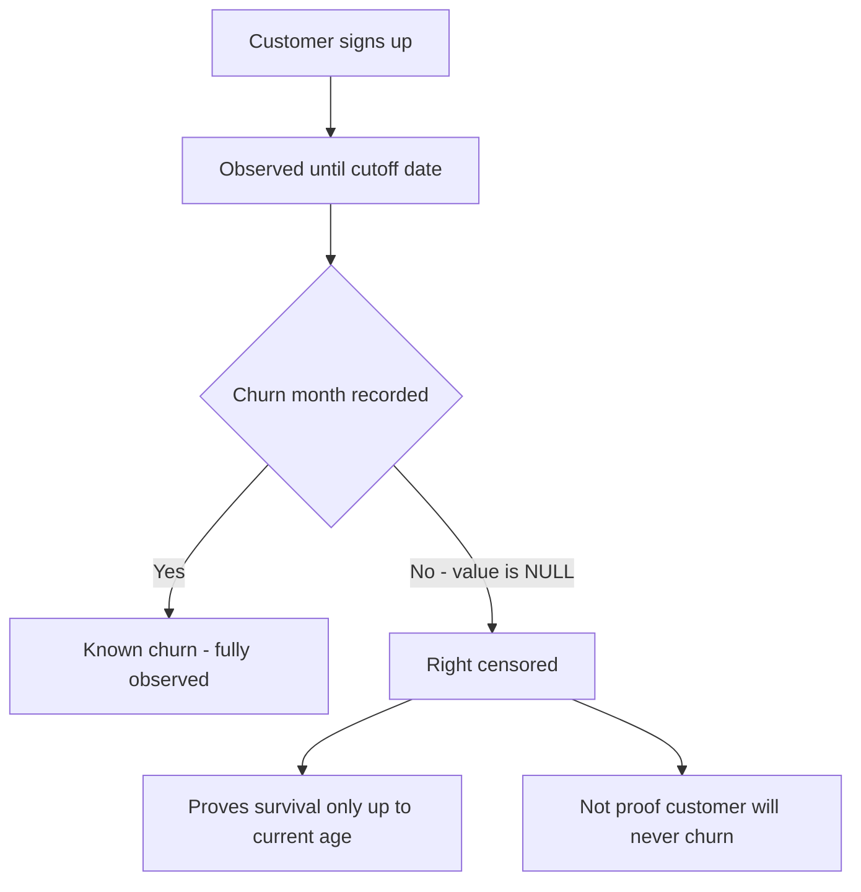

# Lecture 1 — Lifetime Value, Properly

> **Duration:** ~2 hours. **Outcome:** You can build a pooled retention curve from raw customer rows in SQL, turn it into a contribution-margin-based LTV two different ways, explain why each method is biased in a different direction, and state precisely why a revenue-based LTV overstates the truth.

Every growth deck has a slide with "LTV: $X" on it. Almost none of them say how that number was computed, and the honest answer is usually "we're not totally sure." This lecture removes the mystery. LTV is not a fact you look up — it's a model you build, from two ingredients: **how long a customer sticks around** (retention) and **how much money they're worth to you while they're around** (contribution margin, not revenue). Get both right and LTV becomes a number you can defend in a board meeting. Get either wrong and it becomes a number that quietly justifies overspending on growth.

Run every query in this lecture against the seed from the [week README](../README.md) as you read.

## 1. The question LTV is actually answering

"Lifetime value" sounds like it should be one clean number, the way "salary" is one clean number. It isn't, for two reasons:

1. **You don't know the future.** A customer who signed up in November has only had one chance to churn. A customer who signed up in January has had eleven. Any "average" you compute today is an average of *very differently aged* observations — mixing them naively gives you a number that's biased toward whatever your newest, least-tested cohorts look like.
2. **"Value" isn't revenue.** A $149/month customer isn't worth $149/month to the company — hosting, support, and infrastructure cost money too. The number that's actually yours to keep is **contribution margin**: revenue minus the variable cost of serving that customer. Lumen Metrics runs an 80% gross margin, so a $149/month `paid_search` customer is worth **$119.20/month** in contribution margin, not $149. A $99/month `organic_content` customer is worth **$79.20/month**, not $99.

```sql
SELECT
    channel,
    mrr,
    ROUND(mrr * 0.80, 2) AS contribution_margin_per_month
FROM customers
GROUP BY channel, mrr;
```

```
     channel      | mrr    | contribution_margin_per_month
-------------------+--------+-------------------------------
 paid_search       | 149.00 | 119.20
 organic_content   |  99.00 |  79.20
```

Every LTV formula in this lecture uses that margin number, never the raw `mrr`. Hold onto that — it's the single most common shortcut that inflates an LTV slide.

## 2. Right-censoring: the `NULL` problem, again

You've seen `NULL` mean "missing" and "not applicable." In a churn column it means something sharper: **"hasn't happened yet, as of when we looked."** A customer who signed up in November 2025 and has a `NULL` `churn_month` on 2025-12-31 isn't "retained forever" — they've simply only had one month to prove anything. This is called **right-censoring**, and it is the single biggest source of a wrong LTV.


*A `NULL` churn month means unresolved, not immortal — the customer has only been observed so far.*

```sql
SELECT channel, COUNT(*) AS still_active
FROM customers
WHERE churn_month IS NULL
GROUP BY channel;
```

```
     channel      | still_active
-------------------+--------------
 paid_search       |           19   -- out of 36
 organic_content   |           23   -- out of 28
```

Nineteen `paid_search` customers and twenty-three `organic_content` customers are `NULL` right now. Treat every one of those as "will never churn" and your LTV becomes fiction. The fix isn't to drop them (that throws away most of your data) or to treat them as churned today (that understates retention just as badly). The fix is to build a **retention curve indexed by age since signup**, so every customer only contributes evidence for the ages they've actually lived through.

## 3. Building the retention curve in SQL

"Age" here means **months since signup**, not calendar month. A January cohort at age 3 is April; a June cohort at age 3 is September. Pooling by *age* (not calendar date) is what lets you compare a channel's month-1 behavior against its month-1 behavior regardless of which calendar month people signed up in — and it's what turns eleven thin, noisy monthly cohorts into one usable curve.

For each customer, generate every age they *could* have been observed at by the cutoff (0 up through however many months have elapsed since their signup), then flag whether they were still active at that age:

```sql
WITH cohort_ages AS (
    SELECT
        c.customer_id,
        c.channel,
        c.signup_month,
        c.churn_month,
        gs AS age
    FROM customers c,
         generate_series(0, 11) AS gs                              -- max possible age this year
    WHERE c.signup_month + (gs || ' months')::interval <= DATE '2025-12-31'   -- only ages we can actually observe
),
flagged AS (
    SELECT
        channel,
        age,
        CASE
            WHEN churn_month IS NULL THEN 1                                          -- still active at cutoff
            WHEN churn_month > signup_month + (age || ' months')::interval THEN 1     -- hadn't churned yet at this age
            ELSE 0
        END AS is_active
    FROM cohort_ages
)
SELECT
    channel,
    age,
    COUNT(*)                          AS n_observed,
    ROUND(AVG(is_active)::numeric, 3) AS retention
FROM flagged
GROUP BY channel, age
ORDER BY channel, age;
```

**SQLite equivalent:** SQLite has no `generate_series` by default and no `interval` arithmetic. Use a recursive CTE to produce `0..11`, and `date(signup_month, '+' || age || ' months')` in place of the interval math. The logic is identical — only the date/series syntax changes.

Run it and you get the pooled curve for ages 0 through 6 (the range with a meaningful sample on both channels — more on that in a moment):

| age | `paid_search` retention | n | `organic_content` retention | n |
|----:|------------------------:|---:|-----------------------------:|---:|
| 0 | 100.0% | 36 | 100.0% | 28 |
| 1 | 90.9% | 33 | 87.5% | 24 |
| 2 | 70.0% | 30 | 90.0% | 20 |
| 3 | 59.3% | 27 | 88.2% | 17 |
| 4 | 54.2% | 24 | 78.6% | 14 |
| 5 | 52.4% | 21 | 72.7% | 11 |
| 6 | 55.6% | 18 | 77.8% | 9 |

Two things jump out immediately, and both are the point of this exercise:

- **The shapes are completely different.** `paid_search` loses nearly half its cohort in the first three months (100% → 59.3%) — a steep "leaky bucket" that then flattens. `organic_content` barely dips (100% → 88.2% by month 3) and stays there. That's not a coincidence: someone who found you through a targeted ad and signed up on impulse churns differently than someone who read four blog posts, trusted your content, and signed up on purpose.
- **The curve is not smooth, and that's honest, not broken.** Notice retention *ticks up* from age 5 to age 6 on both channels (52.4% → 55.6% and 72.7% → 77.8%). That's not customers un-churning — it's **sample-size noise**: by age 6 you're pooling as few as 9–18 customers, and one or two extra cancellations shifts the percentage a lot. **Rule of thumb: don't trust a retention point built on fewer than ~15 customers.** Ages 0–4 are solid on both channels here; age 6 is directionally useful but noisy. A real analyst says this out loud instead of hiding it behind a smoothed line — and so should you, in the mini-project.

## 4. LTV, method 1 — sum the cohort curve

The most honest LTV is the simplest one: multiply each age's retention by that month's contribution margin, and add it up.

```
LTV(0..6 months) = Σ [ retention(age) × contribution_margin_per_month ]   for age = 0 .. 6
```

```sql
-- pandas version, working from the retention query above
import pandas as pd

retention = pd.DataFrame({
    'channel':  ['paid_search']*7 + ['organic_content']*7,
    'age':      list(range(7)) * 2,
    'retention': [1.000, 0.909, 0.700, 0.593, 0.542, 0.524, 0.556,
                  1.000, 0.875, 0.900, 0.882, 0.786, 0.727, 0.778],
})
margin = {'paid_search': 119.20, 'organic_content': 79.20}

retention['margin_dollars'] = retention.apply(
    lambda r: r['retention'] * margin[r['channel']], axis=1
)
ltv_0_6 = retention.groupby('channel')['margin_dollars'].sum().round(2)
print(ltv_0_6)
```

```
channel
organic_content    471.09
paid_search         574.87
Name: margin_dollars, dtype: float64
```

Two honest facts about this number: it's **conservative** — it only counts the seven months you actually have solid data for, so it *understates* true lifetime value (customers keep paying past month 6). It's also **trustworthy** — every input is an observed retention rate, not an assumption. This is your floor: whatever the "real" LTV is, it's at least this.

## 5. LTV, method 2 — the churn-rate reciprocal formula

The formula you'll see in almost every SaaS metrics deck is much shorter:

```
LTV = contribution_margin_per_month ÷ monthly_churn_rate
```

This formula assumes churn is a **constant hazard** — the same fraction of survivors cancels every month, forever — which turns a geometric series into one clean division. It's popular because it's fast and it extrapolates past the 6-month wall the cohort-sum method can't see past. To use it you need one number: the average monthly churn rate. Estimate it from the same retention curve, as the average month-over-month drop across ages 1–6:

```python
import numpy as np

surv = {
    'paid_search':     [1.000, 0.909, 0.700, 0.593, 0.542, 0.524, 0.556],
    'organic_content': [1.000, 0.875, 0.900, 0.882, 0.786, 0.727, 0.778],
}
for ch, s in surv.items():
    hazards = [1 - s[i]/s[i-1] for i in range(1, len(s))]
    avg_churn = np.mean(hazards)
    ltv = margin[ch] / avg_churn
    print(ch, "avg monthly churn:", round(avg_churn, 4), "  LTV:", round(ltv, 2))
```

```
paid_search        avg monthly churn: 0.0888   LTV: 1342.73
organic_content     avg monthly churn: 0.0384   LTV: 2061.64
```

Sanity-check these against each other: the reciprocal formula gives **higher** numbers than the 6-month cohort sum ($1,342.73 vs. $574.87 for `paid_search`) — which makes sense, since it's projecting the *entire* future lifetime, not just six months of it. It also assumes the hazard rate holds forever, which is optimistic for `paid_search` (that steep early drop-off might keep going past month 6, not flatten) and roughly fair for `organic_content` (whose curve had already flattened by month 3). **The reciprocal formula is a projection built on an assumption; the cohort sum is a fact built on evidence, cut short.** Good analysts quote both and say which one they trust more, and why.

## 6. Why revenue-based LTV overstates — exactly

Swap `contribution_margin_per_month` for raw `mrr` in either formula and watch what happens:

```python
for ch in margin:
    ltv_margin = margin[ch] / avg_churn_by_channel[ch]      # from above
    ltv_revenue = mrr[ch] / avg_churn_by_channel[ch]
    print(ch, "margin-based:", round(ltv_margin, 2), " revenue-based:", round(ltv_revenue, 2))
```

```
paid_search        margin-based: 1342.73   revenue-based: 1678.41
organic_content     margin-based: 2061.64   revenue-based: 2577.05
```

Both revenue-based numbers are **exactly 25% higher**. That's not a coincidence — it's `1 ÷ gross_margin` (`1 ÷ 0.80 = 1.25`), applied identically to every channel, every cohort, every method. **Revenue-based LTV always overstates by exactly the inverse of your gross margin**, no more, no less. At an 80% margin that's a 25% inflation; at a 50% margin (typical for a lower-margin services business) it would be a full 2×. If someone hands you an "LTV" and can't tell you whether it's margin- or revenue-based, assume the worse case and ask.

## 7. Putting it together

| Method | What it uses | Bias | When to trust it |
|---|---|---|---|
| Cohort sum (0–6mo) | Observed retention, real margin | Understates (truncated at 6mo) | Always — it's your floor |
| Reciprocal formula | Estimated constant churn rate, real margin | Could over- or understate (assumes hazard never changes) | When the curve has already flattened |
| Reciprocal on revenue | Estimated churn rate, raw revenue | Overstates by exactly `1 ÷ margin%` | Never, without converting to margin first |

For Lumen Metrics: `organic_content`'s LTV is higher than `paid_search`'s under **every single method** in this lecture. That's the retention curve talking — a customer who churns half as often is worth roughly twice as much, holding margin constant. Whether that higher LTV is *enough* to justify what it costs to acquire that customer is a CAC question — which is exactly where Lecture 2 picks up.

## 8. Check yourself

- Why is treating a `NULL` `churn_month` as "will never churn" the classic LTV mistake, and what does right-censoring mean?
- What does pooling by *age since signup* (instead of calendar month) buy you that pooling by calendar month doesn't?
- Why did retention tick *up* from age 5 to age 6 on both channels, and why is that a warning sign rather than good news?
- Write, in one sentence, why the cohort-sum LTV is a floor and the reciprocal-formula LTV is a projection.
- A revenue-based LTV came in at $2,000 on a company with a 75% gross margin. What's the margin-based LTV?
- Why does the reciprocal formula's accuracy depend on whether the retention curve has "flattened" yet?

If those are automatic, Lecture 2 turns to the other half of the equation — what it actually costs to acquire these customers, fully loaded.

## Further reading

- **PostgreSQL — Set Returning Functions (`generate_series`):** <https://www.postgresql.org/docs/current/functions-srf.html>
- **PostgreSQL — Date/Time Functions and Operators:** <https://www.postgresql.org/docs/current/functions-datetime.html>
- **SQLite — Recursive Common Table Expressions:** <https://www.sqlite.org/lang_with.html#recursive_common_table_expressions>
- **pandas — `groupby` user guide:** <https://pandas.pydata.org/docs/user_guide/groupby.html>
