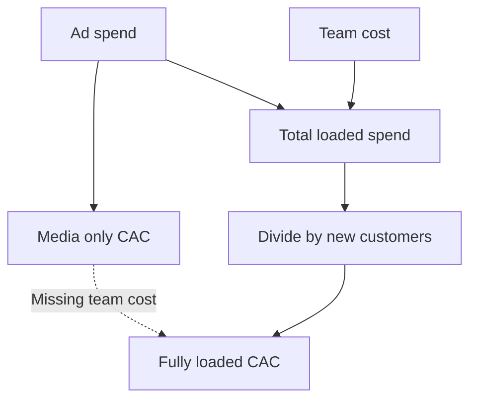
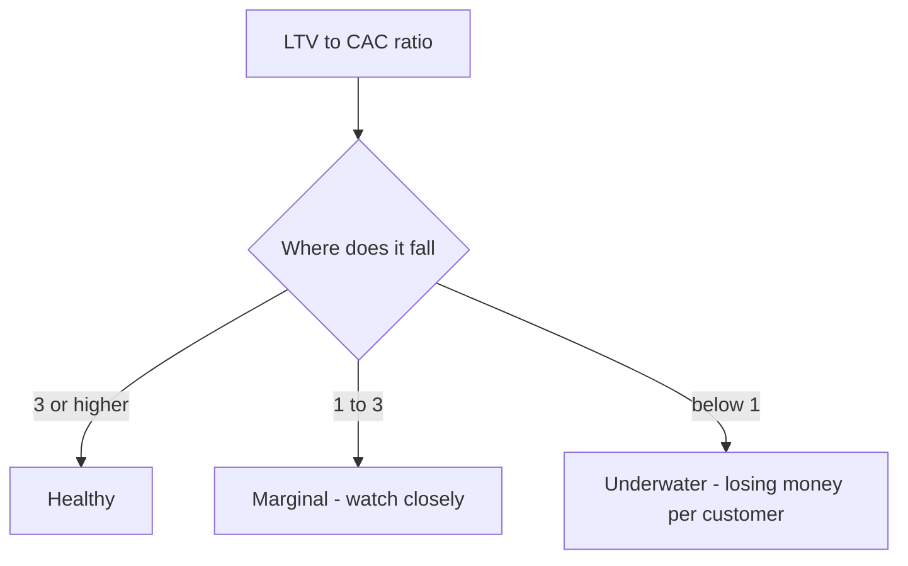

# Lecture 2 — CAC and Payback

> **Duration:** ~2 hours. **Outcome:** You can compute a fully-loaded CAC per channel and blended, tell blended CAC apart from trailing/marginal CAC and know which one to trust, compute both a naive and a retention-adjusted payback period, and read the LTV:CAC ratio against the standard SaaS health heuristics.

Lecture 1 built the "how much is a customer worth" half of the equation. This lecture builds the other half: "what did it cost to get them." Put the two together and you get the single number that decides whether growth is worth funding — **LTV:CAC** — plus the number that decides how much cash you need in the bank to fund it — **payback period**. Both are simple arithmetic. Both are trivially easy to compute wrong by leaving something out of CAC, which is exactly what this lecture is designed to stop you from doing.

## 1. CAC is not "ad spend divided by signups"

Ask a marketer for CAC and you'll often get: `ad_spend ÷ new_customers`. That's **media-only CAC**, and it is not the number that tells you whether a channel is worth running, because it leaves out the people running it.

```sql
SELECT
    channel,
    SUM(ad_spend)                                AS total_ad_spend,
    (SELECT COUNT(*) FROM customers c
       WHERE c.channel = cc.channel)              AS total_new_customers,
    ROUND(SUM(ad_spend) / (SELECT COUNT(*) FROM customers c
                              WHERE c.channel = cc.channel), 2) AS media_only_cac
FROM channel_costs cc
GROUP BY channel;
```

```
     channel      | total_ad_spend | total_new_customers | media_only_cac
-------------------+-----------------+----------------------+-----------------
 paid_search       |          32400 |                   36 |          900.00
 organic_content   |           4800 |                   28 |          171.43
```

Read those numbers and `organic_content` looks like a steal — five times cheaper than `paid_search`. It isn't. `organic_content`'s real cost is barely in `ad_spend` at all — it's in the two content writers and an editor who get paid every month whether or not anyone signs up that month. Leave `team_cost` out and you've hidden the majority of the channel's actual cost. **Fully-loaded CAC** adds it back:

```sql
SELECT
    channel,
    SUM(ad_spend + team_cost)                      AS total_loaded_spend,
    (SELECT COUNT(*) FROM customers c
       WHERE c.channel = cc.channel)                AS total_new_customers,
    ROUND(SUM(ad_spend + team_cost) /
          (SELECT COUNT(*) FROM customers c
             WHERE c.channel = cc.channel), 2)       AS fully_loaded_cac
FROM channel_costs cc
GROUP BY channel;
```

```
     channel      | total_loaded_spend | total_new_customers | fully_loaded_cac
-------------------+---------------------+----------------------+-------------------
 paid_search       |               72000 |                   36 |           2000.00
 organic_content   |               72000 |                   28 |           2571.43
```

Same total budget on both channels ($72,000 for the year — $6,000/month each), completely different real cost per customer once you count who's being paid to run it. The moment you load in team cost, `organic_content` flips from "5× cheaper" to "29% more expensive" than `paid_search`, on a blended full-year basis. **Rule: if a CAC doesn't include the salaries of the people running the channel, it isn't CAC — it's a partial number pretending to be one.**


*Media-only CAC leaves team cost out of the sum; fully-loaded CAC puts it back before dividing.*

## 2. Blended CAC hides a trend — look at trailing CAC too

"Blended CAC" — total spend over the whole year divided by total new customers over the whole year — is the number above. It's useful for a scorecard, but it answers the wrong question if you're deciding what to do *next*. The right question for a forward decision is: **what does it cost to acquire the next customer, right now?**

```sql
SELECT
    channel,
    CASE
        WHEN cost_month <  '2025-04-01' THEN 'H1-early (Jan-Mar)'
        WHEN cost_month <  '2025-10-01' THEN 'mid-year (Apr-Sep)'
        ELSE 'Q4 (Oct-Dec)'
    END AS period,
    SUM(ad_spend + team_cost)                                     AS loaded_spend,
    COUNT(cust.customer_id)                                       AS new_customers,
    ROUND(SUM(ad_spend + team_cost) / NULLIF(COUNT(cust.customer_id), 0), 2) AS period_cac
FROM channel_costs cc
LEFT JOIN customers cust
       ON cust.channel = cc.channel AND cust.signup_month = cc.cost_month
GROUP BY channel, period
ORDER BY channel, MIN(cost_month);
```

Running the underlying arithmetic gives you this trend:

| Channel | H1 (Jan–Jun) CAC | Q4 (Oct–Dec) CAC | Blended (full year) CAC |
|---|---:|---:|---:|
| `paid_search` | $2,000.00 | $2,000.00 | $2,000.00 |
| `organic_content` | $4,000.00 | $1,636.36 | $2,571.43 |

`paid_search` is flat all year — the same team, the same ad budget, buying the same three customers a month at the same price, every month. `organic_content` starts *worse* than `paid_search` ($4,000 CAC in H1, twice as expensive) and ends up *better* ($1,636.36 in Q4, 18% cheaper) — because the content team's fixed cost gets spread over a growing number of monthly signups as older articles keep ranking and compounding. **The blended full-year number ($2,571.43) makes `organic_content` look worse than it currently is; the trailing quarter ($1,636.36) is closer to what it will actually cost you to buy the next customer on that channel.** When you're deciding where to put next quarter's budget, trailing/marginal CAC is the more honest input — blended CAC is a historical report card.

## 3. Payback period — two ways, and they disagree on purpose

Payback period answers: **how many months of a customer's contribution margin does it take to earn back what you spent acquiring them?**

**Naive payback** assumes the customer keeps paying every month forever at 100% retention — no churn at all:

```
naive_payback = CAC ÷ contribution_margin_per_month
```

```python
margin = {'paid_search': 119.20, 'organic_content': 79.20}
cac = {'paid_search': 2000.00, 'organic_content_blended': 2571.43, 'organic_content_q4': 1636.36}

print("paid_search naive payback:", round(cac['paid_search'] / margin['paid_search'], 2), "months")
print("organic (blended CAC) naive payback:", round(cac['organic_content_blended'] / margin['organic_content'], 2), "months")
print("organic (Q4 CAC) naive payback:", round(cac['organic_content_q4'] / margin['organic_content'], 2), "months")
```

```
paid_search naive payback: 16.78 months
organic (blended CAC) naive payback: 32.47 months
organic (Q4 CAC) naive payback: 20.66 months
```

At a glance, 16.78 months for `paid_search` looks tolerable — long, but inside the "under 18 months" heuristic some investors use. **It's also wrong**, because it assumes nobody ever churns, and you already know from Lecture 1 that `paid_search` had lost nearly half its cohort by month 3.

**Retention-adjusted payback** asks the real question: at each month, how much contribution margin has the *average surviving customer actually delivered*, given real churn? Sum the cohort curve from Lecture 1 (cumulative margin, weighted by retention) and see where — or whether — it crosses the CAC line:

| Age (months) | `paid_search` cumulative margin | `organic_content` cumulative margin |
|---:|---:|---:|
| 0 | $119.20 | $79.20 |
| 1 | $227.56 | $148.50 |
| 2 | $311.00 | $219.78 |
| 3 | $381.64 | $289.66 |
| 4 | $446.21 | $351.89 |
| 5 | $508.65 | $409.49 |
| 6 | $574.87 | $471.09 |

By month 6, `paid_search` has recovered **$574.87 of the $2,000 it cost to acquire that customer — 28.7%.** `organic_content` has recovered $471.09 of a Q4-level $1,636.36 CAC — **28.8%**, almost identical *in percentage terms* despite the very different dollar amounts, because `organic_content`'s CAC is proportionally lower and its retention proportionally higher. Extending both curves forward using each channel's own average monthly churn rate (from Lecture 1: 8.9% for `paid_search`, 3.8% for `organic_content`) to see where — or whether — cumulative margin ever crosses the CAC line:

| Channel | CAC used | Does cumulative margin ever cross CAC? | Retention-adjusted payback |
|---|---:|---|---|
| `paid_search` | $2,000.00 (blended) | **No** — asymptotes at $1,342.34, below CAC | Undefined — this CAC is never recovered |
| `organic_content` | $2,571.43 (blended) | **No** — asymptotes at $2,061.71, below CAC | Undefined at the blended CAC |
| `organic_content` | $1,636.36 (Q4/trailing) | **Yes** — crosses at month 40 | ~40 months (slow, but real) |

That "asymptotes below CAC" result is not a rounding error — it's the same fact Lecture 1's LTV numbers already told you: `paid_search`'s LTV ($1,342.73) is *less* than its CAC ($2,000). **A channel whose LTV is below its CAC has no payback period, at any time horizon, at its current churn and cost.** It doesn't "pay back slowly" — it doesn't pay back. Naive payback (16.78 months) made this channel look survivable; retention-adjusted payback shows it structurally isn't, at these numbers. That gap between the two methods is the whole reason this lecture exists.

## 4. The LTV:CAC ratio

Payback tells you *when*; LTV:CAC tells you *how much, ever*. It's the single number growth teams get asked for most:

```
LTV:CAC = LTV (margin-based) ÷ CAC (fully loaded)
```

```python
ltv = {'paid_search': 1342.73, 'organic_content': 2061.64}

print("paid_search:      ", round(ltv['paid_search'] / cac['paid_search'], 2))
print("organic (blended): ", round(ltv['organic_content'] / cac['organic_content_blended'], 2))
print("organic (Q4):       ", round(ltv['organic_content'] / cac['organic_content_q4'], 2))
```

```
paid_search:        0.67
organic (blended):   0.80
organic (Q4):        1.26
```

The standard SaaS heuristics: **3:1 or higher is healthy**, **1:1–3:1 is marginal — profitable in theory but thin, watch it closely**, and **below 1:1 means you're spending more to acquire a customer than that customer will ever be worth.** By that yardstick: `paid_search` at 0.67:1 is underwater with no visible trend fixing it (Section 2 showed its CAC is flat, not improving). `organic_content` is *also* underwater on a blended basis (0.80:1) — but its trailing-quarter ratio (1.26:1) is above water and its CAC is falling every quarter, which is a completely different trajectory than a channel that's just as unprofitable and going nowhere. **The ratio alone doesn't tell you which channel to fix, pause, or scale — the ratio plus its trend does.** That judgment call is exactly what the mini-project asks you to make.


*The standard SaaS health bands the LTV:CAC ratio gets checked against.*

## 5. Check yourself

- Why is `ad_spend ÷ new_customers` not a fully-loaded CAC, and what does fully-loaded CAC add back?
- `organic_content`'s media-only CAC ($171.43) is far below its fully-loaded CAC ($2,571.43). What's hiding in that gap?
- Why does blended (full-year) CAC understate how cheap `organic_content` has become by Q4, and overstate how expensive it was in Q1?
- In your own words, what does "naive payback" assume that's almost always false?
- `paid_search`'s LTV ($1,342.73) is below its CAC ($2,000.00). What does that say about its payback period — not "long," but structurally?
- Why does the same channel (`organic_content`) have an LTV:CAC ratio below 1 on blended CAC but above 1 on trailing Q4 CAC? Which one would you use to decide next quarter's budget, and why?

If those are automatic, Lecture 3 pulls LTV, CAC, payback, and contribution margin into one model — the one you'll build in SQL and pandas for the mini-project.

## Further reading

- **Investopedia — "Customer Acquisition Cost (CAC)":** <https://www.investopedia.com/terms/c/cac.asp>
- **Investopedia — "Customer Lifetime Value (LTV/CLV)":** <https://www.investopedia.com/terms/c/customer-lifetime-value-clv.asp>
- **Bessemer Venture Partners — State of the Cloud** (industry benchmark reference for LTV/CAC and payback): <https://www.bvp.com/atlas/state-of-the-cloud>
- **PostgreSQL — `CASE` expressions:** <https://www.postgresql.org/docs/current/functions-conditional.html>
- **pandas — `merge`, `join`, and `concat`:** <https://pandas.pydata.org/docs/user_guide/merging.html>
