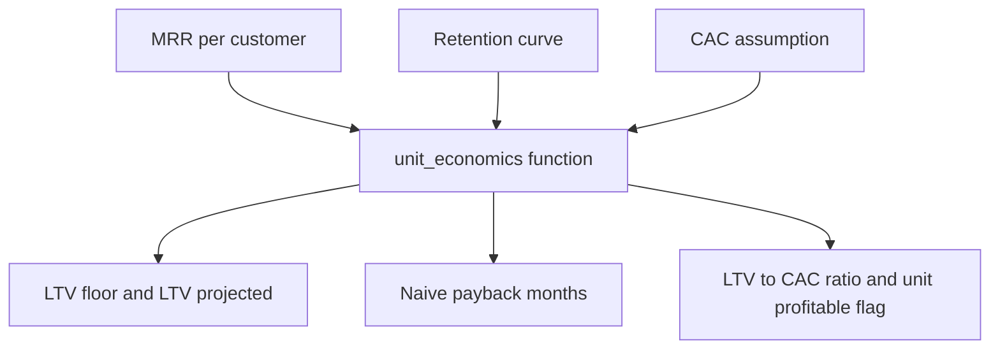

# Lecture 3 — Unit Economics That Hold

> **Duration:** ~2 hours. **Outcome:** You can show, with one query, that a company's revenue can grow every single month while one of its channels loses money on every customer it buys — and you can build a single reusable model in SQL and pandas that computes contribution margin, CAC, LTV, payback, and the LTV:CAC ratio for any channel, on demand.

"Growing" and "profitable" are two different claims about a business, and a rising revenue line proves only the first one. This lecture shows you the gap between them using Lumen Metrics' own numbers, then gives you the model — reusable, not one-off — that every exercise, challenge, and the mini-project from here on will run through.

## 1. The company is growing. Loudly.

Total monthly recurring revenue, all channels combined, month by month through 2025:

```sql
WITH month_grid AS (
    SELECT generate_series('2025-01-01'::date, '2025-12-01'::date, interval '1 month') AS as_of
)
SELECT
    mg.as_of                                                      AS month,
    COUNT(*) FILTER (WHERE c.signup_month <= mg.as_of
                        AND (c.churn_month IS NULL OR c.churn_month > mg.as_of)) AS active_customers,
    SUM(c.mrr) FILTER (WHERE c.signup_month <= mg.as_of
                          AND (c.churn_month IS NULL OR c.churn_month > mg.as_of)) AS total_mrr
FROM month_grid mg
CROSS JOIN customers c
GROUP BY mg.as_of
ORDER BY mg.as_of;
```

```
   month    | active_customers | total_mrr
------------+-------------------+-----------
 2025-01-01 |                 4 |     546.00
 2025-02-01 |                 8 |    1092.00
 2025-03-01 |                11 |    1489.00
 2025-04-01 |                14 |    1886.00
 2025-05-01 |                17 |    2233.00
 2025-06-01 |                19 |    2481.00
 2025-07-01 |                24 |    3126.00
 2025-08-01 |                30 |    3870.00
 2025-09-01 |                31 |    3869.00
 2025-10-01 |                36 |    4464.00
 2025-11-01 |                39 |    4761.00
 2025-12-01 |                42 |    5108.00
```

Monthly recurring revenue went from **$546 in January to $5,108 in December — up 836%.** Active customers climbed from 4 to 42. Every board slide built from this table looks fantastic, and every sentence in it would be true. **None of it tells you whether the company is making or losing money on the customers it's buying to get there.** That's the whole trap: a company can grow its top line every single month by acquiring customers whose CAC exceeds their LTV — it just needs to keep raising or spending more capital to buy the next cohort, faster than the last one churns out. Growth funded that way isn't a business yet; it's a subsidy.

## 2. What "unit-profitable" actually means

A business is **unit-profitable** on a channel when, for the average customer that channel brings in, the contribution margin they generate over their lifetime **exceeds** what it cost to acquire them — i.e., **LTV > CAC**, not just "MRR is going up." You already have every ingredient:

| | `paid_search` | `organic_content` (blended) | `organic_content` (Q4/trailing) |
|---|---:|---:|---:|
| Contribution margin / customer / month | $119.20 | $79.20 | $79.20 |
| LTV (churn-reciprocal) | $1,342.73 | $2,061.64 | $2,061.64 |
| CAC (fully loaded) | $2,000.00 | $2,571.43 | $1,636.36 |
| LTV : CAC | **0.67** | **0.80** | **1.26** |
| Verdict | Unit-**un**profitable | Unit-**un**profitable | Marginally unit-profitable |

Put the two tables side by side and the tension is the whole lesson: **the company's revenue line says "healthy, growing business." The unit-economics table says "one of your two channels is destroying value on every customer, and the other one only crossed into profitable territory in the last quarter."** Both are true at once. A CFO who only reads the first table approves next year's budget increase for `paid_search` because "it's driving growth." A CFO who reads the second table cuts it. This is why the discipline exists.

## 3. One model, not five separate calculations

Every exercise so far has computed CAC, LTV, payback, and the ratio as separate steps. In practice you want one function (or one SQL view) that takes a channel and a CAC assumption and returns the whole picture — because you'll run it dozens of times: per channel, per quarter, under different assumptions, in a "what if CAC drops 20%" scenario. Build it once.


*Three inputs go in once; every downstream number comes out of the same function.*

**pandas version** — the reusable core:

```python
import pandas as pd
import numpy as np

GROSS_MARGIN = 0.80

def unit_economics(mrr: float, retention_curve: list[float], cac: float, horizon: int = 6) -> dict:
    """
    mrr:              monthly recurring revenue per customer on this channel
    retention_curve:  observed retention fraction at age 0, 1, 2, ... (age 0 = 1.0 always)
    cac:               fully-loaded customer acquisition cost to test against
    horizon:           how many months of retention_curve to trust (see Lecture 1's small-n rule)
    """
    margin_per_month = mrr * GROSS_MARGIN

    # cohort-sum LTV (floor, honest, truncated at `horizon`)
    ltv_floor = sum(retention_curve[a] * margin_per_month for a in range(horizon + 1))

    # reciprocal-formula LTV (projection, assumes constant hazard from ages 1..horizon)
    hazards = [1 - retention_curve[a] / retention_curve[a - 1] for a in range(1, horizon + 1)]
    avg_churn = float(np.mean(hazards))
    ltv_projected = margin_per_month / avg_churn

    return {
        "margin_per_month":  round(margin_per_month, 2),
        "avg_monthly_churn": round(avg_churn, 4),
        "ltv_floor_6mo":     round(ltv_floor, 2),
        "ltv_projected":     round(ltv_projected, 2),
        "cac":               round(cac, 2),
        "ltv_cac_ratio":     round(ltv_projected / cac, 2),
        "naive_payback_mo":  round(cac / margin_per_month, 2),
        "unit_profitable":   ltv_projected > cac,
    }


paid_search_curve     = [1.000, 0.909, 0.700, 0.593, 0.542, 0.524, 0.556]
organic_content_curve = [1.000, 0.875, 0.900, 0.882, 0.786, 0.727, 0.778]

print(unit_economics(149.00, paid_search_curve, cac=2000.00))
print(unit_economics(99.00, organic_content_curve, cac=2571.43))   # blended CAC
print(unit_economics(99.00, organic_content_curve, cac=1636.36))   # trailing Q4 CAC
```

```
{'margin_per_month': 119.2, 'avg_monthly_churn': 0.0888, 'ltv_floor_6mo': 574.87, 'ltv_projected': 1342.34, 'cac': 2000.0,  'ltv_cac_ratio': 0.67, 'naive_payback_mo': 16.78, 'unit_profitable': False}
{'margin_per_month': 79.2,  'avg_monthly_churn': 0.0384, 'ltv_floor_6mo': 471.09, 'ltv_projected': 2061.71, 'cac': 2571.43, 'ltv_cac_ratio': 0.8,  'naive_payback_mo': 32.47, 'unit_profitable': False}
{'margin_per_month': 79.2,  'avg_monthly_churn': 0.0384, 'ltv_floor_6mo': 471.09, 'ltv_projected': 2061.71, 'cac': 1636.36, 'ltv_cac_ratio': 1.26, 'naive_payback_mo': 20.66, 'unit_profitable': True}
```

One function, three scenarios, three consistent verdicts — and now every future "what if we cut `paid_search`'s CAC by 20%?" or "what if `organic_content`'s churn improves to 3%?" question is a one-line call, not a re-derivation.

**SQL version** — the same logic as a view, so it's queryable and joinable, not just a script you run locally:

```sql
CREATE VIEW channel_economics AS
WITH channel_totals AS (
    SELECT
        c.channel,
        c.mrr,
        cc_totals.total_loaded_spend,
        cc_totals.total_new_customers,
        ROUND(cc_totals.total_loaded_spend / cc_totals.total_new_customers, 2) AS blended_cac
    FROM customers c
    JOIN (
        SELECT
            channel,
            SUM(ad_spend + team_cost) AS total_loaded_spend,
            (SELECT COUNT(*) FROM customers c2 WHERE c2.channel = channel_costs.channel) AS total_new_customers
        FROM channel_costs
        GROUP BY channel
    ) cc_totals ON cc_totals.channel = c.channel
    GROUP BY c.channel, c.mrr, cc_totals.total_loaded_spend, cc_totals.total_new_customers
)
SELECT
    channel,
    mrr,
    ROUND(mrr * 0.80, 2)                          AS margin_per_month,
    blended_cac,
    ROUND(blended_cac / (mrr * 0.80), 2)           AS naive_payback_months
FROM channel_totals;
```

Views like this are how a real growth/RevOps team ships this analysis — not as a one-time spreadsheet, but as a live object anyone can `SELECT * FROM channel_economics` against, that updates automatically as new rows land in `customers` and `channel_costs`. Week 6 (RevOps & the customer data stack) builds the full pipeline that keeps a view like this fresh; this week you're learning the math it's built on.

## 4. Contribution margin at the company level

Everything so far has been per-customer. Roll it up and you get the same "growing vs. profitable" tension at the whole-company level — the number a CFO actually watches:

```python
import pandas as pd

monthly = pd.DataFrame({
    'month':          pd.date_range('2025-01-01', periods=12, freq='MS'),
    'total_mrr':      [546, 1092, 1489, 1886, 2233, 2481, 3126, 3870, 3869, 4464, 4761, 5108],
})
monthly['contribution_margin'] = (monthly['total_mrr'] * 0.80).round(2)

# rough loaded spend on both channels combined, per month
monthly['loaded_spend'] = 6000 + 6000   # paid_search + organic_content, both flat $6,000/mo

monthly['net_after_acquisition_spend'] = (monthly['contribution_margin'] - monthly['loaded_spend']).round(2)
print(monthly[['month', 'contribution_margin', 'loaded_spend', 'net_after_acquisition_spend']])
```

```
       month  contribution_margin  loaded_spend  net_after_acquisition_spend
0 2025-01-01               436.80         12000                   -11563.20
1 2025-02-01               873.60         12000                   -11126.40
2 2025-03-01              1191.20         12000                   -10808.80
...
11 2025-12-01              4086.40         12000                    -7913.60
```

Even in December — the best month of the year — Lumen Metrics' contribution margin ($4,086.40) doesn't yet cover that month's acquisition spend ($12,000). The gap is *narrowing* every month (from -$11,563 in January to -$7,914 in December), which is a real, good signal — but "narrowing loss" and "profitable" are not the same word, and a growth chart alone will never show you this line. This is what "unit economics that hold" means in practice: not "can we compute LTV and CAC," but "does the model, run honestly, say this business earns back what it spends — and if not yet, is the trend actually getting there, or just getting bigger."

## 5. Check yourself

- Lumen Metrics' MRR grew 836% in a year. Why does that number, by itself, say nothing about whether the company is unit-profitable?
- What's the difference between "revenue is growing" and "unit-profitable," in one sentence each?
- In the `unit_economics()` function, why does it take a `cac` argument instead of computing one fixed CAC internally?
- Why is a SQL view (`channel_economics`) a better deliverable for a real team than a one-off script, even though they compute the same numbers?
- Company-wide contribution margin is growing every month but is still negative after acquisition spend. Is that necessarily a bad sign? What would you need to see to call it a *good* trajectory instead of a *bad* one?

You now have every tool this week set out to give you. The exercises turn each of these three lectures into hands-on queries against the real seed data; the challenges and mini-project ask you to use all three together and put a recommendation in writing.

## Further reading

- **Y Combinator Startup Library — "A Founder's Guide to Unit Economics":** <https://www.ycombinator.com/library>
- **Investopedia — "Contribution Margin":** <https://www.investopedia.com/terms/c/contributionmargin.asp>
- **PostgreSQL — `CREATE VIEW`:** <https://www.postgresql.org/docs/current/sql-createview.html>
- **PostgreSQL — Aggregate Functions (`FILTER` clause):** <https://www.postgresql.org/docs/current/functions-aggregate.html>
- **pandas — `DataFrame` basics and vectorized column math:** <https://pandas.pydata.org/docs/user_guide/10min.html>
