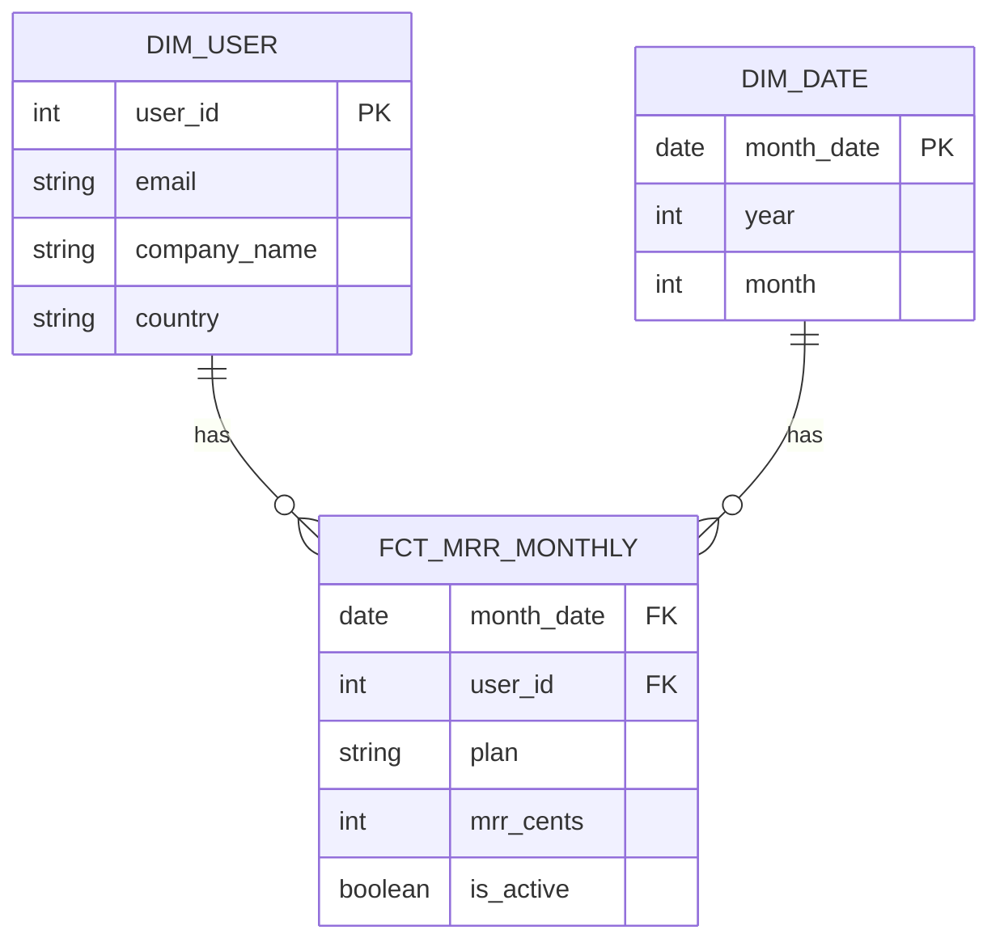
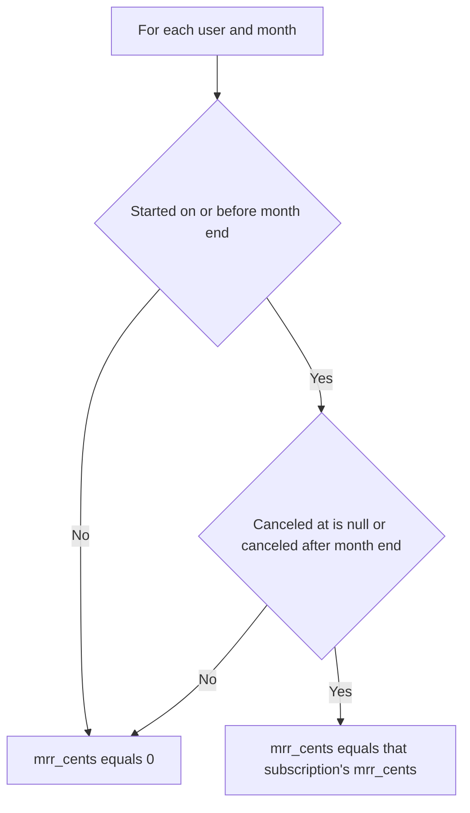

# Lecture 2 — Modeling Users and Revenue

> **Duration:** ~2 hours. **Outcome:** You can design and build conformed dimension tables (`dim_user`, `dim_date`) and a monthly recurring-revenue fact table (`fct_mrr_monthly`), normalize annual plans into monthly terms, and produce one MRR number the whole company can query instead of re-deriving.

This lecture assumes the staging pattern from Lecture 1. We'll build the actual `stg_subscriptions` model here as the bridge into marts — Exercise 1 asks you to build the *rest* of the staging layer (`stg_users`, `stg_events`) yourself using this as a worked template.

## 1. Dimensions and facts — the two kinds of mart tables

Every mart table is one of two things:

- **A dimension** describes *who, what, or when* — a relatively slow-changing entity you'll filter and group by. `dim_user` (one row per customer), `dim_date` (one row per calendar day), `dim_plan` (one row per plan tier).
- **A fact** records *something measurable that happened, or a measurable state at a point in time* — a numeric event or snapshot you'll sum, average, or count. `fct_mrr_monthly` (revenue per user per month), `fct_events` (one row per product event), `fct_subscription_changes` (one row per upgrade/downgrade/cancellation).

The pattern — dimensional modeling — comes from data-warehousing practice going back decades (Kimball-style star schemas), and it survives into the modern ELT stack unchanged: **facts have foreign keys into dimensions**, dimensions carry the descriptive attributes, and a fact table's numeric measures are only ever meaningful in the context of dimensions you join to it.

```
        dim_user                    fct_mrr_monthly                 dim_date
┌────────────────────┐      ┌────────────────────────────┐    ┌──────────────────┐
│ user_id (PK)         │◀────│ user_id (FK)                  │────▶│ date (PK)          │
│ email                 │      │ month_date (FK)               │    │ year               │
│ company_name          │      │ plan                          │    │ month               │
│ country               │      │ mrr_cents                     │    │ month_start        │
│ signup_date           │      │ is_active                     │    │ month_end           │
└────────────────────┘      └────────────────────────────┘    └──────────────────┘
```

**"Conformed"** means: `dim_user` is built exactly once, and *every* fact table in the warehouse — this week's `fct_mrr_monthly`, later weeks' `fct_funnel_events`, `fct_ltv` — joins to the very same `dim_user`. If Week 8's experimentation fact and this week's revenue fact each built their own slightly-different user dimension, you'd be right back to three-numbers-for-one-metric. One `dim_user`, reused everywhere, is what "conformed" buys you.


*Facts carry foreign keys into conformed dimensions - the star schema shape.*

## 2. Building `dim_user`

`dim_user` is staging's `stg_users` with essentially no further transformation — dimensions are usually thin wrappers once staging has done the cleaning:

```sql
CREATE TABLE dim_user AS
SELECT
    user_id,
    email,
    full_name,
    company_name,
    country,
    signup_date,
    signup_plan
FROM stg_users;

-- a real primary key, enforced (SQLite: use INTEGER PRIMARY KEY at CREATE TABLE time instead)
ALTER TABLE dim_user ADD PRIMARY KEY (user_id);   -- PostgreSQL syntax
```

That's it. Fifteen rows, one per Crunch Flow customer, and every later fact table's `user_id` foreign key points here.

## 3. Building `dim_date`

Nearly every fact table in this course is time-grained, so a **date dimension** — one row per calendar day (or, for a monthly-grain fact like ours, one row per month) — pays for itself immediately. Rather than repeating `EXTRACT(YEAR FROM ...)` logic in every query, you compute it once:

```sql
-- PostgreSQL: generate one row per month for a 2-year span
CREATE TABLE dim_date AS
SELECT
    d::date                                   AS month_date,     -- first day of the month
    EXTRACT(YEAR FROM d)::int                 AS year,
    EXTRACT(MONTH FROM d)::int                AS month,
    TO_CHAR(d, 'YYYY-MM')                     AS year_month,
    (d + INTERVAL '1 month - 1 day')::date    AS month_end
FROM generate_series('2025-01-01'::date, '2026-12-01'::date, '1 month'::interval) AS d;
```

```sql
-- SQLite: no generate_series, so build the spine with a recursive CTE instead
CREATE TABLE dim_date AS
WITH RECURSIVE months(month_date) AS (
    SELECT date('2025-01-01')
    UNION ALL
    SELECT date(month_date, '+1 month') FROM months WHERE month_date < '2026-12-01'
)
SELECT
    month_date,
    CAST(strftime('%Y', month_date) AS INTEGER) AS year,
    CAST(strftime('%m', month_date) AS INTEGER) AS month,
    strftime('%Y-%m', month_date)               AS year_month,
    date(month_date, '+1 month', '-1 day')      AS month_end
FROM months;
```

This "date spine" trick — generate every period you care about, even ones with zero activity — is the single most useful pattern in this lecture. Without it, a month where a customer churned and had *zero* revenue simply wouldn't appear in a naive `GROUP BY`, silently making a churn month look like missing data instead of $0 revenue. You'll lean on this again in Weeks 4, 8, and 11.

## 4. Building `stg_subscriptions` — the unification staging couldn't skip

Lecture 1 said staging does "no joins across sources." `stg_subscriptions` is the one deliberate exception this week, because subscriptions genuinely live in two places and someone has to pick a winner *before* marts can use a single number. We do that picking here, in a clearly named staging model, not silently inside a mart:

```sql
CREATE VIEW stg_subscriptions AS
SELECT
    u.user_id,
    s.subscription_id,
    s.plan_name                                              AS plan,
    s.status,
    -- normalize every plan to a MONTHLY dollar amount, in cents, regardless of billing_interval
    CASE s.billing_interval
        WHEN 'year' THEN ROUND(s.amount_cents / 12.0)
        ELSE s.amount_cents
    END                                                       AS mrr_cents,
    s.billing_interval,
    s.created                                                 AS started_on,
    s.canceled_at
FROM raw_stripe_subscriptions s
JOIN stg_users u ON u.email = s.customer_email;
```

Notice this **keeps every row**, including Ben's and Drew's second subscription. Those two rows per customer are **not duplicates** — they're two distinct real-world subscription periods (an old plan that was canceled, and a new plan that replaced it), and a monthly revenue history needs both: Ben genuinely paid Growth-tier money in January and February, and only started paying Scale-tier money in March. Deduping down to "only the latest row per customer" would silently erase that history and make his January/February MRR look like `$0` — a bug, not a simplification. (If you ever need just a customer's *current* plan — say, for feature-gating — that's a separate, simple query: `WHERE status = 'active'`. Don't bake that filter into the staging model itself.)

Two design decisions worth naming out loud, because RevOps decisions are exactly this kind of thing:

1. **Stripe, not the app database, is the source of truth for money.** `stg_subscriptions` reads only from `raw_stripe_subscriptions`. The app database's subscription record is useful for feature-gating and support tooling, but it is never used to compute revenue in this warehouse — that's precisely the discrepancy Exercise 3 makes you confront and document.
2. **Annual is normalized to monthly at the staging boundary**, once, so every mart and every query downstream can just sum `mrr_cents` without re-deriving "oh wait, is this one an annual plan?" every time. Opal's $2,990/year Scale plan becomes `ROUND(299000 / 12.0) = 24917` cents/month here — and nowhere else in the warehouse does that division happen again.

## 5. Building `fct_mrr_monthly` — one row per user per month

This is the fact table the rest of the course leans on. Grain: **one row per `(user_id, month)`**, using the `dim_date` spine so months with zero revenue still appear as `0`, not as a missing row.

```sql
CREATE TABLE fct_mrr_monthly AS
SELECT
    dd.month_date,
    du.user_id,
    COALESCE(
        (SELECT s.mrr_cents
         FROM stg_subscriptions s
         WHERE s.user_id = du.user_id
           AND s.started_on <= dd.month_end
           AND (s.canceled_at IS NULL OR s.canceled_at > dd.month_end)
        ), 0
    ) AS mrr_cents,
    (SELECT s.plan
     FROM stg_subscriptions s
     WHERE s.user_id = du.user_id
       AND s.started_on <= dd.month_end
       AND (s.canceled_at IS NULL OR s.canceled_at > dd.month_end)
    ) AS plan,
    CASE WHEN (SELECT s.mrr_cents FROM stg_subscriptions s
               WHERE s.user_id = du.user_id
                 AND s.started_on <= dd.month_end
                 AND (s.canceled_at IS NULL OR s.canceled_at > dd.month_end)) > 0
         THEN TRUE ELSE FALSE END AS is_active
FROM dim_date dd
CROSS JOIN dim_user du
WHERE dd.month_date BETWEEN '2025-01-01' AND '2025-06-01';
```

Read the `WHERE` inside each correlated subquery carefully: a subscription counts toward a given month if it **started on or before** that month ended, **and** either was never canceled or was canceled **after** that month ended. That's how Ben's canceled old subscription (ended 2025-03-10) correctly stops contributing MRR from March onward, while his new Scale subscription picks up the same month.


*The per-row decision that gives every user a row in every month, active or not.*

## 6. The one trusted MRR number

With `fct_mrr_monthly` built, "what's our MRR?" has exactly one answer, for any month you ask about:

```sql
SELECT month_date, SUM(mrr_cents) / 100.0 AS mrr_usd, COUNT(*) FILTER (WHERE is_active) AS active_customers
FROM fct_mrr_monthly
GROUP BY month_date
ORDER BY month_date;
```

Running this against the seed data for `2025-05-01` gives:

| month_date | mrr_usd | active_customers |
|---|---:|---:|
| 2025-05-01 | 1858.17 | 12 |

Twelve active customers, $1,858.17 in normalized monthly recurring revenue, ARR ≈ $22,298. Every number in that row traces back through `fct_mrr_monthly` → `stg_subscriptions` → `raw_stripe_subscriptions`, and you can re-run the query at any point and get the same answer — that's the whole point of building it this way instead of typing a number into a slide.

**(SQLite note:** SQLite doesn't support `FILTER`; write `SUM(CASE WHEN is_active THEN 1 ELSE 0 END)` instead.)

## 7. Why this beats "just query Stripe directly"

You might reasonably ask: if Stripe already has this data, why not just query Stripe's API for MRR every time you need it? Three reasons this warehouse approach wins for anything beyond a single number-on-a-dashboard:

1. **You need it joined to product data.** "What's MRR for customers who activated within 3 days of signup?" is not a question Stripe can answer — it needs `raw_events` joined to `fct_mrr_monthly` through `dim_user`. That join only exists in your warehouse.
2. **You need history Stripe doesn't expose the way you want it.** Stripe shows you current state well; reconstructing "what was our MRR on March 1st, including subscriptions that have since changed" from the live API is painful. `fct_mrr_monthly` has that answer sitting in a table.
3. **You need one number multiple tools can share.** A BI dashboard, a Python forecasting notebook (Week 11), and a churn model (Week 10) all need the *same* MRR. Point three different tools at three different live API calls and you're back to the three-numbers problem this lecture opened with.

## 8. Check yourself

- What's the difference between a dimension and a fact, in one sentence each?
- Why does "conformed" matter — what breaks if two different weeks of this course each build their own `dim_user`?
- Why is a `dim_date` spine necessary for a fact table like `fct_mrr_monthly`? What would silently go wrong without it?
- Where, specifically, does this warehouse decide that Stripe — not the app database — is the source of truth for MRR? Why there and not in the mart?
- Walk through, in words, why Ben's canceled Growth subscription doesn't add to his March MRR even though its `started_on` date is before March.
- If a customer signs up for an **annual** plan mid-year, where exactly does the annual-to-monthly conversion happen, and why does it happen only once?

If those are automatic, Lecture 3 covers the operational discipline that keeps this pipeline correct over time: idempotent loads, data tests, and documented definitions.

## Further reading

- **Kimball Group — dimensional modeling primer:** <https://www.kimballgroup.com/data-warehouse-business-intelligence-resources/kimball-techniques/dimensional-modeling-techniques/>
- **PostgreSQL — `generate_series`:** <https://www.postgresql.org/docs/current/functions-srf.html>
- **PostgreSQL — window functions (`ROW_NUMBER`):** <https://www.postgresql.org/docs/current/tutorial-window.html>
- **PostgreSQL — aggregate `FILTER` clause:** <https://www.postgresql.org/docs/current/sql-expressions.html#SYNTAX-AGGREGATES>
- **SQLite — date and time functions (for the recursive-CTE spine):** <https://www.sqlite.org/lang_datefunc.html>
