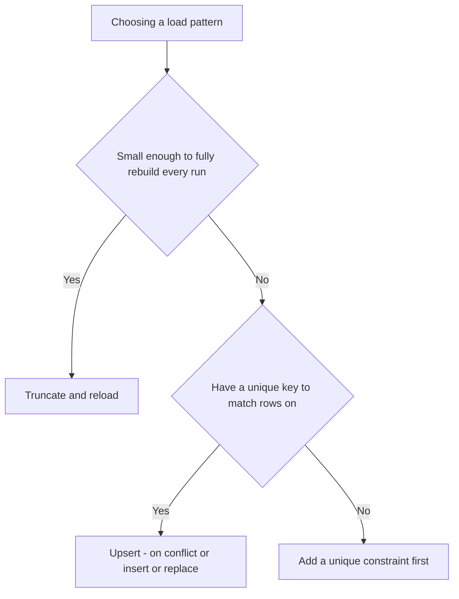
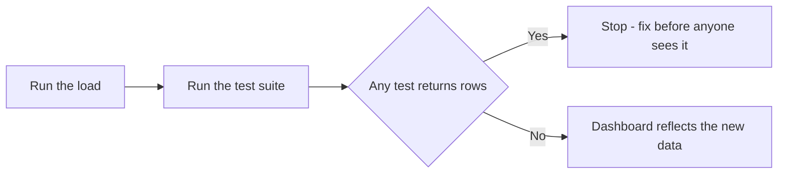

# Lecture 3 — RevOps Hygiene

> **Duration:** ~2 hours. **Outcome:** You can write idempotent SQL loads that are safe to re-run, write data tests as plain SQL assertions that fail loudly on bad data, write a documented metric-definitions glossary, and give a specific, evidence-backed answer to "why not just use a spreadsheet?"

Everything in Lectures 1–2 built the pipeline. This lecture makes sure it stays correct after you've run it fifty times, after a webhook double-fires, and after someone six months from now who isn't you has to trust it without asking you first.

## 1. Idempotence — the property that makes reruns safe

A load is **idempotent** if running it once and running it five times produce the exact same result. This matters constantly in a real pipeline: a scheduled job re-runs nightly, a webhook occasionally fires twice, someone manually kicks off a backfill after fixing a bug. If your load isn't idempotent, any of those doubles your revenue.

### The naive, dangerous way

```sql
-- DON'T DO THIS as a recurring load
INSERT INTO fct_mrr_monthly (month_date, user_id, mrr_cents, plan, is_active)
SELECT month_date, user_id, mrr_cents, plan, is_active FROM /* ... the query from Lecture 2 ... */;
```

Run this pipeline twice and `fct_mrr_monthly` now has **two rows** for every `(user_id, month_date)` pair, and `SUM(mrr_cents)` silently doubles. Nobody gets an error. The dashboard just quietly lies.

### Pattern 1 — truncate and reload (simple, correct, fine for small marts)

For a mart table you fully rebuild from staging every time (which is most marts in a small warehouse — they're cheap to recompute), the simplest idempotent pattern is: wipe it, rebuild it, in one transaction.

```sql
BEGIN;

TRUNCATE TABLE fct_mrr_monthly;

INSERT INTO fct_mrr_monthly (month_date, user_id, mrr_cents, plan, is_active)
SELECT
    dd.month_date,
    du.user_id,
    COALESCE(sub.mrr_cents, 0),
    sub.plan,
    COALESCE(sub.mrr_cents, 0) > 0
FROM dim_date dd
CROSS JOIN dim_user du
LEFT JOIN LATERAL (
    SELECT s.mrr_cents, s.plan
    FROM stg_subscriptions s
    WHERE s.user_id = du.user_id
      AND s.started_on <= dd.month_end
      AND (s.canceled_at IS NULL OR s.canceled_at > dd.month_end)
    LIMIT 1
) sub ON TRUE
WHERE dd.month_date BETWEEN '2025-01-01' AND '2025-06-01';

COMMIT;
```

Run this ten times: `fct_mrr_monthly` has the exact same rows every time, because the `TRUNCATE` guarantees a clean slate before each `INSERT`. Wrapping it in a transaction (`BEGIN`/`COMMIT`) means a crash mid-load leaves the *old* correct table intact rather than a half-emptied one — the truncate and the insert either both happen or neither does.

**(SQLite note:** SQLite doesn't have `TRUNCATE`; use `DELETE FROM fct_mrr_monthly;` instead — functionally equivalent for our purposes. SQLite also doesn't support `LATERAL` joins; use the correlated-subquery form from Lecture 2 instead.)

### Pattern 2 — upsert (`ON CONFLICT` / `INSERT OR REPLACE`) for incremental loads

Truncate-and-reload doesn't scale once a table is too large to fully rebuild every run (imagine `fct_events` with a billion rows). The alternative is an **upsert**: insert new rows, and where a row with the same key already exists, update it instead of duplicating it. This requires a real uniqueness constraint on the key you're loading against.

```sql
-- PostgreSQL: requires a UNIQUE or PRIMARY KEY constraint on (user_id, month_date)
ALTER TABLE fct_mrr_monthly ADD CONSTRAINT fct_mrr_monthly_uq UNIQUE (user_id, month_date);

INSERT INTO fct_mrr_monthly (user_id, month_date, mrr_cents, plan, is_active)
VALUES (9, '2025-04-01', 2900, 'Starter', TRUE)
ON CONFLICT (user_id, month_date)
DO UPDATE SET
    mrr_cents  = EXCLUDED.mrr_cents,
    plan       = EXCLUDED.plan,
    is_active  = EXCLUDED.is_active;
```

```sql
-- SQLite equivalent: INSERT OR REPLACE (requires the same UNIQUE constraint)
INSERT OR REPLACE INTO fct_mrr_monthly (user_id, month_date, mrr_cents, plan, is_active)
VALUES (9, '2025-04-01', 2900, 'Starter', 1);
```

Run either statement fifty times with the same values and the row count never changes — that's the definition of idempotent. `EXCLUDED` (Postgres) refers to the row that *would* have been inserted, letting you overwrite the existing row's columns with the new values instead of erroring or duplicating.

**Rule of thumb for this course:** for the mart sizes we work with (thousands, not billions, of rows), **truncate-and-reload is simpler, easier to reason about, and just as correct** — prefer it. Reach for upsert only when a table is genuinely too large to fully rebuild on every run, or when you're loading incrementally from an append-only event stream where "the whole history" isn't available to recompute from.


*Truncate-and-reload by default; reach for upsert only when rebuilding gets too expensive.*

## 2. Data tests — SQL assertions that fail loudly

A data test is a query designed to **return zero rows when the data is healthy and one-or-more rows when it isn't.** Run your test suite after every load; if any test returns rows, the pipeline failed and you stop before anyone sees a bad dashboard. This needs no special tooling — it's plain SQL, run in sequence, with a script that checks each result's row count.


*Tests sit as a gate between a load finishing and anyone trusting the result.*

### Not-null

```sql
-- FAILS (returns rows) if any user is missing a required field
SELECT user_id FROM dim_user WHERE email IS NULL OR signup_date IS NULL;
```

### Uniqueness

```sql
-- FAILS if fct_mrr_monthly has duplicate (user_id, month_date) — the exact bug
-- an unguarded rerun of the naive INSERT from Section 1 would cause
SELECT user_id, month_date, COUNT(*)
FROM fct_mrr_monthly
GROUP BY user_id, month_date
HAVING COUNT(*) > 1;
```

### Accepted values

```sql
-- FAILS if plan drifts outside the three known tiers — catches a typo
-- or an un-conformed legacy name leaking through staging
SELECT DISTINCT plan
FROM fct_mrr_monthly
WHERE plan IS NOT NULL AND plan NOT IN ('Starter', 'Growth', 'Scale');
```

### Referential integrity

```sql
-- FAILS if fct_mrr_monthly references a user_id that doesn't exist in dim_user
-- (a classic sign staging and marts were built from data at different points in time)
SELECT f.user_id
FROM fct_mrr_monthly f
LEFT JOIN dim_user u ON u.user_id = f.user_id
WHERE u.user_id IS NULL;
```

### Non-negative revenue

```sql
-- FAILS if any month shows negative MRR — a sign of a sign error somewhere upstream
SELECT user_id, month_date, mrr_cents FROM fct_mrr_monthly WHERE mrr_cents < 0;
```

### Freshness (staleness check)

```sql
-- FAILS if the mart's latest month is more than 35 days old — the load
-- silently stopped running and nobody would otherwise notice
SELECT MAX(month_date) AS latest_month
FROM fct_mrr_monthly
HAVING MAX(month_date) < CURRENT_DATE - INTERVAL '35 days';
```

Chain a handful of these into one test script, and you have a real, if lightweight, version of what tools like dbt call "tests" — the pattern, not the tool, is what matters, and plain SQL gets you the whole benefit. Challenge 2 has you build a fuller suite.

## 3. Documented metric definitions

A metric definition is worthless if it lives only in someone's head or in a comment nobody reads. Write it down, next to the code that computes it, in a place anyone can find:

```markdown
## MRR (Monthly Recurring Revenue)

**Definition:** the normalized monthly value of all *active* subscriptions,
as of the last day of the given month.

**Computed in:** `fct_mrr_monthly.mrr_cents`, summed by `month_date`.

**Source of truth:** `raw_stripe_subscriptions` (billing system), NOT the
internal app database — see Lecture 1 / Exercise 3 for why.

**Rules:**
- Annual plans are divided by 12 and normalized to a monthly figure, once,
  in `stg_subscriptions`.
- A subscription counts toward a month if it started on or before that
  month's last day, and either was never canceled or was canceled after
  that month's last day.
- Canceled subscriptions contribute `0`, not a negative number, starting
  the month after cancellation.
- A customer with $0 MRR (e.g., mid-cancellation, or before their first
  paid month) still has a row in `fct_mrr_monthly` for every month in
  the date spine — they are not simply absent.

**Owner:** RevOps. Changes to this definition require updating this
document and re-running the full mart rebuild (Section 1).
```

This is the practical shape of a "semantic layer" for a course-sized warehouse — a markdown file, colocated with the SQL, that a metric's *name* always points back to. `resources.md` and the mini-project both ask you to keep exactly this kind of file current.

## 4. Why a warehouse beats a spreadsheet — with specifics, not vibes

You'll be asked this question in an interview or by a skeptical stakeholder. Have real answers, not "spreadsheets are old-fashioned":

| Failure mode | In a spreadsheet | In this warehouse |
|---|---|---|
| Someone fat-fingers a formula | Silent — the cell just shows a wrong number, and formulas are invisible to anyone who didn't write them | A data test (Section 2) catches an impossible value (negative MRR, unknown plan) immediately |
| Two people edit at once | Version conflict, or one person's edit silently overwrites another's | A relational database enforces constraints (`UNIQUE`, `NOT NULL`) that reject bad concurrent writes outright |
| "Why does this number say $1,850?" | You trace it by clicking through formulas, cell by cell, hoping nobody broke the chain | You run the exact `SELECT` that produced it, against raw data that was never modified — full audit trail, always |
| Re-running last month's numbers after a bug fix | Manually re-enter or re-paste; easy to miss a row | Re-run the same idempotent SQL load; guaranteed identical result every time (Section 1) |
| 10,000 rows of subscription history | Spreadsheets slow down and get unwieldy well before this | A relational database is built for exactly this scale and beyond |
| Reproducibility for an external audit or a new hire | "Ask the person who built it" — if they've left, you're stuck | The SQL *is* the documentation; anyone with database access can read and re-run it |

None of this means spreadsheets are useless — they're excellent for a one-off scratch calculation or presenting a number someone else already computed. What they are *not* good for is being the **system of record** for a metric multiple people and multiple tools depend on. That's precisely why this course's data-tooling rule exists: **any time you're storing, modeling, or querying data as this course's persistent record, it's SQL or pandas — never a spreadsheet.**

## 5. Check yourself

- What specifically breaks if you re-run a non-idempotent `INSERT`-only load twice?
- Name the two idempotent-load patterns from this lecture and say, in one sentence each, when you'd reach for one over the other.
- Write (in words, not SQL) a data test that would have caught the naive-reload bug from Section 1 before anyone saw a doubled MRR number.
- Why does a metric's written definition need to name its *source of truth*, not just its formula?
- Give one specific, concrete failure mode a spreadsheet has that a warehouse with tested, idempotent loads doesn't.
- Who "owns" a metric's definition in this framework, and what does that ownership actually require them to do?

If those are automatic, you're ready for the exercises — Exercise 1 builds the full staging layer, Exercise 2 builds `fct_mrr_monthly` from scratch yourself, and Exercise 3 makes you resolve the three real discrepancies baked into this week's seed data.

## Further reading

- **PostgreSQL — `INSERT ... ON CONFLICT`:** <https://www.postgresql.org/docs/current/sql-insert.html#SQL-ON-CONFLICT>
- **PostgreSQL — Transactions:** <https://www.postgresql.org/docs/current/tutorial-transactions.html>
- **SQLite — `INSERT OR REPLACE` / conflict resolution:** <https://www.sqlite.org/lang_conflict.html>
- **SQLite — `UNIQUE` constraints:** <https://www.sqlite.org/lang_createtable.html#uniqueconst>
- **dbt — "What are tests?" (concept reference; this course implements the idea in plain SQL, no dbt required):** <https://docs.getdbt.com/docs/build/data-tests>
