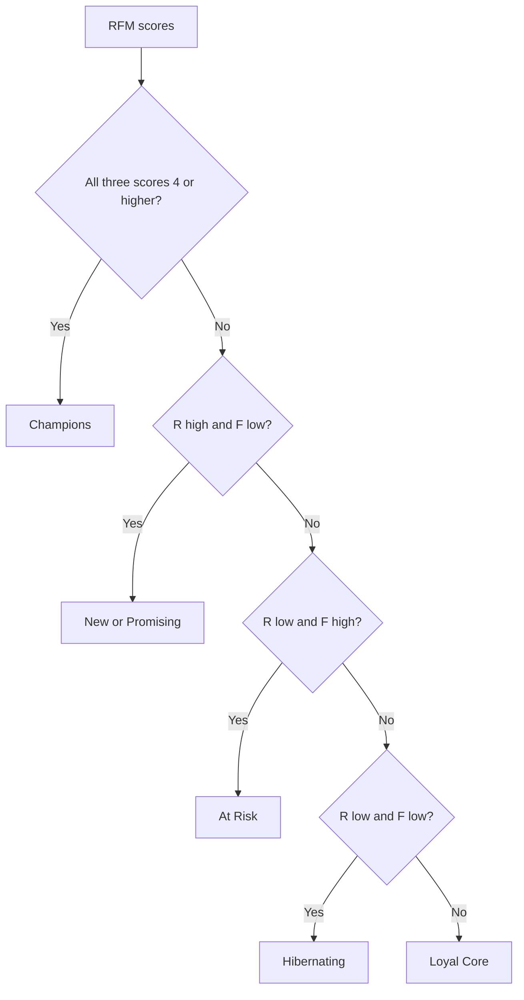

# Lecture 1 — RFM Segmentation

> **Duration:** ~2 hours. **Outcome:** You can compute recency, frequency, and monetary value for every customer in SQL, turn the three into 1–5 scores with `NTILE`, combine the scores into a value tier, and handle the `NULL`-recency case (a customer with zero purchases) without it silently corrupting your tiers.

## 1. What RFM actually measures, and why it's still used

RFM is forty years old — it comes from 1990s direct-mail catalog targeting — and it's still the first segmentation almost every company builds, for one reason: **it only needs a table of purchases.** No experiment infrastructure, no product-analytics pipeline, no machine learning. If you can `SELECT customer_id, order_date, amount FROM orders`, you can build RFM today.

It scores every customer on three independent axes:

- **Recency (R)** — how long ago was their *last* purchase? Fresher is better; recency is the single strongest predictor of whether someone buys again.
- **Frequency (F)** — how many purchases, total? Repeat buyers are more likely to keep being repeat buyers.
- **Monetary (M)** — how much have they spent, total? Bigger spenders are worth more attention, obviously — but M is deliberately scored *last* in priority, because a single huge one-time order can make a customer look valuable when R and F say they've never come back.

The insight worth sitting with: **a customer who bought once, six months ago, for $5,000 is not automatically better than a customer who buys $200 every three weeks.** RFM forces you to look at all three axes together instead of defaulting to "sort by lifetime spend," which is what most people do when nobody stops them.

This week we compute RFM on **Crunch Flow's `orders` table** — the a la carte add-ons customers buy on top of their subscription (extra seats, integration packs, onboarding, support, reporting). It's a genuine purchase-history table, so RFM applies to it cleanly, exactly like it would to an e-commerce `orders` table. (Subscription MRR itself doesn't have a natural "recency" or "frequency" — it's a steady drip, not a series of discrete purchases — which is exactly why this week's schema gives you a separate `orders` table instead of trying to force RFM onto `mrr`.)

## 2. Step 1 — compute the raw R, F, M numbers

Start with one CTE that rolls `orders` up to one row per customer:

```sql
WITH rfm_base AS (
    SELECT
        c.customer_id,
        c.company_name,
        MAX(o.order_date)                              AS last_order_date,
        COUNT(o.order_id)                               AS frequency,
        ROUND(COALESCE(SUM(o.amount), 0), 2)            AS monetary
    FROM customers c
    LEFT JOIN orders o ON o.customer_id = c.customer_id
    GROUP BY c.customer_id, c.company_name
)
SELECT * FROM rfm_base ORDER BY customer_id;
```

Two choices in that query are load-bearing:

- **`LEFT JOIN`, not `JOIN`.** Two customers (`22` Halcyon Health, `24` Bluepeak Media) have never placed an order. An inner join would silently drop them from the segmentation entirely — and "customers who've never bought an add-on" is precisely the group a value-tier analysis needs to be able to name, not hide.
- **`COALESCE(SUM(...), 0)`** on monetary. `SUM` over zero matching rows returns `NULL`, not `0` — a classic aggregate-`NULL` trap from Week 3 (C33). Left uncorrected, Halcyon's and Bluepeak's `monetary` would print as `NULL`, which sorts unpredictably and breaks arithmetic downstream.

Recency needs one more step: turn `last_order_date` into a **number of days** relative to "today" — and decide what "recency" means for a customer with **no** last order date at all.

```sql
SELECT
    customer_id,
    company_name,
    last_order_date,
    CAST(julianday('2025-12-31') - julianday(last_order_date) AS INTEGER) AS recency_days
FROM rfm_base
ORDER BY customer_id;
-- customers 22 and 24: recency_days comes back NULL, because
-- julianday(NULL) is NULL and anything minus NULL is NULL.
```

*(PostgreSQL syntax: `('2025-12-31'::date - last_order_date)` returns an integer directly — no `julianday` needed. SQLite needs the `julianday()` subtraction shown above.)*

**Don't leave that `NULL` alone.** A customer who has never bought an add-on isn't "unknown recency" — they're the *worst possible* recency, worse than someone who bought eleven months ago. `COALESCE` it to a value that will always sort last:

```sql
COALESCE(
    CAST(julianday('2025-12-31') - julianday(last_order_date) AS INTEGER),
    9999
) AS recency_days
```

`9999` is a sentinel — an intentionally huge number that guarantees "never purchased" always ranks as the coldest possible recency, without a special-cased `CASE` branch cluttering every downstream query. (Sentinel values are a blunt tool — document them. A stray `9999` reappearing in an average or a chart three queries later, with no comment explaining it, is exactly the kind of bug that costs someone an afternoon.)

## 3. Step 2 — score each axis 1–5 with `NTILE`

Raw recency-in-days, order-count, and dollars-spent live on three completely different scales — you can't compare a `recency_days` of `9` to a `frequency` of `9` and say anything meaningful. RFM's fix is to **rank each axis into quintiles** (five equal-sized buckets, 1 = worst, 5 = best) so all three axes end up on the same 1–5 scale.

`NTILE(5)` is the tool. It splits rows, ordered by an expression, into five as-equal-as-possible groups:

```sql
WITH rfm_base AS (
    SELECT
        c.customer_id,
        c.company_name,
        COALESCE(CAST(julianday('2025-12-31') - julianday(MAX(o.order_date)) AS INTEGER), 9999) AS recency_days,
        COUNT(o.order_id)                                                                        AS frequency,
        ROUND(COALESCE(SUM(o.amount), 0), 2)                                                     AS monetary
    FROM customers c
    LEFT JOIN orders o ON o.customer_id = c.customer_id
    GROUP BY c.customer_id, c.company_name
)
SELECT
    *,
    -- recency_days ASCENDING means LOWEST (best) recency lands in bucket 1 —
    -- so we flip it: 6 minus the bucket number turns "bucket 1" into "score 5"
    (6 - NTILE(5) OVER (ORDER BY recency_days)) AS r_score,
    NTILE(5) OVER (ORDER BY frequency)          AS f_score,
    NTILE(5) OVER (ORDER BY monetary)           AS m_score
FROM rfm_base
ORDER BY customer_id;
```

**Read the `r_score` inversion twice — it's the single most common RFM bug.** `NTILE(5) OVER (ORDER BY recency_days)` puts the *smallest* `recency_days` values (the customers who bought most recently — the good ones) into bucket **1**, because `NTILE` numbers ascending buckets starting at 1 for the lowest sort key. But in RFM, a score of **5** always means "best." So for `recency_days` specifically — where *low* is good — you have to flip the bucket number: `6 - NTILE(...)` turns bucket 1 (best) into score 5, and bucket 5 (worst — the 9999-sentinel customers) into score 1. `frequency` and `monetary` don't need the flip, because for both of them *high* is already good and `NTILE`'s bucket 5 already means "top fifth."

Run the full query against the seed and you'll see something like:

| customer_id | company_name | recency_days | frequency | monetary | r_score | f_score | m_score | rfm_total |
|---:|---|---:|---:|---:|---:|---:|---:|---:|
| 2 | Lumen Studio | 5 | 7 | 487.50 | 5 | 5 | 4 | 14 |
| 1 | Northwind Traders | 9 | 8 | 861.17 | 4 | 5 | 5 | 14 |
| 4 | BrightPath Consulting | 9 | 9 | 1517.40 | 4 | 5 | 5 | 14 |
| … | … | … | … | … | … | … | … | … |
| 24 | Bluepeak Media | 9999 | 0 | 0.00 | 1 | 1 | 1 | 3 |
| 22 | Halcyon Health | 9999 | 0 | 0.00 | 1 | 1 | 1 | 3 |

Halcyon and Bluepeak land at the absolute floor — `1/1/1`, `rfm_total = 3` — exactly where "never bought an add-on" belongs. That's the `NULL`-handling paying off; had you left `recency_days` as `NULL`, `NTILE` in most engines would either error, silently exclude those rows, or scatter them unpredictably depending on the engine's `NULL`-ordering default (Postgres sorts `NULL` last by default; SQLite sorts it first) — three different wrong answers, none of which you'd notice without checking.

## 4. Step 3 — combine scores into a value tier

`rfm_total` (the sum of the three scores, 3–15) is a starting point, but a single number throws away information — a `9` from `(5,3,1)` (recent, moderately frequent, cheap) is a very different customer from a `9` from `(1,4,4)` (long-gone, but a former mid-spender). Most real RFM implementations instead pattern-match on the **combination** of scores:

```sql
WITH scored AS ( /* ...the query above, aliased rfm_base + NTILE columns... */ )
SELECT
    *,
    CASE
        WHEN r_score >= 4 AND f_score >= 4 AND m_score >= 4 THEN 'Champions'
        WHEN r_score >= 4 AND f_score <= 2                  THEN 'New/Promising'
        WHEN r_score <= 2 AND f_score >= 3                  THEN 'At Risk'
        WHEN r_score <= 2 AND f_score <= 2                  THEN 'Hibernating'
        ELSE 'Loyal Core'
    END AS rfm_segment
FROM scored;
```

The order of the `WHEN` clauses matters — `CASE` takes the first match, so put the most specific, highest-priority patterns first (`Champions` requires all three scores high; check that before the looser `At Risk`/`Hibernating` catch-alls).


*The CASE statement's WHEN clauses tested top to bottom, most specific pattern first.*

Against Crunch Flow's 30 customers, this produces:

| rfm_segment | n | avg_monetary | total_monetary |
|---|---:|---:|---:|
| Champions | 5 | $916.74 | $4,583.71 |
| Loyal Core | 8 | $493.73 | $3,949.83 |
| At Risk | 6 | $442.59 | $2,655.54 |
| New/Promising | 5 | $203.69 | $1,018.44 |
| Hibernating | 6 | $87.45 | $524.70 |

Read that table with a business eye, not just a query eye: **5 Champions generate almost as much add-on revenue ($4,584) as the 8-customer Loyal Core segment ($3,950)** — a small group carrying outsized weight is the single most common finding in every real RFM analysis, and it's why "treat all customers the same" is such an expensive default.

## 5. The tier boundaries are a choice, not a law

Sit with this before you trust any RFM output, yours or a vendor's: **the `>= 4`, `<= 2` cutoffs above are arbitrary.** `NTILE(5)` guarantees exactly five *equal-sized* buckets regardless of whether the underlying data actually clusters into five groups — feed it 30 customers who are all nearly identical, and `NTILE` will still confidently sort them into five tiers with score differences that mean nothing. Two consequences:

- **Quintile boundaries are sample-relative, not absolute.** A customer scored `r_score = 5` this month could be `r_score = 3` next quarter — not because they changed, but because everyone else's recency improved and pushed the buckets around. RFM segments need periodic recomputation and light interpretation, not a one-time label stapled to a customer forever.
- **The tier `CASE` logic is a hypothesis, not ground truth.** In this week's seed data, look closely at customers `11`–`15` and `21`, `23`, `25` — several of them get pulled into `Loyal Core` or `New/Promising` by the mechanical score even though their underlying story (a brand-new signup buying its first add-on; a Starter-plan customer with almost no engagement) doesn't quite match the label. That's not a bug in the query — it's what quintile-based scoring on 30 rows genuinely produces at the edges. Challenge 1 makes you find and defend (or fix) exactly these mismatches.

## 6. Check yourself

- Why `LEFT JOIN` from `customers` to `orders`, and not the reverse?
- Why does `SUM(o.amount)` need `COALESCE(..., 0)` but `COUNT(o.order_id)` doesn't?
- Why is `r_score` computed as `6 - NTILE(5) OVER (ORDER BY recency_days)` instead of just `NTILE(5) OVER (ORDER BY recency_days)`?
- A customer has never placed an order. What raw `recency_days` value does `julianday('2025-12-31') - julianday(NULL)` produce, and why is a `9999` sentinel safer than leaving it as-is?
- Two customers both have `rfm_total = 9`. Give a plausible `(r,f,m)` triple for each that would produce very different business stories despite the identical total.
- Why is `NTILE(5)`'s guarantee of five *equal-sized* buckets a limitation, not just a convenience?

If those are automatic, Lecture 2 sets purchase history aside entirely and segments the same 30 customers by what they *do* in the product instead of what they *buy*.

## Further reading

- **PostgreSQL — Window functions (`NTILE`, `ROW_NUMBER`):** <https://www.postgresql.org/docs/current/tutorial-window.html>
- **PostgreSQL — `NTILE` reference:** <https://www.postgresql.org/docs/current/functions-window.html>
- **SQLite — Date and time functions (`julianday`):** <https://www.sqlite.org/lang_datefunc.html>
- **PostgreSQL — Aggregate functions and `NULL` behavior:** <https://www.postgresql.org/docs/current/functions-aggregate.html>
