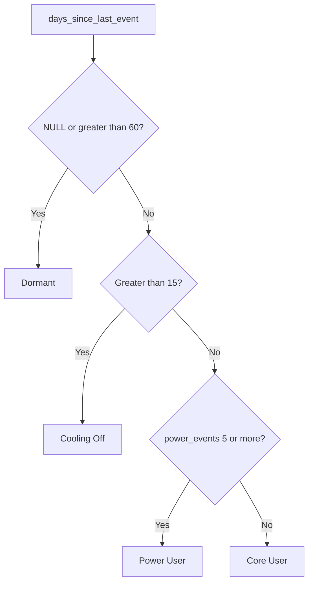

# Lecture 2 — Behavioral Segments

> **Duration:** ~2 hours. **Outcome:** You can build feature-adoption and recency-of-use metrics from a raw event log in SQL, turn them into a behavioral segment (Power User / Core User / Cooling Off / Dormant), and explain why behavioral segments catch trouble RFM structurally cannot.

## 1. Why behavior, when you already have RFM

RFM answers "who's spending money, and when did they last spend it." That's a real, useful signal — and it has a blind spot: **it only sees purchases.** A customer on a flat-rate `Growth` plan who logs in every day, builds automations, and has the whole team using Crunch Flow generates *zero* purchase events unless they happen to buy an add-on that particular week. RFM would score them identically to a customer who signed up and never opened the product again, as long as neither bought anything recently. That's not a small gap — for any subscription business where the core value is usage, not repeat purchase, **behavior is the earlier and more honest signal.**

This lecture builds segments from `product_events` — Crunch Flow's feature-usage log — instead of `orders`. Same 30 customers, same "today" of 2025-12-31, completely different lens.

## 2. The event vocabulary, and why two kinds of feature matter differently

`product_events.event_name` has exactly 8 values, and they split into two meaningfully different groups:

| Category | Events | What they signal |
|---|---|---|
| **Core actions** | `task_created`, `comment_added`, `report_created`, `template_used`, `invite_sent` | Baseline product use — any plan, any skill level, can do these |
| **Power actions** | `automation_triggered`, `integration_connected`, `api_call` | Deep, technical adoption — connecting Crunch Flow to the rest of a company's stack |

This split isn't decoration — it's the single most useful fact in this dataset. A customer who's racked up 40 `task_created` events and nothing else is *active*, but they're one bad week from churning: nothing ties them to the product beyond habit. A customer with even a handful of `automation_triggered` or `integration_connected` events has built the product into their actual workflow — ripping it out means breaking something else. **Power-action adoption is a far stronger churn-resistance signal than raw activity volume**, and any behavioral segmentation that just counts "total events" and stops there is throwing away the most important bit.

## 3. Step 1 — build the per-customer usage profile

Three numbers, one query, `LEFT JOIN` again for the same reason as Lecture 1 — some customers have thin event history and must not silently vanish from the result:

```sql
SELECT
    c.customer_id,
    c.company_name,
    c.plan,
    COUNT(pe.event_id) AS total_events,
    COUNT(DISTINCT pe.event_name) AS distinct_features,
    SUM(CASE WHEN pe.event_name IN ('automation_triggered','integration_connected','api_call')
             THEN 1 ELSE 0 END) AS power_events,
    CAST(julianday('2025-12-31') - julianday(MAX(pe.event_date)) AS INTEGER) AS days_since_last_event
FROM customers c
LEFT JOIN product_events pe ON pe.customer_id = c.customer_id
GROUP BY c.customer_id, c.company_name, c.plan
ORDER BY c.customer_id;
```

Three techniques worth naming:

- **`COUNT(DISTINCT pe.event_name)`** is *feature breadth* — how many of the 8 possible actions this customer has ever taken, at least once. A customer with breadth 8 has tried everything the product offers; a customer with breadth 2 is barely scratching the surface, regardless of how many *times* they've done those two things.
- **`SUM(CASE WHEN ... THEN 1 ELSE 0 END)`** is the pre-`FILTER` way to do a conditional count — this pattern works identically on every SQL engine, including ones that don't support `FILTER (WHERE ...)`. (If your engine does support it — Postgres does — `COUNT(*) FILTER (WHERE pe.event_name IN (...))` is the cleaner spelling of the same thing, straight from Week 1's Lecture 3.)
- **`days_since_last_event`** is recency, exactly like Lecture 1's `recency_days` — except this time it's recency of *use*, not recency of *purchase*. A customer can be perfectly current on `days_since_last_event` while having placed zero orders in months — engagement and spend are genuinely different axes, and conflating them is the single biggest mistake a "customer health score" can make.

Run it, and a handful of rows tell most of the story:

| customer_id | plan | total_events | power_events | days_since_last_event |
|---:|---|---:|---:|---:|
| 3 | Scale | 24 | 14 | 2 |
| 10 | Growth | 17 | 0 | 6 |
| 19 | Growth | 9 | 0 | 67 |
| 27 | Starter | 5 | 0 | 248 |

Customer 3 and customer 10 both used the product *recently* (`days_since_last_event` under a week) — but customer 3 has 14 power events and customer 10 has zero. RFM alone would never surface that difference. It matters: customer 10 is active but shallow; customer 3 is active and embedded.

## 4. Step 2 — turn the profile into a behavioral tier

```sql
WITH usage AS ( /* the query above */ )
SELECT
    *,
    CASE
        WHEN days_since_last_event IS NULL OR days_since_last_event > 60 THEN 'Dormant'
        WHEN days_since_last_event > 15                                  THEN 'Cooling Off'
        WHEN power_events >= 5                                           THEN 'Power User'
        ELSE 'Core User'
    END AS behavior_segment
FROM usage;
```

Notice the **priority order** in this `CASE`: recency is checked *first*, before power-usage depth. That's a deliberate design choice, not an accident — a customer who used to be a heavy automation user but hasn't touched the product in 80 days is `Dormant`, full stop, regardless of how impressive their historical `power_events` count is. Recency gates everything else; depth-of-adoption only matters for customers who are still showing up. Getting this priority backwards — checking `power_events` first — would misclassify a churned power user as still-engaged, which is exactly the kind of false comfort a health score exists to prevent.


*Recency gates the tier first; power-usage depth only breaks the tie for customers who are still active.*

Against the seed data:

| behavior_segment | n | avg_total_events | avg_power_events |
|---|---:|---:|---:|
| Dormant | 10 | 7.5 | 0.4 |
| Core User | 9 | 15.6 | 1.9 |
| Power User | 7 | 21.0 | 9.0 |
| Cooling Off | 4 | 7.8 | 0.3 |

A third of Crunch Flow's customers (10 of 30) are `Dormant` by this definition — no product activity in over 60 days. That's a number a CS team can act on directly: it's an outreach list, not an abstraction.

## 5. Cross-referencing behavior against RFM — where the real insight lives

Neither segmentation alone tells the full story. Cross-tabulating Lecture 1's `rfm_segment` against this lecture's `behavior_segment` does:

```sql
SELECT rt.rfm_segment, bt.behavior_segment, COUNT(*) AS n
FROM rfm_tier rt
JOIN behavior_tier bt USING (customer_id)
GROUP BY rt.rfm_segment, bt.behavior_segment
ORDER BY rt.rfm_segment, n DESC;
```

| rfm_segment | behavior_segment | n |
|---|---|---:|
| At Risk | Dormant | 6 |
| Champions | Power User | 5 |
| Hibernating | Dormant | 4 |
| Hibernating | Cooling Off | 2 |
| Loyal Core | Core User | 7 |
| Loyal Core | Cooling Off | 1 |
| New/Promising | Power User | 2 |
| New/Promising | Core User | 2 |
| New/Promising | Cooling Off | 1 |

Two rows are the whole lecture in miniature:

- **Every single `At Risk` customer (6 of 6) is behaviorally `Dormant`.** The purchase-history signal and the usage signal agree completely — this segment isn't a false alarm, it's confirmed from two independent data sources. That's exactly the kind of cross-validated finding a targeting decision can be built on with confidence.
- **`Loyal Core` is overwhelmingly `Core User` (7 of 8), not `Power User`.** These customers buy add-ons regularly and haven't gone quiet — but almost none of them have adopted automation, integrations, or the API. That's not a churn-risk finding; it's an **expansion opportunity** finding — a very different, and arguably more valuable, action than anything RFM alone would have surfaced.

That second finding is the reason this course builds behavioral segments *in addition to* RFM instead of picking one. They answer different questions, and the customers where they disagree are usually the most interesting ones in the whole dataset.

## 6. Save the pipeline as a view, not a copy-pasted query

By this point you've written the usage-profile CTE chain twice — once for the tier table, once for the cross-tab. That's the signal to stop copy-pasting and promote it to a **view**, exactly the raw → staging → marts instinct from Week 6:

```sql
CREATE VIEW behavior_tier AS
WITH usage AS (
    SELECT
        c.customer_id,
        COUNT(pe.event_id) AS total_events,
        COUNT(DISTINCT pe.event_name) AS distinct_features,
        SUM(CASE WHEN pe.event_name IN ('automation_triggered','integration_connected','api_call')
                 THEN 1 ELSE 0 END) AS power_events,
        CAST(julianday('2025-12-31') - julianday(MAX(pe.event_date)) AS INTEGER) AS days_since_last_event
    FROM customers c
    LEFT JOIN product_events pe ON pe.customer_id = c.customer_id
    GROUP BY c.customer_id
)
SELECT
    *,
    CASE
        WHEN days_since_last_event IS NULL OR days_since_last_event > 60 THEN 'Dormant'
        WHEN days_since_last_event > 15                                  THEN 'Cooling Off'
        WHEN power_events >= 5                                           THEN 'Power User'
        ELSE 'Core User'
    END AS behavior_segment
FROM usage;
```

Now every later query — the Lecture 2 cross-tab, the challenges, the mini-project — just does `SELECT * FROM behavior_tier` or joins to it, instead of re-deriving the `CASE` logic and risking two copies quietly drifting apart (the same "one trusted number" argument Week 6 made for `fct_mrr_monthly`, applied to a segment definition instead of a metric). *(PostgreSQL and SQLite both support plain `CREATE VIEW ... AS SELECT ...` with identical syntax — no engine-specific changes needed here.)*

## 7. The `2025-12-31` cutoff is baked in — and that's a maintenance smell worth naming

Look closely at the view above: `'2025-12-31'` is a literal string, hardcoded three times across this lecture's queries so far. That's fine for a seed dataset with a fixed, known cutoff — but it's exactly the kind of thing that silently goes stale in a real production pipeline. If this view ran against a live `product_events` table that kept growing, every customer's `days_since_last_event` would freeze at whatever gap existed on 2025-12-31 forever, even a year later. A production version would replace the literal with `CURRENT_DATE` (Postgres) or `date('now')` (SQLite) — this week keeps the literal for reproducibility (so your numbers match the lecture's exactly), but Exercise 2 and the mini-project both ask you to say, explicitly, which version you're using and why.

## 8. Check yourself

- Why does `power_events` use `automation_triggered`, `integration_connected`, and `api_call` specifically, and not, say, `report_created`?
- What does `COUNT(DISTINCT pe.event_name)` measure that `COUNT(pe.event_id)` does not?
- In the tier `CASE` statement, why is `days_since_last_event` checked before `power_events`, and what would go wrong if the order were reversed?
- A customer has `power_events = 12` and `days_since_last_event = 90`. What `behavior_segment` do they land in, and why is that the *correct* call despite the high power-event count?
- Why does `Loyal Core` × `Core User` (not `Power User`) represent an expansion opportunity rather than a churn risk?
- Name one customer profile RFM alone would misclassify, and explain what the behavioral cross-tab reveals that RFM couldn't see on its own.

If those are automatic, Lecture 3 stops hand-picking thresholds entirely and lets k-means find the groups in the combined RFM + behavioral feature space.

## Further reading

- **PostgreSQL — `FILTER` clause for conditional aggregates:** <https://www.postgresql.org/docs/current/sql-expressions.html#SYNTAX-AGGREGATES>
- **PostgreSQL — `CASE` expressions:** <https://www.postgresql.org/docs/current/functions-conditional.html>
- **Amplitude — "Behavioral Cohorts" (product docs, conceptual, free to read):** <https://amplitude.com/blog/behavioral-cohorts>
- **Reforge — "Product-Qualified Leads and Usage Signals" (free blog post):** search "Reforge product qualified leads usage signals"
