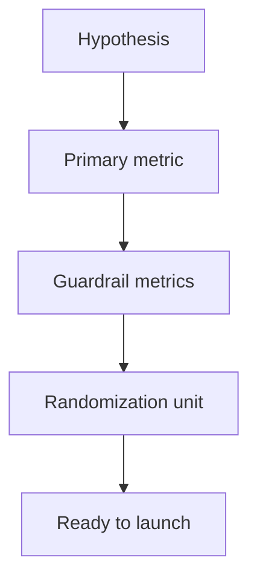

# Lecture 1 — Designing an Experiment

> **Duration:** ~2 hours. **Outcome:** You can write a complete experiment brief — a falsifiable hypothesis, a single primary metric, at least one guardrail metric, and a correctly chosen randomization unit — and name the pre-launch pitfalls that invalidate a test before it ever collects a row of data.

Most A/B tests don't fail in the analysis. They fail on Monday morning, before anyone writes a query, because nobody wrote down — precisely, in a sentence a skeptic could try to break — what would count as a win. This lecture is entirely about that sentence.

## 1. The idea LoopCart is testing

LoopCart's checkout is three pages: cart → shipping → payment. The growth team wants to test **Express Checkout** — one page, all three steps combined, with saved-card autofill. The pitch: fewer pages means fewer places to abandon, so conversion goes up.

That pitch is not yet an experiment. An experiment needs four things, in this order:

1. A **hypothesis** — a specific, falsifiable claim.
2. A **primary metric** — the one number that decides the outcome.
3. A **guardrail metric** (or two) — numbers that must not get meaningfully worse.
4. A **randomization unit** — the thing you split into two groups.

Skip any one of these and you don't have an experiment — you have a launch with a dashboard next to it.


*The four building blocks of an experiment brief, always assembled in this order.*

## 2. Writing a falsifiable hypothesis

A hypothesis is not "Express Checkout will be better." That can't be proven wrong, which means it can't be proven right either — there's no result that would make you say "I was wrong." A real hypothesis names the mechanism, the metric, and the direction:

> **If** we replace the 3-step checkout with a single-page Express Checkout, **then** checkout conversion rate will increase, **because** removing page transitions removes the points where a hesitant buyer can bail.

This is the standard **if / then / because** shape. The "because" clause matters more than it looks — it's your theory of *why* the change should work, and it's what tells you which metric is primary and what a guardrail should watch for. If your "because" is about reducing friction, your guardrail should watch for the failure mode of friction-removal: rushing someone into a purchase they didn't mean to make (returns, refunds) or hiding information they needed (surprise shipping costs, wrong size).

Two disciplines that keep a hypothesis honest:

- **Write it down before looking at any data from the test.** A hypothesis invented after seeing the result isn't a hypothesis, it's a story (this is HARKing — Hypothesizing After the Results are Known — and it quietly poisons every "we found that..." claim that follows).
- **State the direction.** "Conversion will change" is not falsifiable enough — a coin flip could produce "changed." "Conversion will *increase*" can be wrong, and that's the point.

## 3. Picking exactly one primary metric

The **primary metric** is the single number the test lives or dies by. Chosen *before* the test runs, chosen *once*.

**Why exactly one, not three or five?** Because every additional metric you're willing to accept as a "win" is another roll of the dice. If you test 5 metrics at α = 0.05 each, and none of them actually moved, your chance of at least one showing "significant" by pure chance is not 5% — it's close to 23% (you'll compute this exactly in Lecture 3, section 4, "multiple comparisons"). One primary metric means one roll of the dice on the question that matters.

For LoopCart's test, the primary metric is:

> **Checkout conversion rate** = (sessions that complete a purchase) ÷ (sessions that reach the cart page), measured per session, over the life of the test.

Notice what this definition nails down that a vaguer version wouldn't:

- **The denominator is "reached the cart," not "visited the site."** Someone who never got near checkout was never at risk of converting differently because of a checkout redesign — including them just adds noise that dilutes your ability to detect a real effect.
- **"Per session," not "per visitor."** A returning visitor who comes back twice in the test window is two chances to observe the outcome, not one. (Whether that's the *right* choice depends on the randomization unit — more below. For LoopCart, session-level bucketing and session-level analysis are consistent with each other, which is the property that actually matters.)
- **It's a rate, not a raw count.** "Purchases went up" is meaningless without knowing whether traffic went up too. A rate cancels that out by construction.

## 4. Guardrail metrics — the thing that must not break

A guardrail metric doesn't have to move in your favor. It just has to **not get meaningfully worse**. Every real experiment needs at least one, because almost every growth lever has a plausible way to win the primary metric while quietly damaging the business.

For Express Checkout, the two obvious guardrails, straight from the hypothesis's "because" clause:

- **Average order value (AOV)** — if Express Checkout removes friction, does it also remove the moments where a customer notices an upsell, double-checks their cart, or adds one more item? A conversion lift paired with a big AOV drop might net out to *less* revenue, not more.
- **Refund rate** — a faster checkout that lets someone buy the wrong size, or buy on impulse, shows up weeks later as returns and refunds, not as a same-day metric. This one needs a longer observation window than conversion does (more on this in Lecture 3's discussion of novelty effects and measurement windows).

A guardrail needs a **pre-committed threshold**, same as the primary metric needs a pre-committed direction. "AOV must not fall more than 10% relative to control" is a guardrail. "We'll keep an eye on AOV" is not — "keeping an eye on it" is exactly the kind of soft commitment that gets rationalized away in a launch review when the primary metric already looks good.

## 5. Choosing the randomization unit

The **randomization unit** is the thing you flip a coin on — and it is not automatically "the user." Get this wrong and every stat in Lecture 2 is computed correctly against the wrong population.

Three common choices, in order of how "sticky" they are:

| Unit | What it means | When to use it |
|------|---------------|-----------------|
| **Request/page-view** | Every page load is independently randomized | Almost never for UI tests — the same visitor could see both variants in one session, which contaminates both groups |
| **Session** | One visitor gets one variant for the whole session, re-randomized on their next visit | Fine for a single-session decision like checkout, where you don't care about consistency across visits |
| **Visitor (cookie/account)** | One visitor gets the same variant every time they show up, for the life of the test | Required whenever the *experience itself* would feel broken by switching (pricing, layout, anything the user might compare visit-to-visit) |

LoopCart's test uses **visitor-level, session-scoped bucketing**: a visitor is assigned once, the first time they hit the cart page in the test window, and stays in that bucket if they come back within the window. This is the right call here — checkout is normally a single-session decision, but a visitor who abandons and returns a day later to finish buying should see a *consistent* checkout, not a coin flip on every visit. Inconsistent bucketing across a single purchase journey is one of the most common — and most invisible — ways a real test gets contaminated.

**The rule that generalizes:** the randomization unit must be the same as (or a superset of) the **unit of analysis** — the thing your primary metric's denominator counts. LoopCart's metric denominator is "sessions that reached the cart," and the randomization unit (visitor, sticky within the window) guarantees every session from one visitor sees one consistent variant. If you randomized by *request* instead, a single visitor's session could straddle both variants, and "conversion rate by variant" would no longer mean what you think it means.

## 6. Pitfalls baked in before the test even starts

Four failure modes that have nothing to do with statistics — they're wrong before a single row of data exists:

**Testing during an unrepresentative window.** A checkout test that runs only during Black Friday week measures Black Friday behavior, not typical behavior. LoopCart's pilot ran Jun 1–7, an ordinary week — deliberately, so the result generalizes.

**Changing the test mid-flight.** If you notice a bug in Express Checkout on day 2 and patch it, you don't have one experiment anymore — you have two experiments glued together, and your day 1–2 data belongs to neither. The fix, if you must patch: restart the clock and discard (or clearly segment) the pre-patch data.

**Confounding the test with something else that changed at the same time.** If marketing launches a new ad campaign the same week as the checkout test, and that campaign happens to send more (or less) qualified traffic to one variant's landing pages disproportionately, your "checkout effect" is partly an "ad campaign effect" you can't separate out. The defense is organizational, not statistical: check the launch calendar before you start the clock.

**Mismatched unit of randomization and unit of business impact.** A classic version: testing a change to an individual seller's storefront on a marketplace, randomized by *buyer*, when sellers (not buyers) are actually who the change targets and who could plausibly tell other sellers about it. Get the unit wrong and your "independent observations" assumption — which every formula in Lecture 2 depends on — is false, and no amount of correct arithmetic afterward fixes it.

## 7. The complete brief

Put sections 2–5 together and LoopCart's actual experiment brief is:

```
Hypothesis:  If we replace the 3-step checkout with single-page Express
             Checkout, checkout conversion rate will increase, because
             removing page transitions removes points where a hesitant
             buyer can bail.

Primary:     Checkout conversion rate = purchases / cart-page sessions,
             measured per session. Direction: increase. Minimum win: see
             Lecture 2 for the pre-registered MDE.

Guardrails:  1. Average order value (converted sessions only) must not
                fall more than 10% relative to control.
             2. Refund rate (of converted sessions) must not rise more
                than 5 percentage points relative to control, measured
                over a 14-day post-purchase window.

Unit:        Visitor, bucketed on first cart-page hit in the test
             window, sticky for the window's duration.

Window:      One full calendar week minimum (day-of-week effects — more
             in Lecture 3), extended if Lecture 2's sample-size math
             says one week isn't enough traffic.
```

Every clause in that brief exists to answer one question before it can be asked *after* the fact, when the answer would be self-serving instead of honest: "what, exactly, would have counted as this experiment failing?"

## 8. Check yourself

- Why must the primary metric be chosen *before* the test runs, not after looking at results?
- Rewrite "Express Checkout will improve the user experience" as a falsifiable if/then/because hypothesis.
- Why does testing 5 metrics at once, with no correction, inflate your real false-positive rate above 5%?
- LoopCart randomizes by visitor, sticky for the test window. What could go wrong if it randomized by page-view instead?
- Name one guardrail metric for Express Checkout that isn't AOV or refund rate, and explain what failure mode it would catch.
- Why is "we'll keep an eye on it" not an acceptable guardrail commitment?

Lecture 2 turns the primary metric and a target effect size into an actual number: how many visitors, and how many days, this test needs before you're allowed to trust its answer.

## Further reading

- **Kohavi, Tang, Xu — *Trustworthy Online Controlled Experiments* (Cambridge University Press), Ch. 1–3** — the standard reference for experiment design at scale; this lecture's brief structure follows its core recommendations.
- **PostgreSQL — `CASE` expressions** (used to compute rates from raw boolean columns): <https://www.postgresql.org/docs/current/functions-conditional.html>
- **PostgreSQL — Aggregate expressions (`FILTER`)**: <https://www.postgresql.org/docs/current/sql-expressions.html#SYNTAX-AGGREGATES>
