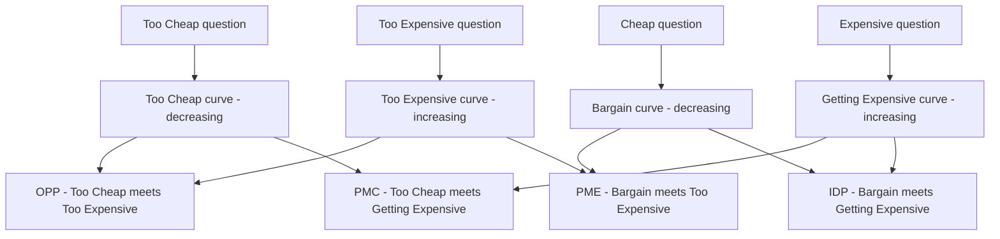

# Lecture 1 — Willingness to Pay

> **Duration:** ~2 hours. **Outcome:** You can build all four Van Westendorp Price Sensitivity Meter curves from raw survey data in SQL, read off PMC/PME/OPP/IDP, explain what conjoint analysis adds that Van Westendorp can't, and name three behavioral WTP signals you can pull from a product database without ever running a survey.

Every pricing decision starts with the same unanswerable-feeling question: *what would people actually pay?* You can't observe willingness to pay directly — it lives inside someone's head, not in a column. This lecture covers the two ways operators get at it anyway: **ask people directly**, in a structured way that cancels out the fact that everyone lies a little about prices (Van Westendorp, conjoint), and **watch what they already do**, which never lies (behavioral signals). You'll use both on ScopeIQ's data before the lecture is over.

## 1. Why "what would you pay?" is the wrong question

If you ask someone "what would you pay for this?" directly, you get a number, but not a useful one. People anchor low to seem savvy, anchor high to seem serious, or just guess — and a single number can't tell you the difference between "I'd pay $10 because that's all it's worth" and "I'd pay $10 because I assume that's what things like this cost." You need multiple, differently-framed questions that box the true willingness-to-pay in from both directions. That's what the Van Westendorp Price Sensitivity Meter (PSM) does — a technique from 1976 that's still the fastest, cheapest, defensible way to get a first WTP estimate before you've spent a dollar on a formal experiment.

## 2. The Van Westendorp Price Sensitivity Meter

The PSM asks every respondent **four questions**, always in this order, always about the same product:

1. **Too Cheap (TC)** — "At what price would you consider [product] to be priced so low that you'd feel the quality couldn't be very good?"
2. **Cheap / Bargain (B)** — "At what price would you consider [product] to be a bargain — a great buy for the money?"
3. **Expensive / Getting Expensive (GE)** — "At what price would you consider [product] starting to get expensive, so that it's not out of the question, but you'd have to think about it?"
4. **Too Expensive (TE)** — "At what price would you consider [product] to be priced so high that you would not consider buying it?"

For any honest respondent, these four numbers come back in increasing order: `too_cheap < cheap < expensive < too_expensive`. That ordering is your first data-quality check — a respondent who violates it wasn't reading carefully, and you drop their row.

ScopeIQ ran exactly this survey against 30 people — a mix of solo indie builders, small startup teams, and agencies — before touching its pricing page. The results are in `wtp_survey`:

```sql
SELECT * FROM wtp_survey ORDER BY segment, respondent_id LIMIT 6;
```

```
 respondent_id | segment | too_cheap | cheap | expensive | too_expensive
---------------+---------+-----------+-------+-----------+---------------
             1 | indie   |         8 |    14 |        22 |            30
             2 | indie   |         9 |    15 |        25 |            34
             3 | indie   |        10 |    17 |        28 |            38
            21 | agency  |        55 |    88 |       138 |           182
            22 | agency  |        60 |    96 |       150 |           198
            23 | agency  |        65 |   104 |       162 |           214
```

Notice the spread already, before any analysis: an indie builder's "too expensive" ($30–68) overlaps almost nowhere with an agency's "too cheap" ($55–102). Flat pricing across that range is a bet that one number can satisfy both — keep that thought, Lecture 2 is built entirely around it.

### 2.1 From four raw numbers to four cumulative curves

The trick that makes PSM work is turning each column into a **cumulative distribution over price**, not looking at any one respondent's answer. For a given price `p`, ask: *what percentage of respondents would place `p` in this category?*

| Curve | Question it's built from | Direction | Meaning at price `p` |
|---|---|---|---|
| **Too Cheap (TC)** | too_cheap | Decreasing | % of respondents whose `too_cheap` threshold is **≥ p** — they'd still distrust quality at `p` |
| **Bargain (B)** | cheap | Decreasing | % of respondents whose `cheap` threshold is **≥ p** — they'd still call `p` a great deal |
| **Getting Expensive (GE)** | expensive | Increasing | % of respondents whose `expensive` threshold is **≤ p** — they've already started hesitating at `p` |
| **Too Expensive (TE)** | too_expensive | Increasing | % of respondents whose `too_expensive` threshold is **≤ p** — they'd already refuse to buy at `p` |

Two of the curves *decrease* as price rises (the "low price" questions — the higher the price, the fewer people still think it's suspiciously cheap or a bargain), and two *increase* (the "high price" questions — the higher the price, the more people are already uneasy or refusing). That's the whole mechanism: run all four as SQL window-style counts over a price grid, and where a decreasing curve crosses an increasing curve, you have a meaningful price point.

Here's the curve builder in SQL, using a generated price grid from $1 to $250 and a `CASE`-based cumulative count. In PostgreSQL, `generate_series` builds the grid; in SQLite, use a small recursive CTE (shown after):

```sql
-- PostgreSQL: price grid + all four cumulative percentages in one query
WITH prices AS (
    SELECT generate_series(1, 250) AS p
),
n AS (
    SELECT COUNT(*)::numeric AS total FROM wtp_survey
)
SELECT
    prices.p,
    ROUND(100.0 * COUNT(*) FILTER (WHERE too_cheap    >= prices.p) / n.total, 1) AS tc_pct,
    ROUND(100.0 * COUNT(*) FILTER (WHERE cheap        >= prices.p) / n.total, 1) AS bargain_pct,
    ROUND(100.0 * COUNT(*) FILTER (WHERE expensive    <= prices.p) / n.total, 1) AS getting_exp_pct,
    ROUND(100.0 * COUNT(*) FILTER (WHERE too_expensive<= prices.p) / n.total, 1) AS te_pct
FROM prices
CROSS JOIN wtp_survey, n
GROUP BY prices.p, n.total
ORDER BY prices.p;
```

```sql
-- SQLite: same idea, using CASE WHEN instead of FILTER, and a recursive grid
WITH RECURSIVE prices(p) AS (
    SELECT 1
    UNION ALL
    SELECT p + 1 FROM prices WHERE p < 250
)
SELECT
    prices.p,
    ROUND(100.0 * SUM(CASE WHEN too_cheap     >= prices.p THEN 1 ELSE 0 END) / (SELECT COUNT(*) FROM wtp_survey), 1) AS tc_pct,
    ROUND(100.0 * SUM(CASE WHEN cheap         >= prices.p THEN 1 ELSE 0 END) / (SELECT COUNT(*) FROM wtp_survey), 1) AS bargain_pct,
    ROUND(100.0 * SUM(CASE WHEN expensive     <= prices.p THEN 1 ELSE 0 END) / (SELECT COUNT(*) FROM wtp_survey), 1) AS getting_exp_pct,
    ROUND(100.0 * SUM(CASE WHEN too_expensive <= prices.p THEN 1 ELSE 0 END) / (SELECT COUNT(*) FROM wtp_survey), 1) AS te_pct
FROM prices
CROSS JOIN wtp_survey
GROUP BY prices.p
ORDER BY prices.p;
```

Spot-check a few rows against all 30 respondents (blended, ignoring segment for now):

| price | TC % | Bargain % | Getting Exp % | TE % |
|------:|-----:|----------:|---------------:|-----:|
| 20 | 66.7 | 86.7 | 0.0 | 0.0 |
| 39 | 36.7 | 60.0 | 23.3 | 10.0 |
| 50 | 33.3 | 50.0 | 33.3 | 20.0 |
| 60 | 30.0 | 40.0 | 40.0 | 26.7 |
| 68 | 23.3 | 33.3 | 43.3 | 33.3 |
| 80 | 16.7 | 33.3 | 50.0 | 40.0 |

### 2.2 The four intersection points

Where curves cross, you get a named, actionable price point:

- **OPP — Optimal Price Point** = **Too Cheap ∩ Too Expensive**. The price where the same share of people would call it suspiciously cheap as would refuse to buy it — the point of *minimum combined resistance*. For the full 30-respondent blend: **OPP ≈ $60.50**, where both curves sit at **28.3%**.
- **PMC — Point of Marginal Cheapness** = **Too Cheap ∩ Getting Expensive**. Below this price, more people doubt your quality than are starting to hesitate on cost — a floor. Blended: **PMC ≈ $50.00** (33.3%).
- **PME — Point of Marginal Expensiveness** = **Bargain ∩ Too Expensive**. Above this price, more people have already refused to buy than still call it a bargain — a ceiling. Blended: **PME ≈ $68.00** (33.3%).
- **IDP — Indifference Price Point** = **Bargain ∩ Getting Expensive**. Where "still a bargain" and "starting to hesitate" swap places — a secondary central estimate. Blended: **IDP ≈ $59.00** (40.0%).


*Each of the four PSM questions becomes a curve, and pairwise curve intersections yield the four named price points.*

Put together: **`[PMC, PME] = [$50, $68]`** is the *acceptable price range* for ScopeIQ, with **OPP ≈ $60.50** as the single best-guess sweet spot, if you had to ship one flat number tomorrow.

**And there's the trap.** ScopeIQ's actual price is $39 — comfortably *below* PMC. The blended survey says: *you are leaving money on the table, full stop, raise the price to somewhere in the $50–68 zone.* That's a true statement about the average respondent. It is also nearly useless as pricing advice, because there is no average respondent — there's an indie builder and there's an agency, and blending them together produced a single number that fits neither.

### 2.3 Segment the survey before you trust the curve

Recompute PMC/PME with a `GROUP BY segment` instead of pooling everyone, and the picture changes completely:

```sql
SELECT
    segment,
    PERCENTILE_CONT(0.5) WITHIN GROUP (ORDER BY too_cheap)     AS median_too_cheap,
    PERCENTILE_CONT(0.5) WITHIN GROUP (ORDER BY cheap)         AS median_cheap,
    PERCENTILE_CONT(0.5) WITHIN GROUP (ORDER BY expensive)     AS median_expensive,
    PERCENTILE_CONT(0.5) WITHIN GROUP (ORDER BY too_expensive) AS median_too_expensive
FROM wtp_survey
GROUP BY segment
ORDER BY median_too_cheap;
```

*(SQLite has no `PERCENTILE_CONT`; for an odd-sized group of 10, the median is the average of the 5th and 6th ordered values — pull the sorted column into pandas with `pandas.read_sql` and use `.median()` instead.)*

| segment | median too_cheap | median cheap | median expensive | median too_expensive |
|---|---:|---:|---:|---:|
| indie | 12.5 | 21.0 | 35.0 | 47.5 |
| team | 29.0 | 49.5 | 78.5 | 104.5 |
| agency | 77.5 | 124.0 | 194.0 | 256.0 |

Three completely different willingness-to-pay worlds, sitting inside one blended curve that told you to price at "$60.50 for everyone." At $39 flat: indie customers are being charged near the *top* of their comfortable range (their median "expensive" is $35 — $39 is already past it), while agency customers are being charged so far *below* their `too_cheap` median ($77.50) that a rational agency buyer might reasonably distrust whether the product is serious enough for their needs. **One flat price is simultaneously too high for your smallest customers and low enough to raise a quality red flag for your largest ones.** That is Lecture 2's entire premise, proven with data instead of asserted.

## 3. Conjoint analysis, briefly — what Van Westendorp can't tell you

Van Westendorp answers *"is this price acceptable"* for one product as a whole. It cannot tell you *how much a specific feature is worth* — if you add SSO, or raise the usage cap, how much more would people pay? That's what **conjoint analysis** is for: you show respondents several complete product bundles (price + features combined differently in each), ask which they'd choose, and repeat with different bundles. Because features and price vary together across many trade-offs, statistical analysis of the choices backs out an implied dollar value for each individual feature — something no single-question survey can do.

You will not run a full conjoint study this week — it requires specialized survey design and a proper choice-modeling regression, both out of scope for a one-week unit. But carry the intuition forward: when Lecture 2 asks "does SSO belong in the Growth tier or the Scale tier," the correct answer is a conjoint question in miniature — *how much would a Growth-tier customer pay for SSO specifically* — and Challenge 1 will have you reason through it with the tools you do have (segment WTP ranges + a simple willingness-to-pay-for-an-add-on estimate), which is exactly what a real team does before it can justify a full conjoint study.

## 4. Behavioral WTP — what people already do, no survey required

Surveys measure *stated* willingness to pay, and stated WTP is systematically noisy — people are bad at predicting their own future behavior around money. **Behavioral WTP** signals come from what customers have *already done*, which is far harder to fake:

- **Usage intensity relative to price.** `accounts_usage.mtu` is a behavioral signal all by itself — an agency account tracking 145,000 monthly users at a $39 flat price is *revealing*, through actual usage, that the product is worth vastly more to them than $39. No one asked them; they told you by using the product hard.
- **Upgrade/downgrade requests.** A customer who emails asking "can I pay more for X" is giving you a stated-and-behavioral signal simultaneously — rare and extremely high-value.
- **Price-page abandonment by segment.** `price_experiment` (Lecture 3's dataset) is behavioral WTP in its purest form: not what people *said* they'd pay, but what fraction actually converted at each real price they were shown.
- **Feature usage before churn.** If accounts that churn used far less of the product before leaving than accounts that stay, low usage is a leading indicator that the account was overpriced *for what it was actually getting* — a WTP mismatch, not (only) a satisfaction problem.

A quick behavioral cross-check against the survey — confirm that `accounts_usage.mtu` (behavior) and `wtp_survey.segment` (stated identity) actually agree with each other, since `respondent_id = account_id`:

```sql
SELECT
    w.segment,
    COUNT(*)                                   AS n,
    ROUND(AVG(a.mtu))                          AS avg_mtu,
    ROUND(AVG(w.too_expensive))                AS avg_stated_too_expensive
FROM wtp_survey w
JOIN accounts_usage a ON a.account_id = w.respondent_id
GROUP BY w.segment
ORDER BY avg_mtu;
```

```
 segment |  n | avg_mtu | avg_stated_too_expensive
---------+----+---------+---------------------------
 indie   | 10 |    1270 |                        48
 team    | 10 |   15280 |                       105
 agency  | 10 |   85000 |                       256
```

Usage and stated WTP move together, segment by segment — the survey isn't lying, and neither is the product database. That agreement is what lets you trust the segment-level PMC/PME numbers enough to design real prices around them next lecture. When behavioral and stated signals *disagree*, trust behavior — it's revealed preference, and revealed preference is what actually shows up in revenue.

## 5. Check yourself

- In your own words, why does asking "what would you pay?" directly produce a worse number than the four-question PSM?
- Which two PSM curves are decreasing in price, and which two are increasing? Why?
- What does it mean, in plain English, for a price to be below the PMC?
- Why did the blended (all-30-respondent) PSM curve recommend a price that was wrong for *every* segment individually?
- Name two behavioral WTP signals you could pull from a product database with SQL alone, without ever running a survey.
- What can conjoint analysis tell you that Van Westendorp cannot?

If those are automatic, Lecture 2 turns the segment ranges you just built into three real, shippable prices.

## Further reading

- **Van Westendorp, P. (1976)** — original ESOMAR congress paper introducing the Price Sensitivity Meter (widely summarized; search "Van Westendorp 1976 NIPO price sensitivity meter" for accessible academic summaries).
- **PostgreSQL — `generate_series` and window/aggregate `FILTER`:** <https://www.postgresql.org/docs/current/functions-srf.html>, <https://www.postgresql.org/docs/current/sql-expressions.html#SYNTAX-AGGREGATES>
- **PostgreSQL — ordered-set aggregates (`PERCENTILE_CONT`):** <https://www.postgresql.org/docs/current/functions-aggregate.html#FUNCTIONS-ORDERED-SET-TABLE>
- **SQLite — recursive CTEs (for the price-grid trick):** <https://www.sqlite.org/lang_with.html>
- **pandas — `.median()`, `.groupby()`:** <https://pandas.pydata.org/docs/reference/api/pandas.DataFrame.groupby.html>
