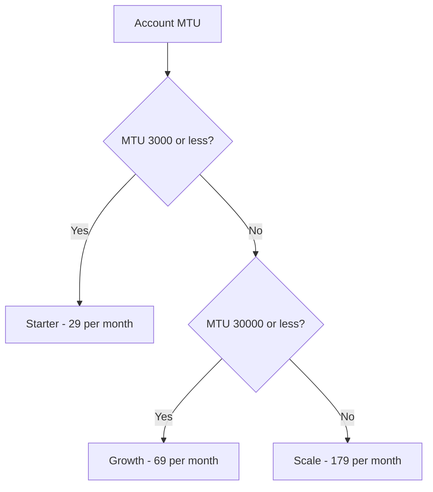
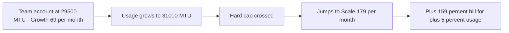

# Lecture 2 — Tiers and Packaging

> **Duration:** ~2 hours. **Outcome:** You can choose a defensible value metric, design Good-Better-Best tiers around it, allocate features across tiers without cannibalizing revenue or bill-shocking customers at the boundary, and compute the MRR impact of a repackaging in SQL and pandas.

Lecture 1 proved, with survey data, that ScopeIQ's flat $39 price is wrong for almost everyone — too high for `indie`, borderline-insulting-ly cheap for `agency`. This lecture fixes it. Not by picking a better single number — you already showed that doesn't exist — but by **packaging**: choosing what a customer pays *for*, so that the price scales with the value delivered instead of being the same for everyone regardless of how hard they use the product.

## 1. The value metric — what you charge *for*

A **value metric** is the unit your price scales with. Per-seat pricing charges for headcount. Per-API-call pricing charges for volume. Flat pricing charges for nothing at all — it's a value metric of "being a customer," which is why it breaks the moment your customers differ in how much value they get.

A good value metric has three properties:

1. **It correlates with value received**, not just with cost to serve. A metric a customer would nod along to — "yes, if I get more of this, I *am* getting more value" — is one they'll pay more for without resentment.
2. **It's visible and predictable to the customer.** They should be able to look at their own usage and reasonably estimate their bill before it arrives. A metric buried in internal infrastructure cost (e.g., "GB of internal log storage") fails this even if it correlates with your cost to serve.
3. **It scales smoothly with company growth**, so pricing grows with the customer instead of requiring a renegotiation every time they succeed.

ScopeIQ's candidate value metric is already sitting in `accounts_usage.mtu` — **Monthly Tracked Users**, the number of end-users whose sessions ScopeIQ actually tracks that month. Check it against the three properties: it correlates with value (more tracked users = more sessions worth analyzing = more insight the product is generating), it's visible (a customer can see their own traffic), and it scales with the customer's own growth automatically. Seats or team size would be a worse metric here — ScopeIQ is used by a handful of people (whoever's on the growth/product team) regardless of whether the underlying product has 300 users or 145,000, so seat count barely varies while the real cost and value *does*. Always check a candidate value metric against what actually varies across your customer base — not what's easiest to query.

## 2. Good-Better-Best — why three tiers, not one price or ten

Once you have a value metric, packaging is choosing **where to draw the tier boundaries** and **what to put behind each one**. Three tiers (Good-Better-Best) is the default shape for a reason:

- **One tier** (what ScopeIQ has today) can't price-discriminate at all — Lecture 1's whole point.
- **Two tiers** force a binary choice that's usually too coarse — everyone above the smallest customers gets crammed into "the expensive one."
- **Three tiers** give you a cheap entry point that doesn't scare off small buyers, a middle tier that captures the median customer (and is usually the one you steer people toward — the "decoy" effect of a visible top tier makes the middle one look reasonable), and a top tier for your highest-value accounts, priced for what they're actually worth instead of capped by what your smallest customer would tolerate.
- **More than three or four tiers** usually signals you're packaging around internal org structure (sales wants a special SKU for X) rather than customer value — a smell, not a feature.

### 2.1 Setting the boundaries from what you already know

You don't have to guess where the tier boundaries go — Lecture 1 already handed you the segment WTP ranges, and `accounts_usage.mtu` shows you where the real usage breaks fall:

```sql
SELECT
    segment,
    MIN(mtu) AS min_mtu,
    MAX(mtu) AS max_mtu,
    COUNT(*) AS n
FROM accounts_usage
GROUP BY segment
ORDER BY min_mtu;
```

```
 segment |  min_mtu | max_mtu | n
---------+----------+---------+----
 indie   |      300 |    2900 | 10
 team    |     4200 |   29500 | 10
 agency  |    35000 |  145000 | 10
```

There's a clean gap between `indie`'s max (2,900) and `team`'s min (4,200), and another between `team`'s max (29,500) and `agency`'s min (35,000). Set the tier caps inside those gaps, not at the segment boundary itself — leave headroom so an account that grows a little doesn't immediately blow through the ceiling:

| Tier | MTU cap | Price | Segment it targets | Anchored to (Lecture 1) |
|---|---:|---:|---|---|
| **Starter** | ≤ 3,000 | **$29/mo** | indie | between `indie` median bargain ($21) and median expensive ($35) |
| **Growth** | ≤ 30,000 | **$69/mo** | team | between `team` median bargain ($49.50) and median expensive ($78.50) |
| **Scale** | uncapped | **$179/mo** | agency | below `agency` median expensive ($194) — leaves room to raise later |


*Every account's MTU routes it into exactly one of the three tiers.*

Every price sits *inside* its segment's comfortable zone from Lecture 1 — none of them are guesses. That's the difference between "we designed three tiers" and "we designed three tiers we can defend in a pricing review."

### 2.2 Compute the repackaging's revenue impact

Map every account to its new tier and price with a `CASE` expression, then compare total MRR before and after:

```sql
SELECT
    account_id,
    segment,
    mtu,
    current_price,
    CASE
        WHEN mtu <= 3000  THEN 'Starter'
        WHEN mtu <= 30000 THEN 'Growth'
        ELSE 'Scale'
    END AS new_tier,
    CASE
        WHEN mtu <= 3000  THEN 29.00
        WHEN mtu <= 30000 THEN 69.00
        ELSE 179.00
    END AS new_price
FROM accounts_usage
ORDER BY mtu;
```

Aggregate it in pandas (or with `GROUP BY new_tier` in SQL — both are shown because you'll want both muscles):

```python
import pandas as pd

df = pd.read_sql("SELECT * FROM accounts_usage", conn)

def assign_tier(mtu):
    if mtu <= 3000:
        return "Starter", 29.00
    elif mtu <= 30000:
        return "Growth", 69.00
    else:
        return "Scale", 179.00

df[["new_tier", "new_price"]] = df["mtu"].apply(lambda m: pd.Series(assign_tier(m)))

old_mrr = df["current_price"].sum()
new_mrr = df["new_price"].sum()

print(df.groupby("new_tier").agg(n=("account_id", "count"), mrr=("new_price", "sum")))
print(f"Old flat MRR: ${old_mrr:,.2f}  ({len(df)} accounts)")
print(f"New tiered MRR: ${new_mrr:,.2f}")
print(f"Uplift: ${new_mrr - old_mrr:,.2f} ({(new_mrr - old_mrr) / old_mrr:.1%})")
```

```
new_tier   n    mrr
Growth    10  690.0
Scale     10 1790.0
Starter   10  290.0

Old flat MRR: $1,170.00  (30 accounts)
New tiered MRR: $2,770.00
Uplift: $1,600.00 (136.8%)
```

Read that carefully before you get excited: **10 of the 30 accounts (the `indie` ones) actually get a *cheaper* bill** — $29 instead of $39, a $10/mo cut — while `team` and `scale` accounts see large increases. That asymmetry is not a bug, it's the entire point of value-based packaging: you're not raising everyone's price, you're **correcting** a price that was wrong in both directions at once. Realistically, no company applies a 136.8% blended increase to its existing base overnight — you'd never ship the `agency` jump from $39 to $179 without warning. That's exactly what grandfathering periods exist to soften, and Lecture 3 covers precisely that rollout problem.

## 3. Feature allocation — packaging is more than a price and a cap

A tier isn't just "more MTU for more money." It's also which **features** live behind which paywall, and that decision has its own failure modes:

- **Under-gating** — putting a feature that only your biggest, most sophisticated customers value (say, SSO or an audit log) into your cheapest tier. You've given away something worth a lot to a small number of buyers, for free, to everyone.
- **Over-gating** — putting a feature that *most* customers expect as table stakes (say, basic email support, or CSV export) behind your top tier. Customers feel nickel-and-dimed, and it becomes a reason to churn or to badmouth you, for very little incremental revenue.
- **The cliff.** This is the one to watch hardest: an account with usage *just* over a tier's cap gets the **full** price jump to the next tier for barely more usage than an account that stayed just under it. Concretely — imagine a `team` account that grows from 29,500 MTU (comfortably `Growth`, $69/mo) to 31,000 MTU next quarter. Under a hard-cap design, that's a jump straight to `Scale` at $179/mo — a **+159% bill increase** for **+5% more usage**. That account is far more likely to churn in anger than to shrug and pay it. Good packaging either smooths the boundary (usage-based overage pricing instead of a hard wall — e.g., $0.005/tracked-user above the cap) or adds an intermediate step (an add-on, not a full tier jump) so growth in usage doesn't trigger a cliff in price. Challenge 1 has you design exactly this fix for a real ScopeIQ scenario.


*A hard tier cap turns a small usage increase into a disproportionate price jump.*

A reasonable first-pass feature map for ScopeIQ's three tiers:

| Feature | Starter | Growth | Scale |
|---|:---:|:---:|:---:|
| Dashboards & funnels | ✅ | ✅ | ✅ |
| Session replay | — | ✅ | ✅ |
| Heatmaps | — | ✅ | ✅ |
| API access | — | — | ✅ |
| SSO / SAML | — | — | ✅ |
| Support SLA | Community | Email, 24h | Dedicated, 4h |

Notice basic dashboards and funnels — the core, expected functionality — sit in **every** tier (no over-gating the essentials), while SSO and API access, which matter almost exclusively to larger, more technically mature buyers, sit only in `Scale` (no under-gating a high-value, narrow-audience feature). Session replay and heatmaps split the difference: valuable but not enterprise-exclusive, so they become the reason `Growth` costs more than `Starter` rather than the reason `Scale` costs more than `Growth`.

## 4. Anti-cannibalization — don't let your best customers downgrade themselves

The last packaging risk is subtler: a tier boundary drawn in the wrong place can let high-value customers **choose** a cheaper tier and still get most of what they need. If `Growth`'s cap were set at 50,000 MTU instead of 30,000, several `agency` accounts (35,000–50,000 MTU) would rationally pick the $69 `Growth` tier over the $179 `Scale` tier — you'd have designed a discount for your best customers by accident. The fix is the same discipline from Lecture 1: **set caps from the data, not round numbers.** The 30,000/35,000 gap in `accounts_usage` wasn't a coincidence you got lucky on — it's what you should always go looking for before finalizing a cap: the natural break in usage between segments, so no rational customer can undercut their true tier by underusing the product on purpose.

## 5. Check yourself

- What three properties make a value metric "good," and why does seat count fail for ScopeIQ specifically?
- Why three tiers instead of one or five?
- In the repackaging table above, why did `indie` accounts get a *price cut* while `agency` accounts got a large increase — and why is that the correct outcome, not an error?
- Describe, in your own words, the "cliff" problem, using a number that isn't the $69→$179 example from this lecture.
- What's the difference between under-gating and over-gating a feature? Give an original example of each.
- Why does setting a tier cap based on a real usage gap in the data prevent cannibalization better than a round number like "25,000"?

If those are automatic, Lecture 3 puts a price change into motion — modeling exactly how existing customers, new signups, discounts, and expansion revenue respond when you actually ship one of these new prices.

## Further reading

- **Price Intelligently / ProfitWell — "Packaging & Pricing" guides** (search "profitwell packaging tiers value metric" — vendor content, but among the more rigorous public writing on value-metric selection).
- **PostgreSQL — `CASE` expressions:** <https://www.postgresql.org/docs/current/functions-conditional.html>
- **pandas — vectorized conditional logic (`apply`, `np.select`, `pd.cut`):** <https://pandas.pydata.org/docs/reference/api/pandas.cut.html>
- **SQLite — `CASE` (identical syntax to Postgres):** <https://www.sqlite.org/lang_expr.html#case>
