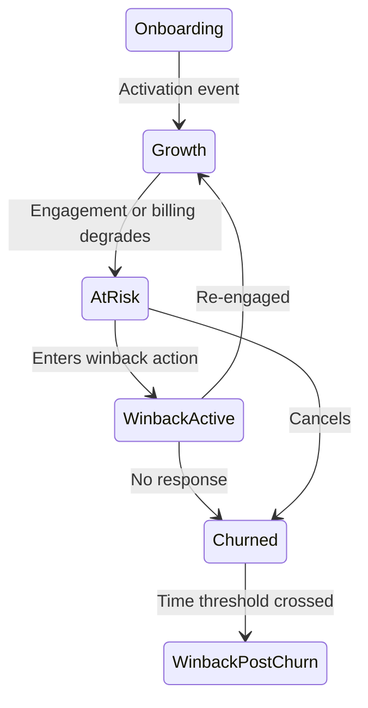
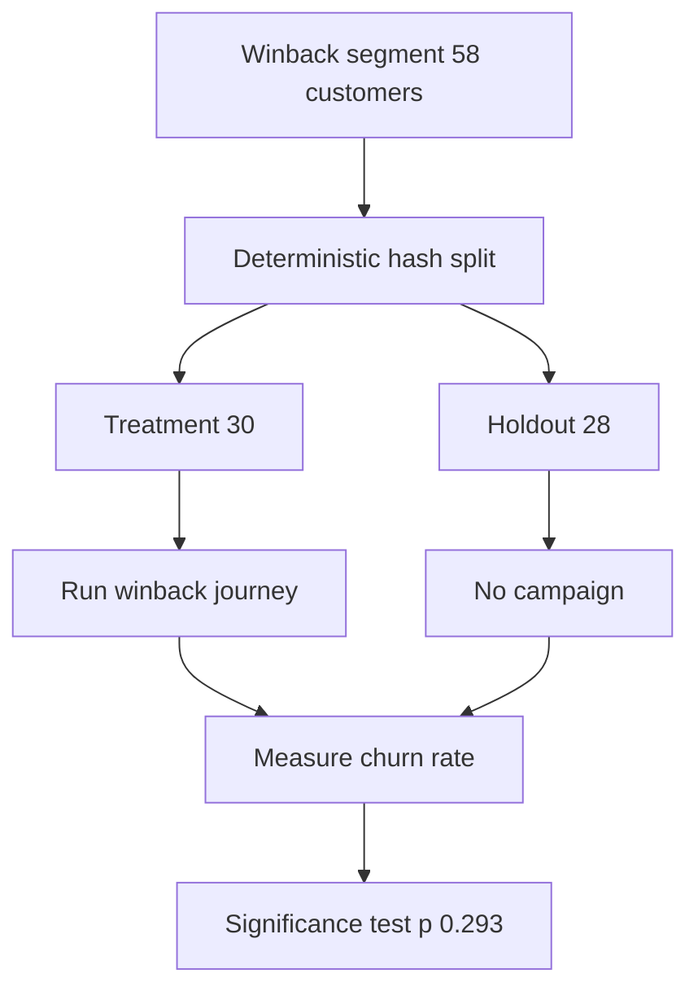

# Lecture 3 — Lifecycle Campaigns

> **Duration:** ~2 hours. **Outcome:** You can design a trigger-based lifecycle journey off a model score (not a calendar), split its target population into a randomized holdout, measure the resulting lift honestly, and recognize when a test doesn't have enough customers in it to trust its own result.

Everything so far — the model, the score, the next-best-action table — is worthless if you can't prove the resulting campaign actually changed behavior. "We sent the win-back email and churn went down" is not proof of anything; churn might have gone down anyway. This lecture is about the difference between a campaign that *feels* like it worked and one you can *show* worked.

## 1. Lifecycle stages, briefly

A lifecycle program maps every customer to a stage and reacts to **transitions between stages**, not to the calendar:

| Stage | Roughly | Typical trigger |
|---|---|---|
| Onboarding | Signed up, not yet activated | Time-since-signup with no activation event (Week 3) |
| Growth / expansion | Activated, healthy, using more over time | Rising `engagement_trend`, approaching a usage limit |
| At-risk | Activated, but engagement or billing signals degrading | `risk_band = "high"` from this week's model |
| Win-back (active) | At-risk, currently receiving an intervention | Entered the `winback_email_discount` action this week |
| Churned | Canceled | `raw_subscriptions.status = 'canceled'` |
| Win-back (post-churn) | Canceled, reactivation attempt | Time-since-cancellation crosses a threshold |

The at-risk → win-back transition is this lecture's focus, because it's the one your model output feeds directly: **every customer who lands in `winback_email_discount` this week is a lifecycle-journey trigger, not a one-off decision.**


*Lifecycle stages react to transitions, not the calendar — the at-risk to win-back edge is this lecture's focus.*

## 2. Trigger-based, not calendar-based

A calendar campaign ("email everyone on the 1st of the month") treats a healthy customer and a customer about to cancel identically. A **trigger-based journey** fires off a state change — a customer's `risk_band` flipping to `"high"` and their `action` becoming `winback_email_discount` — and runs a fixed sequence from there:

1. **Day 0** — automated email: acknowledge friction if there's a known cause (a payment failure, a support ticket), otherwise a general check-in with a modest discount offer.
2. **Day 3** — reminder, if no engagement (no login, no email open) since day 0.
3. **Day 7** — final offer, slightly larger discount, framed as a deadline.
4. **Day 14** — journey ends. Customer either re-engaged, accepted the offer, or is handed to a human for one-time review if they're borderline-high-value.

The mechanics of the email/notification system aren't this course's concern — **the targeting logic and the measurement are.** Both live in SQL and pandas, same as every other system this course has built.

## 3. Defining the target segment in SQL

Reuse Lecture 2's scored, decisioned population (persisted as a table, `scored_customers`, with `churn_score`, `risk_band`, `value_tier`, `action`):

```sql
CREATE TABLE winback_segment AS
SELECT user_id, plan, mrr_usd, churn_score
FROM scored_customers
WHERE action = 'winback_email_discount';
```

On this seed: **58 customers** — high risk, low value, exactly the population an automated (not human) win-back journey is built for. Before this segment goes anywhere, one more question has to be answered honestly: *if we do nothing, how many of these 58 will actually cancel?* You already know, from the label you built in Lecture 1 — for teaching purposes this dataset carries the "ground truth" outcome (`churned_in_window`) that a real company would only learn by waiting until December. Treat it here as the **counterfactual**: what would have happened with no intervention.

```sql
SELECT AVG(churned_in_window) AS baseline_churn_rate
FROM scored_customers
WHERE action = 'winback_email_discount';
```

**62.1%** of this segment would churn with no intervention — high, because "high risk *and* low value" is precisely the population most likely to actually leave. That's the number the campaign has to beat.

## 4. The randomized holdout

The single biggest mistake in lifecycle-campaign measurement: comparing customers **who engaged with the campaign** against customers who didn't. That comparison is worthless — the customers who click the win-back email are, by definition, more engaged than the ones who ignore it, and more-engaged customers churn less *regardless of the email*. You'd be measuring "engaged customers churn less than disengaged ones," which you already knew, and crediting the campaign for it.

The fix, from Week 8: **randomize who gets the campaign at all**, before you know anything about how they'll respond, and compare outcomes for the *whole* treatment group against the *whole* holdout group — including the ones in treatment who never open the email.

```sql
-- deterministic hash-based split: reproducible, no separate "assignment" table to maintain,
-- and every engine (Postgres, SQLite) can compute the same MD5 hash the same way.
SELECT
    user_id,
    CASE WHEN CAST(
        SUBSTR(MD5('crunch-flow-winback-2025-09|' || user_id), 1, 8) AS INTEGER
    ) % 10 < 5 THEN 'treatment' ELSE 'holdout' END AS group_name
FROM winback_segment;
```

(SQLite's `MD5` isn't built in — compute this split in pandas via `hashlib.md5` instead; PostgreSQL has `MD5` natively. Either way, the point is a **deterministic** function of `user_id` and a fixed salt string, so re-running the split produces exactly the same assignment — no state to lose, no accidental re-randomization.)

```python
import hashlib
def split_group(uid):
    h = int(hashlib.md5(f"crunch-flow-winback-2025-09|{uid}".encode()).hexdigest(), 16)
    return "treatment" if (h % 10) < 5 else "holdout"

seg["group"] = seg["user_id"].apply(split_group)
```

A 50/50 split, not the "give most people the good thing" 90/10 split you might reach for instinctively — with only 58 customers in the segment, you need every holdout customer you can get to have any chance of detecting a real effect (Section 6). On this seed: **30 in treatment, 28 in holdout.**


*The segment splits before anyone knows how a customer will respond, so the two group-level churn rates are a fair comparison.*

## 5. Measuring lift

The holdout group's outcome is simply "what would have happened" — no intervention, so their `churned_in_window` label *is* their actual outcome. The treatment group's outcome is whatever actually happens after the journey runs. Comparing the two group-level rates — never individual pairs — is the entire measurement:

```python
summary = seg.groupby("group").agg(
    n=("user_id", "count"),
    actual_churned=("actual_churned_90d", "sum"),
)
summary["churn_rate"] = summary["actual_churned"] / summary["n"]
```

Actual result on this seed:

| Group | n | Churned | Churn rate |
|---|---:|---:|---:|
| Holdout (no campaign) | 28 | 16 | 57.1% |
| Treatment (win-back journey) | 30 | 13 | 43.3% |

```
absolute lift  = 57.1% − 43.3% = 13.8 percentage points
relative lift  = 13.8 / 57.1  = 24.2%
```

That reads like a win — a quarter fewer of the treated customers churned. Section 6 is where you find out whether you're allowed to believe it.

## 6. Is 58 customers enough to know?

Run a two-proportion significance test on the observed counts:

```python
from statsmodels.stats.proportion import proportions_ztest
count = [13, 16]          # churned: [treatment, holdout]
nobs  = [30, 28]          # group sizes: [treatment, holdout]
z, p = proportions_ztest(count, nobs)
# z = -1.051, p = 0.293
```

**p = 0.293.** At the conventional 5% significance threshold from Week 8, this result is **not statistically significant** — you cannot rule out that a 13.8-point difference this large happened by chance alone, even if the campaign did nothing. This is not a failure of the campaign; it's a failure of the *test's size* to detect an effect of this magnitude reliably, and it's the single most common mistake in lifecycle-campaign reporting: treating a directionally-positive, statistically-inconclusive result as proof.

How big would the test have needed to be? A power calculation answers directly:

```python
from statsmodels.stats.power import NormalIndPower
from statsmodels.stats.proportion import proportion_effectsize

effect = proportion_effectsize(0.571, 0.433)   # holdout rate, treatment rate
n_needed = NormalIndPower().solve_power(effect_size=abs(effect), alpha=0.05,
                                         power=0.8, ratio=1.0, alternative="two-sided")
# n_needed ≈ 205 per group
```

To detect a true 13.8-point lift off a 57% baseline with 80% power at the standard 5% significance level, you'd need **roughly 205 customers per group — over 400 total**, against a segment that only has 58 customers *this month*. That's not a modeling failure; it's an honest, quantified answer to "how much longer do we need to run this test?" — either let the segment accumulate over several months before evaluating, run the campaign continuously and analyze quarterly, or treat this result as directional evidence to combine with other signals (support tickets down, NPS up) rather than a standalone verdict.

## 7. What "measuring lift" actually protects you from

- **Survivorship-flavored self-congratulation.** Without a holdout, you'd report "62% of at-risk customers who got the campaign churned anyway" as if the campaign failed, when the real counterfactual (no campaign) would have been worse (this seed's true baseline: 62.1%). Or you'd report the flip side and take credit for customers who'd have stayed regardless.
- **Optional stopping.** Peeking at the p-value daily and stopping the moment it crosses 0.05 inflates your false-positive rate well past the nominal 5% — decide your sample size (or your stopping rule) *before* looking at results, exactly as in Week 8.
- **Silent underpowering.** A non-significant result reported as "the campaign doesn't work" is just as wrong as a non-significant result reported as "it works" — the honest read of p = 0.293 on n = 58 is *"we don't yet know, and here's exactly how much more data would tell us."*

## 8. Check yourself

- Why is comparing "customers who opened the win-back email" against "customers who didn't" the wrong measurement, even though it's tempting?
- What does the 62.1% baseline churn rate represent, and why is it not the same thing as the holdout group's observed 57.1%?
- Explain, in one sentence, why p = 0.293 does not mean "the campaign had no effect."
- The power calculation says you need ~205 customers per group. Name two legitimate ways to get there without waiting a full year.
- Why must the treatment/holdout split happen **before** anyone knows how a customer will respond, rather than after?

If those are automatic, you're ready for the exercises, challenges, and mini-project — which walk this exact pipeline end to end, from raw events to a measured lift.

## Further reading

- **statsmodels — `proportions_ztest`:** <https://www.statsmodels.org/stable/generated/statsmodels.stats.proportion.proportions_ztest.html>
- **statsmodels — Power analysis (`NormalIndPower`):** <https://www.statsmodels.org/stable/stats.html#power-and-sample-size-calculations>
- **PostgreSQL — `md5()` and cryptographic hash functions:** <https://www.postgresql.org/docs/current/functions-binarystring.html>
