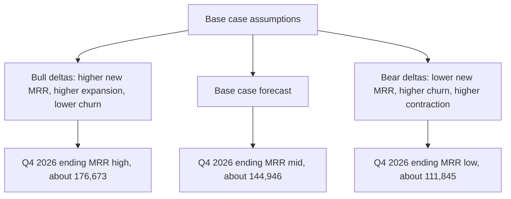

# Lecture 3 — Scenarios and Uncertainty

> **Duration:** ~2 hours. **Outcome:** You can fit a simple linear time-series model to a revenue history, attach an honest, widening prediction interval to it, and build base/bull/bear scenarios from named assumption deltas that roll up into a quarterly table Finance can act on.

Every forecast so far in this week has produced a single number per month. That's a lie, even when it's the *best available* lie — nobody has ever hit a twelve-month revenue forecast to the dollar, and presenting one number with no range invites exactly the kind of false confidence that makes people distrust forecasting entirely. This lecture fixes that in two ways: first, by fitting the simplest defensible time-series model and quantifying how wrong it's historically been; second, by building three named scenarios — base, bull, bear — so a stakeholder sees a range grounded in explicit assumptions instead of a single suspiciously precise number.

## 1. A simple time-series fit, independent of the bridge

Lecture 1's bridge forecast builds `ending_mrr` up from four underlying drivers. As a **sanity check**, it's worth fitting a model that ignores all of that mechanism and just looks at the `ending_mrr` series itself — twelve numbers, one per month, nothing else. If a dead-simple model roughly agrees with your carefully-built bridge, that's reassuring. If it doesn't, you've found a second discrepancy worth investigating (on top of the bridge-vs-cohort check from Lecture 2).

```python
import numpy as np
import pandas as pd

actuals = pd.read_sql("SELECT month, ending_mrr FROM mrr_bridge_actuals ORDER BY month", conn)
x = np.arange(1, 13)                      # month index, Jan..Dec 2025
y = actuals["ending_mrr"].values

slope, intercept = np.polyfit(x, y, 1)    # ordinary least squares, one variable
print(f"slope ≈ {slope:.2f} MRR$/month, intercept ≈ {intercept:.2f}")
# slope ≈ 3208.60, intercept ≈ 38725.76
```

That's it — a straight line through twelve points. It says: Crunch Flow's ending MRR has grown, on average, about **$3,209/month** over 2025, and the line would have read about **$38,726** at "month 0" (before the seed window starts — not a real number, just where the line crosses the axis). This is deliberately the simplest possible time-series model. There are far more sophisticated ones (ARIMA, exponential smoothing, Prophet-style decomposition) — this course doesn't reach for them here because with only twelve data points, a fancier model mostly means more parameters overfitting noise you can't actually distinguish from signal. A simple, honest line beats a complicated, false one.

## 2. Quantifying how wrong the fit has been

The straight line doesn't pass through every actual point — the vertical distance between the fitted line and each real month is a **residual**, and the spread of those residuals is your evidence for how much to trust the line going forward.

```python
fitted = slope * x + intercept
residuals = y - fitted
rmse = np.sqrt(np.mean(residuals**2))
print("residuals by month:", residuals.round(0))
print(f"RMSE ≈ {rmse:.0f}")   # ≈ 937
```

The residuals bounce between about **−$1,875** (August — the summer dip the line couldn't see coming) and **+$2,041** (December — the year-end push the line also couldn't see coming). The root-mean-square error across all twelve months is about **$937**. That number — not a gut feeling — is your starting point for a prediction interval.

## 3. A widening interval, not a fixed one

A forecast for next month should be more confident than a forecast for twelve months out — errors compound the further you project past your last observed data point. The simplest honest way to reflect that: scale the interval by the square root of the forecast horizon (the same logic behind a random walk's growing variance — not a rigorous derivation for this specific series, but a reasonable, standard rule of thumb when you don't have enough data to fit anything more precise).

```python
h = np.arange(1, 13)                        # forecast horizon: 1..12 months out
point_forecast = slope * (12 + h) + intercept
interval_width = rmse * np.sqrt(h)

forecast = pd.DataFrame({
    "month_num": h,
    "point": point_forecast.round(0),
    "low":   (point_forecast - interval_width).round(0),
    "high":  (point_forecast + interval_width).round(0),
})
print(forecast)
```

At one month out (January 2026), the interval is tight: point ≈$80,438, range ≈[$79,500, $81,375] — about ±1.2%. By twelve months out (December 2026), the same ±1-RMSE band has widened to point ≈$115,732, range ≈[$112,485, $118,979] — still only about ±2.8%, because the trend itself is so stable. **The interval widening is the honest part; report the range, not just the point, whenever the horizon is more than a couple of months out.** Quarterly, the point forecast rolls up to roughly **Q1 ≈$86,855 → Q2 ≈$96,481 → Q3 ≈$106,106 → Q4 ≈$115,732**.

Compare that to Lecture 1's bridge forecast (Q4 ≈$144,946). They disagree by a lot — and that's expected, because the linear fit has no idea the underlying rates or new-MRR trend are accelerating (the bridge's compounding mechanism produces faster growth than a straight line ever can). This is *not* a reason to distrust the bridge forecast; it's a reason to note, explicitly, in your memo: **"the naive linear trend on ending MRR alone undershoots the bottoms-up bridge forecast, because the bridge captures compounding on a growing base that a straight line structurally cannot represent — we trust the bridge as the primary forecast and use the linear fit only as a conservative floor."** That's exactly the kind of sentence that makes a forecast defensible instead of merely asserted.

## 4. Building base, bull, and bear from named deltas

A single forecast, however well-built, is a bet. Scenarios turn that bet into a range grounded in *specific, stated* differences from the base case — never "more optimistic" as a vibe, always a named number moving.

Start from Lecture 1's base case:

| Assumption | Base |
|---|---|
| January `new_mrr` | $5,350, growing $150/month |
| Expansion rate | 3.2% of starting MRR |
| Contraction rate | 0.85% of starting MRR |
| Churn rate | 3.0% of starting MRR |

**Bull case — named deltas, not just "better":** *"Sales hires two additional AEs in Q1, ramped by Q2 — new_mrr starts higher ($5,900) and grows faster ($250/month). A planned in-app upsell prompt (shipping February) lifts expansion to 3.8% and, combined with the same onboarding improvement that lifted June's cohort, pulls churn down to 2.4% and contraction to 0.70%."*

**Bear case — named deltas, not just "worse":** *"A key competitor cuts prices in Q1, slowing new-logo growth — new_mrr starts lower ($4,800) and grows only $50/month. Increased price sensitivity raises churn to 3.8% and contraction to 1.10%, and a slower sales cycle cuts expansion to 2.4% as upsell conversations get deprioritized."*

```python
def run_scenario(name, start_mrr, start_new_mrr, new_mrr_growth,
                  exp_rate, contr_rate, churn_rate, months=12):
    rows, start, new = [], start_mrr, start_new_mrr
    for m in range(1, months + 1):
        exp, contr, churn = start*exp_rate, start*contr_rate, start*churn_rate
        end = start + new + exp - contr - churn
        rows.append({"scenario": name, "month_num": m, "ending_mrr": round(end)})
        start, new = end, new + new_mrr_growth
    return pd.DataFrame(rows)

dec_2025_ending = 79270.0
scenarios = pd.concat([
    run_scenario("base", dec_2025_ending, 5350, 150, 0.0320, 0.0085, 0.0300),
    run_scenario("bull", dec_2025_ending, 5900, 250, 0.0380, 0.0070, 0.0240),
    run_scenario("bear", dec_2025_ending, 4800,  50, 0.0240, 0.0110, 0.0380),
])
scenarios["quarter"] = ((scenarios["month_num"] - 1) // 3) + 1
print(scenarios.pivot_table(index="quarter", columns="scenario",
                             values="ending_mrr", aggfunc="last"))
```

The quarterly rollup:

| Scenario | Q1 '26 | Q2 '26 | Q3 '26 | Q4 '26 |
|---|---:|---:|---:|---:|
| **Bear** | $87,664 | $95,883 | $103,939 | $111,845 |
| **Base** | $94,129 | $110,042 | $126,987 | $144,946 |
| **Bull** | $99,522 | $122,469 | $148,166 | $176,673 |

By Q4, the range spans roughly **$111,845 to $176,673** — a spread of nearly 60% around the base case. That's a wide range, and *reporting it as a wide range is the correct, honest thing to do* twelve months out. Notice, too, that the spread widens with the horizon, same as the OLS prediction interval did — the further out you look, the more room small assumption differences have to compound.


*How named assumption deltas off the base case fan out into the bull and bear Q4 endpoints.*

## 5. Communicating a forecast so it survives questioning

A forecast memo that will hold up under a CFO's questions has a specific shape:

1. **State the number and the method in one sentence.** *"Base-case Q4 2026 ending MRR: $144,946, built bottoms-up from a trailing-3-month rate assumption applied to a linear new-MRR trend."*
2. **Name every assumption, as a number, not an adjective.** Not "expansion improves" — "expansion rate assumed at 3.2%, the trailing-3-month average."
3. **Show the range, and say what drives it.** Bear/base/bull, and the one or two assumptions that matter most for the spread (here: new-MRR growth rate and churn rate — expansion and contraction move the needle far less because they're smaller dollar amounts to begin with).
4. **Cross-check with an independent method, and report where they disagree.** The retention-adjusted cohort view (Lecture 2) and the naive linear trend (this lecture) both undershoot the bottoms-up base case — say so, and say why you still trust the base case.
5. **Say what would make you revise it.** *"If January 2026 actual new_mrr comes in below $4,800 (the bear-case floor), that invalidates the base case and this forecast should be rebuilt before Q1 close."* A forecast with no stated invalidation condition can never be proven wrong, which means it was never really a forecast at all.

## Check yourself

1. Why does an interval built from `rmse * sqrt(horizon)` widen with the forecast horizon instead of staying a fixed dollar amount?
2. The bridge forecast (Lecture 1) and the linear-trend forecast (this lecture) disagree by a large margin at Q4. Which one structurally *can't* capture compounding growth on an expanding base, and why not?
3. In the bull/bear scenarios, which single assumption — new-MRR growth rate, expansion rate, contraction rate, or churn rate — appears to move the Q4 ending MRR the most, and why does that make sense given each one's typical dollar size?
4. Write, in one sentence, a stated invalidation condition for your own base case (something a real January 2026 actual could show you that would mean "rebuild this forecast now").

This closes out the week's lecture arc. From here: [Exercise 1](../exercises/exercise-01-build-an-mrr-bridge.md) puts the bridge mechanics in your hands, and the [mini-project](../mini-project/README.md) asks you to build all three methods — bridge, cohort, and scenario — into one forecast with the memo that defends it.
