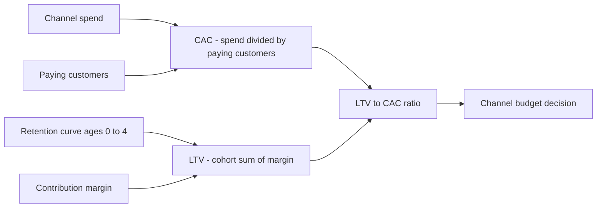
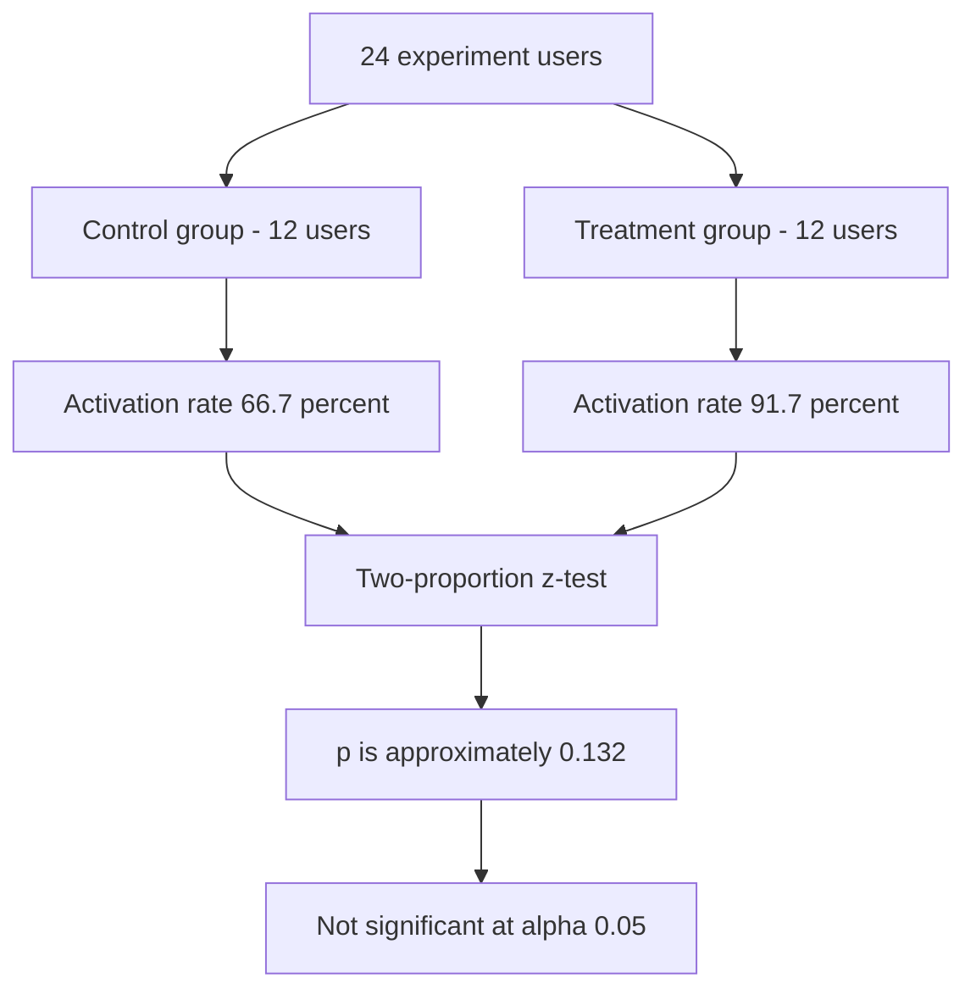

# Lecture 2 — Assembling the Growth System

> **Duration:** ~2 hours (spread across the week — this is the densest lecture). **Outcome:** You can build `fct_acquisition`, `fct_mrr_monthly`, `fct_unit_economics`, and `fct_experiment_results` on top of Lecture 1's staging layer, and you can explain — with real numbers from Crunch Boards — why unit economics, retention, and experiment results have to be read together, not one at a time.

Continue against `crunch_boards`. Every mart in this lecture builds on the `stg_*` views and `dim_user`/`dim_date` from Lecture 1 — build those first if you haven't.

## 1. `fct_acquisition` — the funnel, one row per user

The funnel — signup → activation → paying customer — is one fact table, grained at the user level, joining `dim_user` to the two events that matter:

```sql
CREATE TABLE fct_acquisition AS
SELECT
    u.user_id,
    u.signup_channel,
    u.signup_month,
    CASE WHEN e.user_id IS NOT NULL THEN 1 ELSE 0 END AS activated,
    e.event_date AS activation_date,
    CASE WHEN s.user_id IS NOT NULL THEN 1 ELSE 0 END AS converted,
    s.created AS conversion_date
FROM dim_user u
LEFT JOIN stg_events e        ON e.user_id = u.user_id
LEFT JOIN stg_subscriptions s ON s.user_id = u.user_id;
```

Roll it up by channel and you have the funnel:

```sql
SELECT
    signup_channel,
    COUNT(*)                                   AS signups,
    SUM(activated)                              AS activated,
    ROUND(100.0 * SUM(activated) / COUNT(*), 1) AS activation_rate_pct,
    SUM(converted)                              AS converted,
    ROUND(100.0 * SUM(converted) / COUNT(*), 1) AS conversion_rate_pct
FROM fct_acquisition
GROUP BY signup_channel
ORDER BY signups DESC;
```

```
signup_channel | signups | activated | activation_rate_pct | converted | conversion_rate_pct
----------------+---------+-----------+----------------------+-----------+----------------------
paid_search     |      30 |        20 |                 66.7 |        11 |                 36.7
organic         |      24 |        21 |                 87.5 |        12 |                 50.0
referral        |      18 |        15 |                 83.3 |        12 |                 66.7
```

Read this before you read anything else this week: **`paid_search` brings in the most signups (30) and converts the smallest share of them (36.7%)**. `referral` brings in the fewest signups (18) and converts two out of every three. Volume and quality are pointing in opposite directions on this dataset — which is exactly the tension a real channel-budget decision has to resolve, and exactly why "which channel drove the most signups" is the wrong question to lead with.

## 2. `fct_mrr_monthly` — revenue, by month and by channel

```sql
CREATE TABLE fct_mrr_monthly AS
SELECT
    d.month_start,
    u.signup_channel,
    SUM(s.amount_usd)  AS mrr,
    COUNT(*)           AS active_customers
FROM dim_date d
JOIN stg_subscriptions s
  ON s.created <= (d.month_start || '', d.month_start)  -- placeholder, see below
JOIN dim_user u ON u.user_id = s.user_id
WHERE d.is_forecast = 0
GROUP BY d.month_start, u.signup_channel;
```

That join condition is deliberately broken — real month-end logic needs "created on or before the **last day** of the month, and not yet canceled as of that day," which isn't a single column comparison. Build it properly with an explicit month-end date:

```sql
CREATE TABLE fct_mrr_monthly AS
SELECT
    d.month_start,
    u.signup_channel,
    SUM(s.amount_usd)  AS mrr,
    COUNT(*)           AS active_customers
FROM dim_date d
JOIN stg_subscriptions s
  ON s.created <= DATE(d.month_start, '+1 month', '-1 day')                          -- SQLite month-end
  -- ON s.created <= (d.month_start + INTERVAL '1 month' - INTERVAL '1 day')::date   -- Postgres
 AND (s.canceled_at IS NULL OR s.canceled_at > DATE(d.month_start, '+1 month', '-1 day'))
JOIN dim_user u ON u.user_id = s.user_id
WHERE d.is_forecast = 0
GROUP BY d.month_start, u.signup_channel;
```

Blended (all channels) by month:

```sql
SELECT month_start, SUM(mrr) AS total_mrr, SUM(active_customers) AS total_active
FROM fct_mrr_monthly GROUP BY month_start ORDER BY month_start;
```

```
month_start | total_mrr | total_active
-------------+-----------+---------------
2025-01-01   |    256.00 |             4
2025-02-01   |    599.00 |            11
2025-03-01   |    826.00 |            14
2025-04-01   |    954.00 |            16
2025-05-01   |   1253.00 |            17
2025-06-01   |   1878.00 |            22
```

MRR roughly 7.3×'d over six months (256 → 1,878), and June alone added $625 — the single biggest month-over-month jump in the series. Hold that acceleration in mind; Lecture 3's forecast has to decide whether June was the new normal or a one-month spike, and three different forecasting methods will disagree about which.

## 3. `fct_unit_economics` — CAC, LTV, payback, per channel

This is where Week 5's formulas come back, applied to Crunch Boards. Three ingredients, computed in order.


*How channel spend and a retention curve combine into an LTV to CAC decision.*

**Fully-loaded CAC** — total channel spend ÷ paying customers that channel produced:

```sql
CREATE TABLE fct_unit_economics AS
WITH spend AS (
    SELECT channel, SUM(spend_usd) AS total_spend
    FROM stg_marketing_spend GROUP BY channel
),
paying AS (
    SELECT u.signup_channel AS channel,
           COUNT(*)              AS paying_customers,
           AVG(s.amount_usd)     AS avg_monthly_price
    FROM stg_subscriptions s
    JOIN dim_user u ON u.user_id = s.user_id
    GROUP BY u.signup_channel
)
SELECT
    spend.channel,
    spend.total_spend,
    paying.paying_customers,
    ROUND(spend.total_spend / paying.paying_customers, 2)  AS cac,
    ROUND(paying.avg_monthly_price, 2)                       AS avg_monthly_price,
    ROUND(paying.avg_monthly_price * 0.75, 2)                AS contribution_margin_per_month  -- 75% gross margin
FROM spend JOIN paying ON paying.channel = spend.channel;
```

```
channel      | total_spend | paying_customers | cac     | avg_monthly_price | contribution_margin_per_month
--------------+-------------+-------------------+---------+--------------------+---------------------------------
organic      |    14400.00 |                12 | 1200.00 |              69.83 |                          52.38
paid_search  |    21600.00 |                11 | 1963.64 |              67.18 |                          50.39
referral     |     2700.00 |                12 |  225.00 |             148.17 |                         111.12
```

Crunch Boards runs at a **75% gross margin** (stated assumption, goes straight into `metrics.md`). Note `referral`'s spend model is genuinely different from the other two: `paid_search` and `organic` are **flat monthly budgets** ($3,600 and $2,400/month regardless of volume), but `referral` spend is a **$300/month program-admin fee plus a $50 bonus per referred signup** — a marginal cost that scales with volume. That's not a simplification for this exercise; it's how referral programs are actually costed, and it's why `referral`'s CAC ($225) looks so different in *kind*, not just in size, from the other two.

**LTV, cohort-sum method**, using the retention curve you'll build in Exercise 2 (ages 0–4, the range with a usable sample for this dataset):

```sql
-- retention by channel, ages 0-4 (built fully in Exercise 2; summarized here)
-- paid_search: 1.000, 0.778, 0.444, 0.500, 0.571
-- organic:     1.000, 0.900, 0.875, 0.833, 0.333
-- referral:    1.000, 1.000, 1.000, 1.000, 1.000
```

```python
import pandas as pd

margin = {'paid_search': 50.39, 'organic': 52.38, 'referral': 111.12}
cac    = {'paid_search': 1963.64, 'organic': 1200.00, 'referral': 225.00}
retention = {
    'paid_search': [1.000, 0.778, 0.444, 0.500, 0.571],
    'organic':     [1.000, 0.900, 0.875, 0.833, 0.333],
    'referral':    [1.000, 1.000, 1.000, 1.000, 1.000],
}

for ch, curve in retention.items():
    ltv_cohort = round(sum(r * margin[ch] for r in curve), 2)
    print(ch, "LTV (0-4mo, cohort sum):", ltv_cohort, " LTV:CAC:", round(ltv_cohort / cac[ch], 2))
```

```
paid_search  LTV (0-4mo, cohort sum): 165.93   LTV:CAC: 0.08
organic      LTV (0-4mo, cohort sum): 206.43   LTV:CAC: 0.17
referral     LTV (0-4mo, cohort sum): 555.60   LTV:CAC: 2.47
```

Three channels, three completely different stories, all from the same 75% margin assumption:

- **`paid_search` is underwater by an order of magnitude.** Five months of contribution margin ($165.93) recovers 8% of what it cost to acquire that customer ($1,963.64). Nothing in this dataset suggests that gap closes with more time — Section 4 shows exactly why.
- **`organic` is also underwater**, less dramatically (17%), but the honest read is the same: at current CAC and current retention, `organic` doesn't pay for itself either.
- **`referral` clears 1:1 more than twice over (2.47:1)**, comfortably inside the "healthy" band Week 5 taught (3:1 or higher is healthy, 1:1–3:1 is marginal-but-real, below 1:1 means you're burning cash on every customer).

## 4. Why the reciprocal-LTV formula breaks on `referral` — and that's a lesson, not a bug

Week 5 also taught the reciprocal formula, `LTV = margin ÷ avg_monthly_churn`. Try it here:

```python
import numpy as np
for ch, curve in retention.items():
    hazards = [1 - curve[i]/curve[i-1] for i in range(1, len(curve))]
    avg_churn = np.mean(hazards)
    print(ch, "avg monthly churn:", round(avg_churn, 4))
```

```
paid_search  avg monthly churn: 0.0958
organic      avg monthly churn: 0.1940
referral     avg monthly churn: 0.0000
```

`referral`'s observed churn is **exactly zero** — not one of its twelve paying customers has canceled yet. Divide margin by zero and the formula produces an undefined (infinite) LTV. **That is not "referral customers never churn."** It's "this capstone's referral sample is small (12 customers, oldest cohort only five months old) and hasn't observed a cancellation yet, which is a fact about the sample size, not about referral customers' immortality." The correct move, and the one your `metrics.md` should state explicitly, is: **report the cohort-sum LTV ($555.60) as the defensible number, and flag the reciprocal formula as inapplicable for `referral` until a cancellation is actually observed.** A capstone that quietly reports "`referral` LTV: ∞" because a formula didn't check its own assumptions is a capstone that will get taken apart in front of a real stakeholder. Saying "we don't have enough churn evidence yet to use this formula" is the more rigorous answer, not a weaker one.

`organic`'s curve has its own small-sample trap: retention drops from 83.3% at age 3 to 33.3% at age 4 — but age 4 has only **3** organic customers observed, so that "60-point crash" is one cancellation out of three, not a trend. Compare this to the `paid_search` curve, whose age-2 drop (77.8% → 44.4%) is backed by 9 customers and shows up consistently at every later age too — that's a real leaky bucket, not noise. **The habit from Week 5 — don't trust a retention point built on a thin sample — applies with even more force in a capstone this size than it did on Week 5's larger seed data.** State the sample size next to every retention number you report this week; it's not optional decoration, it's the difference between a number and a claim.

## 5. `fct_experiment_results` — read the lift, then read the power

`onboarding_checklist_v2` ran on the May and June cohorts only (`dim_user.in_experiment = 1`, 24 users, 12 control / 12 treatment). Its outcome metric is **activation** — did the user reach `created_first_project`:


*Path from experiment assignment to a significance verdict on the checklist lift.*

```sql
CREATE TABLE fct_experiment_results AS
SELECT
    ea.variant,
    COUNT(*)                                        AS n,
    SUM(CASE WHEN e.user_id IS NOT NULL THEN 1 ELSE 0 END)  AS activated,
    ROUND(100.0 * SUM(CASE WHEN e.user_id IS NOT NULL THEN 1 ELSE 0 END) / COUNT(*), 1) AS activation_rate_pct
FROM stg_experiment_assignments ea
JOIN dim_user u ON u.user_id = ea.user_id
LEFT JOIN stg_events e ON e.user_id = ea.user_id
GROUP BY ea.variant;
```

```
variant   | n  | activated | activation_rate_pct
-----------+----+-----------+----------------------
control   | 12 |         8 |                 66.7
treatment | 12 |        11 |                 91.7
```

A 25-point absolute lift looks decisive. **It isn't, yet** — with only 12 users per arm, run the two-proportion significance check Week 8 taught:

```python
import math

n1, x1 = 12, 8    # control
n2, x2 = 12, 11   # treatment
p1, p2 = x1/n1, x2/n2
p_pool = (x1 + x2) / (n1 + n2)
se = math.sqrt(p_pool * (1 - p_pool) * (1/n1 + 1/n2))
z = (p2 - p1) / se
p_value = 2 * (0.5 * math.erfc(abs(z) / math.sqrt(2)))   # two-sided normal approximation

print(f"control: {p1:.1%}   treatment: {p2:.1%}   z={z:.3f}   p≈{p_value:.3f}")
```

```
control: 66.7%   treatment: 91.7%   z=1.508   p≈0.132
```

At the conventional α = 0.05 threshold, **p ≈ 0.132 is not statistically significant.** This is the single most important number in the entire capstone, because it's the one most tempting to round up. A 25-point lift *feels* like a story. The honest statement is: **"the checklist shows a promising, directionally consistent lift, but with n=24 total the test is underpowered to rule out chance — we cannot yet claim `onboarding_checklist_v2` causes higher activation."** That is not the same as "the checklist doesn't work" — it's "we don't have enough evidence yet to say it does." Lecture 3, Section 3 turns that honest-but-unsatisfying statement into an actual recommendation (ship-and-monitor vs. extend-the-test), because a growth team can't just shrug and end the meeting on "p is 0.132."

## 6. Update `metrics.md`

Add what this lecture defined, in the same plain-language style as Lecture 1:

```markdown
**MRR:** sum of active stg_subscriptions.amount_usd as of a given month-end,
grouped by dim_user.signup_channel — source: fct_mrr_monthly.

**Fully-loaded CAC:** stg_marketing_spend total per channel (Jan-Jun) divided by
paying customers that channel produced — source: fct_unit_economics. NOTE: referral's
spend is variable (per-signup), paid_search and organic are flat monthly budgets —
CAC trend implications differ by channel, see Lecture 2 Section 3.

**LTV (reported number):** cohort-sum method, ages 0-4, contribution margin at 75%
gross margin — source: fct_unit_economics. Reciprocal-formula LTV is NOT reported
for referral (zero observed churn in a 12-customer sample — formula undefined).

**Experiment success metric:** activation rate (created_first_project) — source:
fct_experiment_results. onboarding_checklist_v2 lift (May-Jun cohorts, n=24):
66.7% control vs 91.7% treatment, p≈0.132 — NOT significant at α=0.05.
```

## 7. Check yourself

- Why does `fct_mrr_monthly`'s join need both a "created on or before month-end" and a "not yet canceled by month-end" condition, and what would break if you dropped the second one?
- `referral`'s CAC is structurally different from `paid_search`'s and `organic`'s — how, and why does that matter for a budget decision, not just for the number itself?
- Why is a cohort-sum LTV of $555.60 for `referral` more defensible right now than a reciprocal-formula LTV of "infinite"?
- Which channel's retention curve shows a real, sample-backed leaky bucket, and which one's scariest-looking drop is a small-sample artifact? How do you tell them apart?
- `onboarding_checklist_v2` shows a 25-point lift with p≈0.132. Is that "the checklist doesn't work"? What's the honest one-sentence summary?
- Why does `dim_user.in_experiment` matter when you compute `fct_acquisition`'s channel-level activation rates?

If those are automatic, Lecture 3 forecasts Crunch Boards' revenue with more than one method, reconciles where they disagree, and turns everything from this lecture into a decision you'd present to a founder.

## Further reading

- **PostgreSQL — Aggregate Functions:** <https://www.postgresql.org/docs/current/functions-aggregate.html>
- **PostgreSQL — `WITH` Queries (CTEs):** <https://www.postgresql.org/docs/current/queries-with.html>
- **Investopedia — "Customer Lifetime Value (LTV/CLV)":** <https://www.investopedia.com/terms/c/customer-lifetime-value-clv.asp>
- **Investopedia — "Statistical Significance":** <https://www.investopedia.com/terms/s/statistically_significant.asp>
